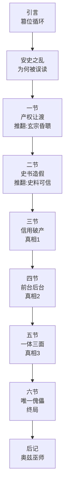
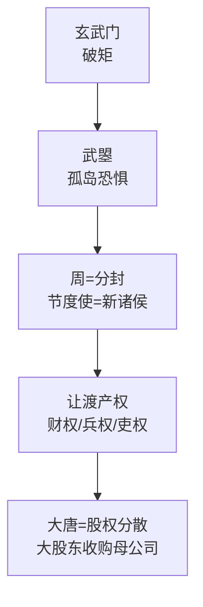
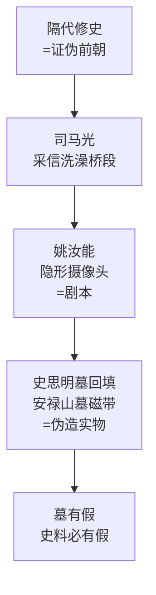
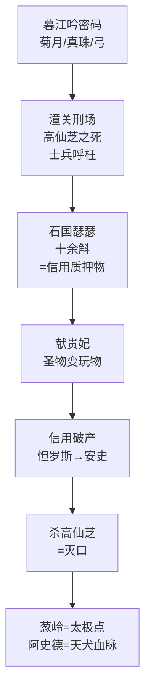
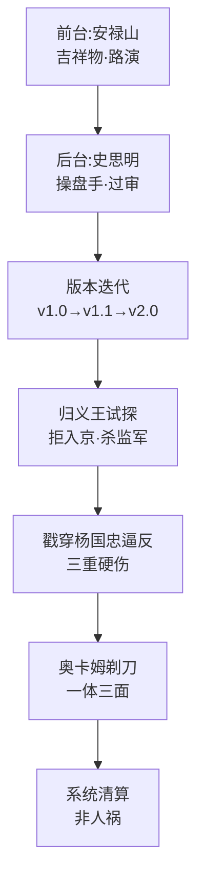
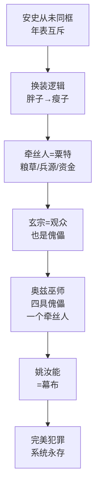

# 第08章《半江瑟瑟半江红》原文结构

> mermaid 原生渲染 · 节点精简 · 自解释

## 总纲：翻案递进链

## 第一节：产权让渡（根）

## 第二节：史书造假（方法）

## 第三节：信用破产（真相1）

## 第四~五节：前台后台 / 一体三面（真相2+3）

## 第六节 + 后记：唯一傀儡（终局）

## 论证链（一句话）

武曌拆产权(根) → 史书造假(方法) → 瑟瑟信用破产(导火索) → 一人分饰多角(手法) → 系统清算(本质) → 玄宗是傀儡(悲剧) → 奥兹巫师(终局)。每节结尾"您以为这就是全部真相了吗？"= 翻案递进钩子。
