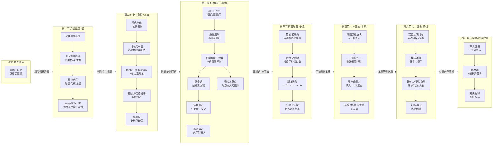

# 第08章 论证关系全景图（横屏）

> flowchart LR · 全节点 · 关系线带注释 · Gitea 原生渲染

```mermaid
flowchart LR
    subgraph S0[引言 篡位循环]
        A0[玄武门破矩<br/>强权即真理]
    end

    subgraph S1[第一节 产权让渡=根]
        B1[武曌孤岛恐惧] --> B2[周=分封代码<br/>节度使=新诸侯]
        B2 --> B3[让渡产权<br/>财权/兵权/吏权]
        B3 --> B4[大唐=股权分散<br/>大股东收购母公司]
    end

    subgraph S2[第二节 史书造假=方法]
        C1[隔代修史<br/>=证伪前朝] --> C2[司马光采信<br/>洗澡桥段泼脏唐]
        C2 --> C3[姚汝能=隐形摄像头<br/>=有人塞剧本]
        C3 --> C4[墓回填/英语磁带<br/>实物伪造]
        C4 --> C5[墓有假<br/>史料必有假]
    end

    subgraph S3[第三节 信用破产=真相1]
        D1[暮江吟密码<br/>菊月/真珠/弓] --> D2[潼关刑场<br/>高仙芝呼枉]
        D2 --> D3[石国瑟瑟十余斛<br/>=信用质押物]
        D3 --> D4[献贵妃<br/>圣物变玩物]
        D4 --> D5[信用破产<br/>怛罗斯→安史]
        D5 --> D6[杀高仙芝<br/>=灭口知情人]
        D3 -.-> D7[葱岭太极点<br/>阿史德天犬血脉]
    end

    subgraph S4[第四节 前台后台=手法]
        E1[前台:安禄山<br/>吉祥物四次路演] --> E2[后台:史思明<br/>操盘手红毯过审]
        E2 --> E3[版本迭代<br/>v1.0→v1.1→v2.0]
        E3 --> E4[归义王试探<br/>拒入京杀监军]
    end

    subgraph S5[第五节 一体三面=本质]
        F1[杨国忠逼反说<br/>=三重谎言] --> F2[三重硬伤<br/>量级/时间/行为]
        F2 --> F3[奥卡姆剃刀<br/>四人=一体三面]
        F3 --> F4[系统对系统的清算<br/>非人祸]
    end

    subgraph S6[第六节 唯一傀儡=终局]
        G1[安史从未同框<br/>年表互斥=穿帮] --> G2[换装逻辑<br/>胖子→瘦子]
        G2 --> G3[牵丝人=粟特商队<br/>粮草/兵源/资金]
        G3 --> G4[玄宗=观众<br/>也是傀儡]
    end

    subgraph S7[后记 奥兹巫师=终极隐喻]
        H1[四具傀儡<br/>一个牵丝人] --> H2[姚汝能<br/>=缝制的幕布]
        H2 --> H3[完美犯罪<br/>系统永存]
    end

    A0 -->|篡位循环的果| S1
    S1 -->|推翻:玄宗昏聩| S2
    S2 -->|推翻:史料可信| S3
    S3 -->|真相1引出手法| S4
    S4 -->|手法剥出本质| S5
    S5 -->|本质落到终局| S6
    S6 -->|终局升华隐喻| S7
```
