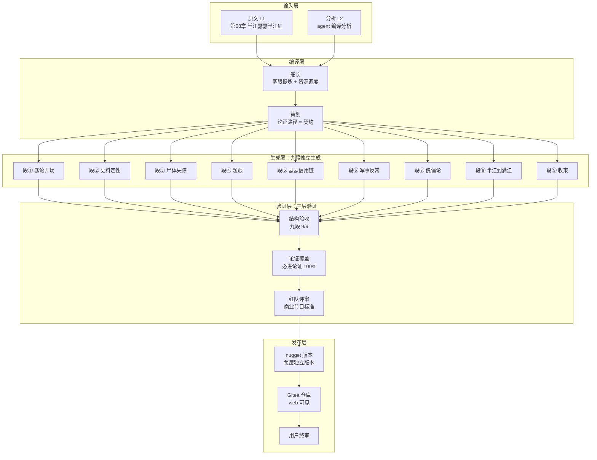
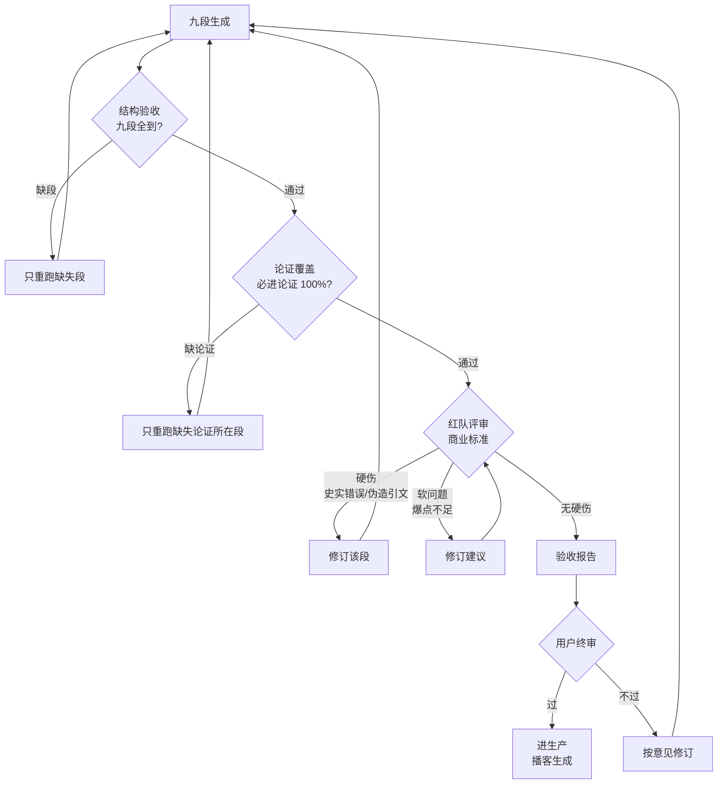

# IDP 生产管线 + 三层验证闭环（flowchart）

> 维护：agent · 2026-08-04 · 先画图后实现

## 一、总图：生产管线

## 二、验证闭环（三层验证 + 重跑）

## 三、判定标准（可判定、可复现）

| 层 | 判定 | 不过怎么办 |
|----|------|-----------|
| 结构验收 | 九段 9/9，每段 ≥400 字 | 只重跑缺失段 |
| 论证覆盖 | 必进论证 100% 命中 | 只重跑缺失论证所在段 |
| 红队评审 | 无硬伤（史实错误/伪造引文）| 修订该段；软问题给建议 |
| 用户终审 | 你说了算 | 按意见修订 → 重新走验证 |

## 四、必进论证清单（第二层验证的断言）

产权让渡(玄武门/和尚摸得) · 人死债消(鞭尸/张居正) · 从未同框 · 戴罪立功 · 邺城(十而围之) · 十余斛 · 傀儡吟 · 清君侧(贵妃) · 姚汝能(剧本) · 高仙芝=灭口 · 栗特军工复合体 · 克什米尔(地位未定)
