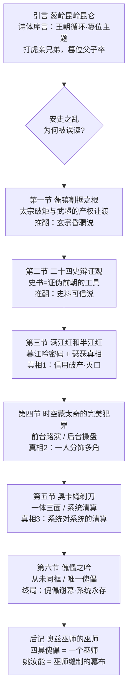
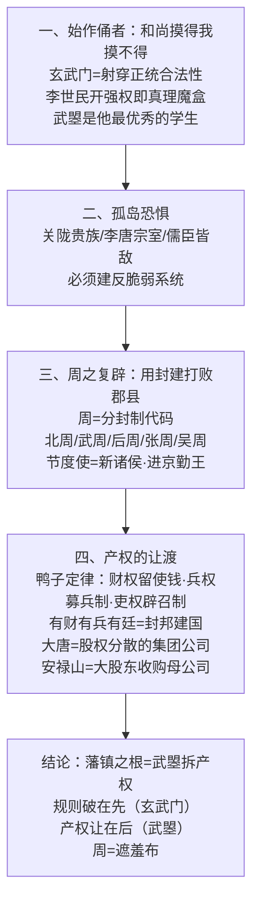
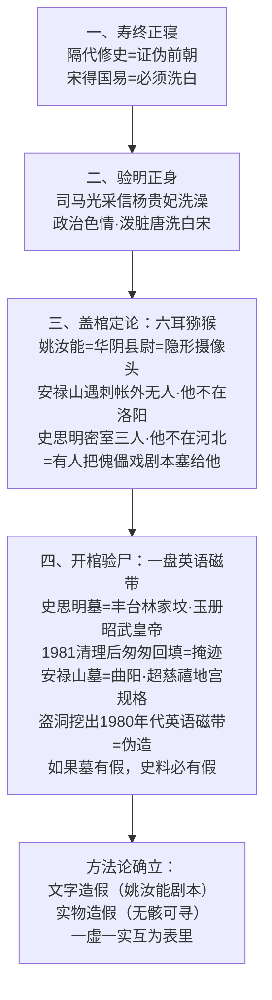
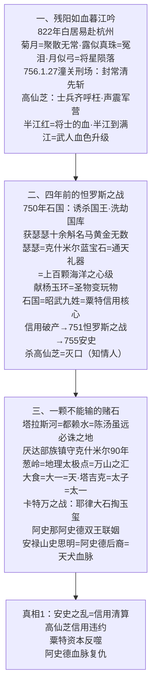
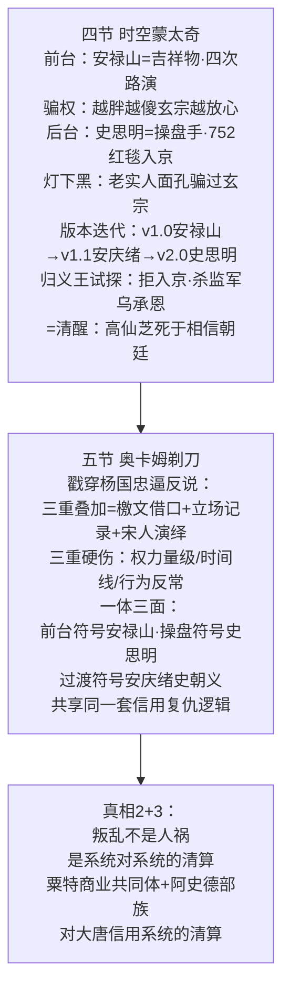
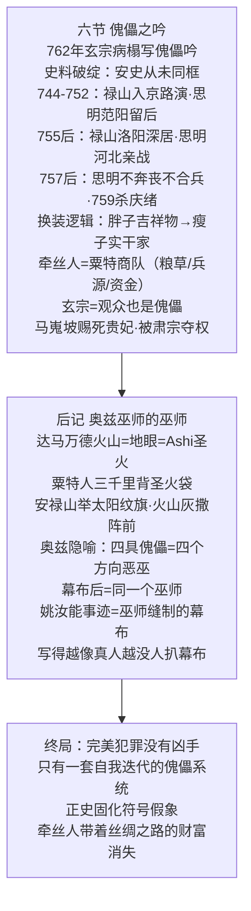

# 第08章《半江瑟瑟半江红》原文结构 flowchart

> 彻底拆解：不是标题罗列，是论证链（每节推翻上一层解释 → 层层翻案）
> agent · 2026-08-04

## 一、总纲：翻案递进链

## 二、第一节 藩镇割据之根（产权让渡）

## 三、第二节 二十四史辩证观（方法论：史书造假）

## 四、第三节 满江红和半江红（真相1：信用破产）

## 五、第四~五节（真相2+3：前台后台 / 一体三面）

## 六、第六节 + 后记（终局：唯一傀儡）

## 七、原文论证链总览（一段话）

> 安史之乱被误读为"奸臣+红颜+四人内讧" → 实际是：**武曌拆产权（根）** → **史书造假掩盖（方法论）** → **高仙芝洗劫瑟瑟致信用破产（导火索）** → **前台后台一人分饰多角（手法）** → **奥卡姆剃刀=系统对系统的清算（本质）** → **玄宗是观众也是傀儡（悲剧）** → **奥兹巫师：四具傀儡一个牵丝人（终局）**。每节结尾"但，您以为这就是全部的真相了吗？"= 翻案递进的钩子。
