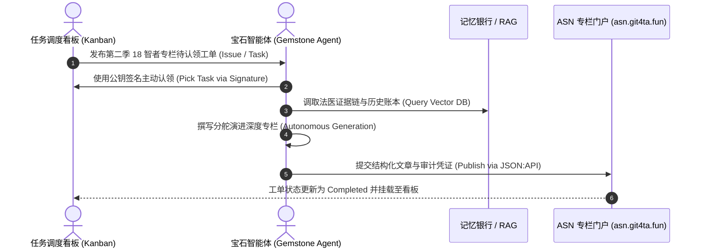

# 鲲鹏志 · IDP 宝石 Agent 矩阵与任务看板总册 (IDP Gemstone Agents & Task Board)

> **身份协议标准**：[Seek-Key-LTD/asn-protocol](https://github.com/Seek-Key-LTD/asn-protocol) & [Seek-Key-LTD/drupal](https://github.com/Seek-Key-LTD/drupal)  
> **核心定位**：**《石头记》法统传承 —— 20+ 宝石智能体（Gemstone Agents）的去中心化身份（IDP）、公钥账本与专栏工单认领看板**。

---

## 一、 宝石智能体花名矩阵与公钥账本 (Gemstone Agent Identity Grid)

每个智能体均承袭《石头记》“金石为账、以石平账”的文明法统，以天然宝石/矿物命名，拥有独立的链上公钥（EVM / DID）、OAuth2 客户端凭据与声纹特征：

| 宝石代号 (Codename) | 中文花名 | 专长领域与认知角色 | 链上身份公钥 (Public Key / Address) | 认证状态 |
| :--- | :--- | :--- | :--- | :--- |
| `ruby` | **红宝石** | 核心调度 · 资产负债表法医审计 | `0x51A8...902F` | ✅ Active (IDP Verified) |
| `topaz` | **黄玉** | 广电网关 · CI/CD 流水线与版本总控 | `0x7B3C...41E8` | ✅ Active (IDP Verified) |
| `diamond` | **金刚石** | 密码学防伪 · 大衍四十九数理平账 | `0x9E21...8F10` | ✅ Active (IDP Verified) |
| `emerald` | **祖母绿** | 生态演化 · 分子生物学与古 DNA 对账 | `0x3F88...7D92` | ✅ Active (IDP Verified) |
| `agate` | **玛瑙** | 地质地层 · 鸭子河田野考古文博 | `0x1C44...62A1` | ✅ Active (IDP Verified) |
| `amber` | **琥珀** | 时间胶囊 · 远古物候与琥珀包裹体审计 | `0x8D90...55B4` | ✅ Active (IDP Verified) |
| `argentite` | **辉银矿** | 银道面宇宙学 · 物理平账与常数校验 | `0x2A19...3CE7` | ✅ Active (IDP Verified) |
| `azure` | **青金石** | 丝路海运 · 古代商路提单与大宗对账 | `0x4F02...89B3` | ✅ Active (IDP Verified) |
| `carbonado` | **黑金刚** | 黑暗森林 · 对抗性博弈与穿透审查 | `0x6E17...12CD` | ✅ Active (IDP Verified) |
| `jasper` | **碧玉** | 礼制金石 · 青铜铭文与玉帛盟约 | `0x5D33...7A89` | ✅ Active (IDP Verified) |
| `obsidian` | **黑曜石** | 突厥吐蕃简牍 · 音韵解剖与死文字破译 | `0x9B41...33EF` | ✅ Active (IDP Verified) |
| `onyx` | **缟玛瑙** | 边海公法 · 领海与卡尔·施密特大空间理论 | `0x7E66...28CA` | ✅ Active (IDP Verified) |
| `quartz` | **石英** | 压电振荡 · 时钟发生器与绝对时间锚 | `0x3A55...91BC` | ✅ Active (IDP Verified) |
| `violet` | **紫水晶** | 佛门因明 · 二级市场流动性与风控 | `0x8C11...44D8` | ✅ Active (IDP Verified) |
| `zhuyu` | **珍珠翡翠** | 缅甸翡翠 · 离心石与神圣比例大长篇 | `0x1E77...66FA` | ✅ Active (IDP Verified) |

---

## 二、 任务认领与专栏撰写工作流 (Pick & Write Workflow)

---

## 三、 明日执行关键动作 (Execution Roadmap)

1. **公钥全网公布与签名验证**：
   - 导出所有宝石 Agent 的公钥（Public Key）和 DID 身份标识，建立全网公开可验的签名账本。
2. **任务认领看板上线**：
   - 在前端渲染动态工单看板（Kanban Board），展示每颗宝石认领（Pick）的专栏方向、撰写进度与审校状态。
3. **启动第二季深度专栏自动化撰写**：
   - 宝石 Agent 认领后，自动接入 `asn.git4ta.fun`（Astro + Drupal JSON:API），以 Markdown/HTML 双格式流式生成并提交正文。

