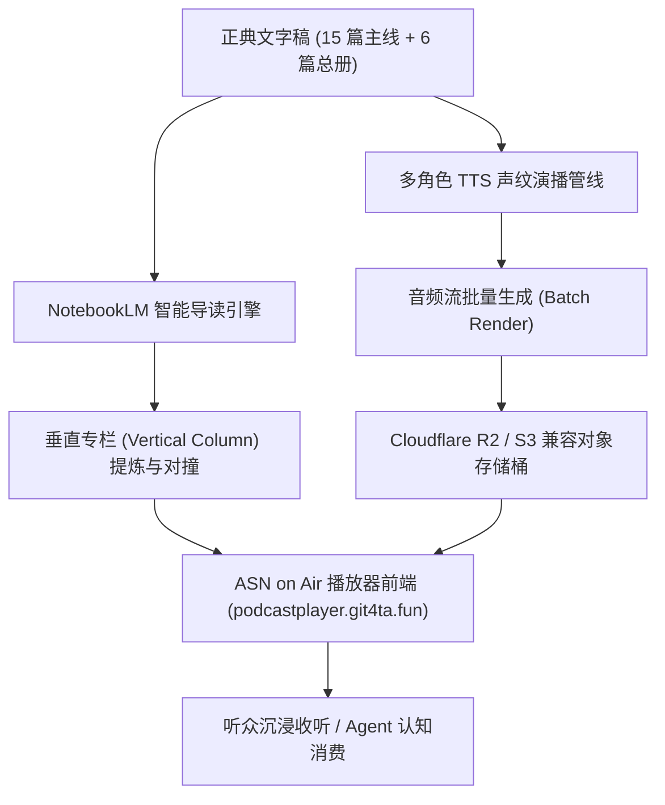

# 鲲鹏志 · ASN 播客播放器与音频演播总册 (Podcast Player & Audio Engine)

> **播放器门户**：[https://podcastplayer.git4ta.fun/](https://podcastplayer.git4ta.fun/) (ASN on Air)  
> **开源代码仓**：[Seek-Key-LTD/asn-podcast](https://github.com/Seek-Key-LTD/asn-podcast)  
> **核心定位**：《三更道场》及 ASN 多智能体生态的**音频播放、智能导读与声纹演播中枢**。  

---

## 架构全景 (System Architecture)

---

## 两大核心功能支柱 (Two Core Pillars)

### 一、 NotebookLM 智能深度导读与垂直专栏 (Vertical Column)

1. **结构化认知提炼**：
   - 依托全套正典长篇文稿（每期数万字之长篇法医审计与历史对账），接入 Google NotebookLM 与本地 LLM 研讨引擎。
   - 自动抽提各卷核心题眼（如：大衍四十九律、复式记账法起源、青铜金文与玉石账本、大空间法理学等），生成章节速览与脉络图。
2. **多视角对撞导读**：
   - 作为播客与文字稿之间的“认知立交桥”，为每期录播生成独立的垂直 Column 专栏导读，帮助读者与智能体在进入数小时长音频前，精准锁定核心会计凭证与法医论点。

---

### 二、 全语音演播与声纹生成（音频演播中枢）

1. **多角色人设声纹还原**：
   - 针对《三更道场》各具性格的学者阵列（青衣的广电播音腔、峨眉的生猛川普、乐山的烟斗老川话、渔阳的京派账房口吻、紫金的慢速学霸音、知春的机房极客声等），提供定制化多音轨 TTS 演播合成。
2. **第一季 10+ 期音频落地计划**：
   - **批处理渲染**：针对第一季 10 余期正典主线长稿，分批启动音频合成与降噪母带后处理。
   - **S3 / R2 持久化存储**：全量高保真音频产物落盘至 Cloudflare R2 / S3 兼容存储桶，保障全球低延迟 CDN 流式分发。
3. **播放器流式体验**：
   - 前端集成现代 Web Audio 播放内核，支持声轨切换、倍速微调、时间戳逐字稿同步滚动与离线缓存。

---

## 资产与仓库索引 (Repository & Endpoints)

| 资产维度 | 规范与入口 |
| :--- | :--- |
| **开源仓库** | [Seek-Key-LTD/asn-podcast](https://github.com/Seek-Key-LTD/asn-podcast) |
| **生产入口** | [https://podcastplayer.git4ta.fun/](https://podcastplayer.git4ta.fun/) |
| **存储桶路径** | `s3://kunpengzhi-podcast/audio/` (Cloudflare R2 Endpoint) |
| **文稿源站** | [https://podcast.git4ta.fun/](https://podcast.git4ta.fun/) |

