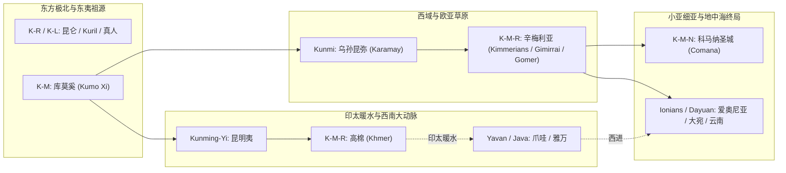

# 《K-M / K-M-R 辅音矩阵与辛梅利亚（Kimmerians）跨洋跨陆权柄流形》· 核心档案

> **建档日期**：2026-09-04  
> **归属谱系**：道名记 · 命名权力学 / 天权记 192《首字母开刃平账》 / 《三更道场》第十二期《黄道》  
> **核心题眼**：**【K-M / K-M-R 欧亚印太总合龙：从库莫奚、乌孙昆弥、高棉到小亚细亚辛梅利亚（Kimmerians）与科马纳（Comana）】**

---

## 一、跨欧亚/印太 K-M / K-M-R 权柄节点全景矩阵

| 历史/地理节点 | 核心称谓与古典账本记录 | 辅音骨架 | 地缘与权柄职能 | 关键考古与文献证据 |
|---|---|---|---|---|
| **东北亚走廊** | **库莫奚（Kumo Xi）** | **K-M** | 东北亚大兴安岭/西辽河古老渔猎游牧霸主 | 《魏书》《旧唐书》；与契丹同出源流，东夷北亚水陆流形 |
| **西域准噶尔/伊犁** | **乌孙昆弥（Kunmi / Kunmo）** | **K-M** | 准噶尔盆地（克拉玛依）与伊犁河谷大帝国最高君王头衔 | 《史记·大宛列传》《汉书·西域传》；乌孙首领代代世袭“昆弥/昆莫” |
| **华夏西南走廊** | **昆明夷（Kunming-Yi）** | **K-M** | 汉武帝经略西南夷；滇池与洱海水网之强权部落 | 《史记·西南夷列传》；冠以“夷”字坐实东方东夷迁徙源流 |
| **中南半岛** | **高棉王朝（Khmer / Kmer）** | **K-M-R** | 湄公河与洞里萨湖大水网热带水利神权大帝国（吴哥文明） | 古吉蔑语（Khmer），底层古音即为“昆弥/昆仑”（K-M-R） |
| **南洋与印度洋** | **爪哇 / 雅万（Java / Yavan / Yawa）** | **Y-V-N / J-V** | 印太暖水航线枢纽；《圣经·创世记》万国表“雅万” | 《创世记》10:2 雅弗之子 Javan（Yavan）；梵语 Yavana；南洋航海枢纽 |
| **小亚细亚 / 黑海** | **辛梅利亚人（Kimmerians / Gimirrai / Gomer）** | **K-M-R / G-M-R** | 公元前8-7世纪横扫小亚细亚、灭弗里吉亚/吕底亚的游牧铁骑霸主 | **希腊账本**：Kimmerioi（Κιμμέριοι）； **亚述帝国账本**：Gimirrai（楔形泥板）； **希伯来圣经账本**：Gomer（歌篾） |
| **小亚细亚圣城** | **科马纳（Comana Pontica / Comana Cappadociae）** | **K-M-N** | 古代小亚细亚卡帕多西亚与本都两大最高母神（Ma）政教合一圣城 | 希腊罗马古典地理志（斯特拉波《地理学》）；数千神庙侍者与神权大中枢 |
| **中亚与爱琴海** | **大宛（Dayuan / Yona / Yunan） vs 爱奥尼亚（Ionians）** | **Y-N / Y-V-N** | 欧亚大陆东西两端对“爱奥尼亚”的同一音译与商贸交割界面 | 《史记》大宛；波斯/阿拉伯语 Yunan；希腊 Ionia |

---

## 二、分子人类学法医证据（古 DNA 铁证）

### 1. 辛梅利亚人（Kimmerians）的东方古老基因空降
- **顶刊实证（2018年《Science Advances》等）**：
  欧洲学者对黑海北岸（乌克兰、高加索及小亚细亚边缘）出土的辛梅利亚人墓葬遗骸进行了全基因组测序。
- **法医测序结果**：
  辛梅利亚游牧统治阶层绝非纯种的本地印欧人，而是**高度富集东亚/西伯利亚古老单倍群（含东欧亚父系与母系特征，如 C 单倍群及相关东亚成分）**！
- **历史物理图景**：
  证明在进入小亚细亚之前，其核心军事与权力骨干是从远东/北亚大通道（沿欧亚草原及印太暖水跳板）长途奔袭平推过来的东方武力集团！

---

## 三、与爱奥尼亚（雅万 / 大宛）在小亚细亚的当堂对质

在公元前8世纪至前6世纪的小亚细亚半岛上，上演了一场横跨欧亚印太的大对账：

1. **海线端（沿海贸易与城邦）**：
   - 爱奥尼亚人（Ionians / Yavana）在小亚细亚西岸建立十二城邦（米利都、以弗所、萨摩斯等），控制爱琴海商道，被东方帝国记录为“雅万/大宛”；
2. **陆线端（内陆铁骑与神权圣城）**：
   - 携带着东方 **`K-M-R`** 基因与战力名号的**辛梅利亚人（Kimmerioi / Gimirrai）**，如狂风般从高加索/黑海席卷而入，彻底摧毁弗里吉亚（国王迈达斯自尽）与吕底亚王国，直扑爱奥尼亚沿海城邦；
   - 与此同时，小亚细亚腹地矗立着两座以 **`K-M-N`（科马纳 / Comana）** 为名的古老母神圣城，掌管着万民祭祀与神庙经济。

---

## 四、终极理论大合龙（四条大动脉全景图）

**结论**：
爱奥尼亚人（雅万）绝非西方孤立诞生的神话，他们在小亚细亚的海滩上，正是迎面撞上了以 **`K-M / K-M-R`** 为战旗与血脉的东方上古洪流！
