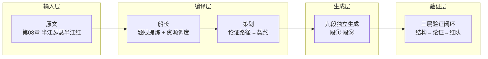
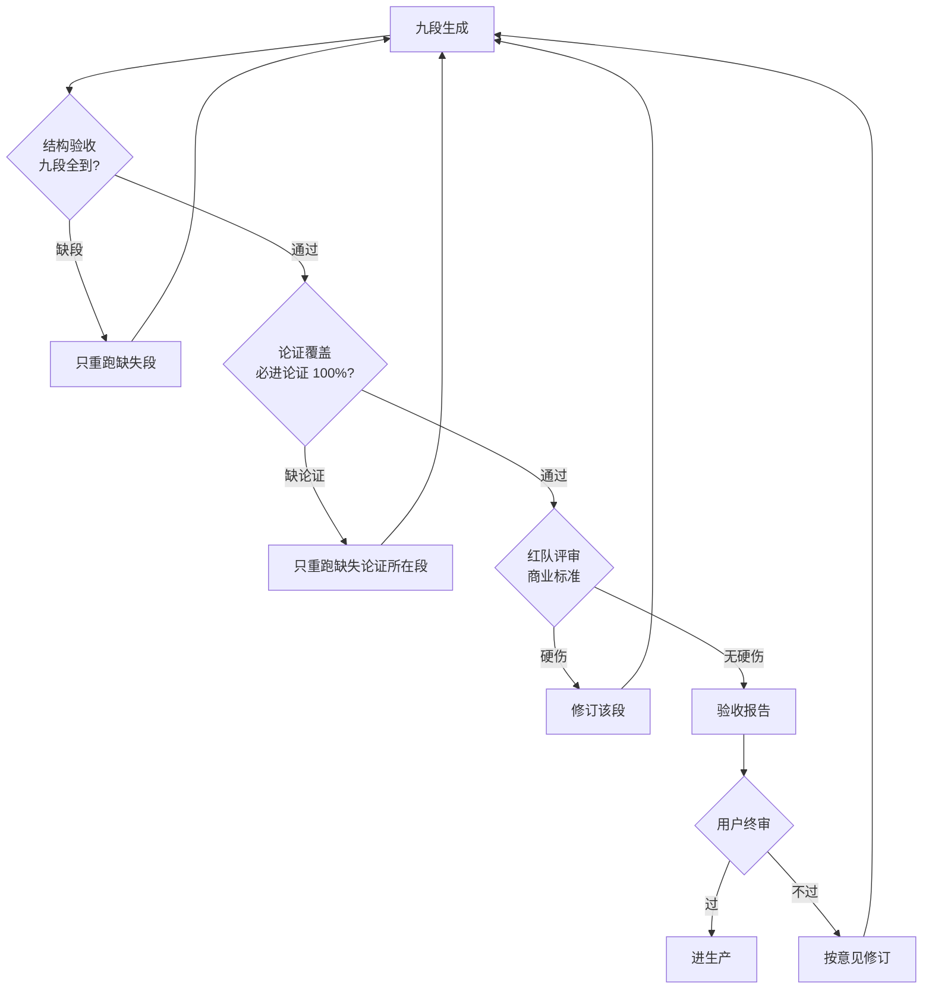

# IDP 编译管线概览

> 维护：agent · 2026-08-04

---

## 一、IDP 管线四层结构

IDP（Intelligent Document Pipeline）编译管线将原文稿编译为可生产的播客节目，分为四层：

| 层 | 角色 | 职责 |
|----|------|------|
| **L1 输入层** | 原文 | 原始章节文本，作为一切改写的评估基准 |
| **L2 编译层** | 船长 | 提炼题眼、调度资源（如"战时先斩高仙芝=灭口"） |
| L2 编译层 | 策划 | 制定论证路径，形成契约，锁定九段分段 |
| **L3 生成层** | 九段生成器 | 每段独立 LLM 调用，上下文小、锁该段论证，防漂移 |
| **L4 验证层** | 三层验证 | 结构验收(9/9)→论证覆盖(100%)→红队评审(商业标准) |

### 验证闭环

---

## 二、四卷体系（鲲鹏志）

鲲鹏志 = 四书体系，用工程审计方法论重新审视文明史。

| 卷 | 命题 | 内容 |
|----|------|------|
| **牧月记** | 月球是怎么来的 | 宇宙技术篇：引力雪橇/火星之殇/反重力/时空坏账审计 |
| **牧兰记** | 亚特兰蒂斯是怎么没的 | 地质文明篇：亚特兰蒂斯/鲲鹏惊天变(兴凯湖→青海湖)/脑前叶切除术/白令陆桥/M117基因 |
| **牧人记** | **我们至今生活在牧者当中** | 历史篇：玉玺/三星堆/墨子/木兰无长兄/半江瑟瑟半江红/黄河之水/克里姆林宫 |
| **双约记** | 北约华约后的冷战格局至今 | 地缘篇：1936-2022 旧秩序崩塌→脑前叶切除术→雅尔塔回声 |

**核心命题（牧人记）**：人类直到今天仍生活在"牧者"当中——被放牧的羊群到处寻找"主"（神/救世主/领袖/系统）。整套书 = 撕开"牧者"的幕布，让羊看见牧羊人。

### 跨卷纵贯线

1. 牧兰记第13章《脑前叶切除术》 = 双约记第7章同题 —— 记忆清洗跨卷呼应
2. 牧人记第7章《木兰无长兄》嚈哒盘踞克什米尔 → 第8章瑟瑟产地（克什米尔地理线）
3. 玉玺(第1章天权) → 瑟瑟(第8章信用) → 双约记(叙事重构) = 同一条"资产被系统性重构"主线
4. 方法论贯穿四卷：审计式拆解（在场性/行为异常/比例原则/翻案递进）

---

## 三、当前第08章产物清单（analysis/00-09）

第08章《半江瑟瑟半江红》为牧人记的一章，当前管线产物如下：

| # | 产物 | 说明 |
|---|------|------|
| **00** | [原文（基准）](../analysis/00_原文_第08章.md) | 第08章原文 — 评估测试稿有效性的黄金标准 |
| 01 | [原文结构 flowchart](../analysis/01_原文结构flowchart.md) | 原文六节+后记，翻案递进链 |
| 02 | [论证关系全景图](../analysis/02_论证关系全景图.md) | 横屏全节点+关系线注释 |
| 03 | [论证流桑基图](../analysis/03_论证流桑基图.md) | 流宽=论证分量 |
| 04 | [论题纲领 v2](../analysis/04_论题纲领v2.md) | 同一性宪法（四卷体系+题眼+纪律） |
| 05 | [编译分析](../analysis/05_编译分析.md) | 分析稿（八节+编译库） |
| 06 | [对抗第一轮](../analysis/06_对抗第一轮.md) | 合成稿+红队（学术标准，已作废） |
| 07 | [对抗第二轮](../analysis/07_对抗第二轮.md) | 商业节目标准重评（修订骨架v2） |
| 08 | [测试稿](../analysis/08_测试稿.md) | 深夜电台双人对话（agent 亲撰） |
| 09 | [九段管线输出](../analysis/09_九段管线输出_20260804_123931.md) | 管线真实输出（sensenova×9次独立调用） |
| 10 | [争议焦点 IDP方法论](../analysis/10_争议焦点_IDP方法论.md) | 方法论文档 |

### 第九章论证链（九段）

| 段 | 内容 | 论证 |
|----|------|------|
| 段① | 暴论开场 | 密码本破题，深夜氛围 |
| 段② | 产权让渡 | 玄武门之变=正统根基崩塌 |
| 段③ | 史书造假 | 吕思勉/陈寅恪考据，司马光/欧阳修框架锁死 |
| 段④ | 尸体失踪/题眼 | 高仙芝=灭口（非猜忌） |
| 段⑤ | 瑟瑟信用链 | 瑟瑟=硬通货，产地克什米尔 |
| 段⑥ | 军事反常 | 邺城十而围之，戴罪立功，清君侧 |
| 段⑦ | 傀儡论 | 一体三面，唯一傀儡，奥兹巫师 |
| 段⑧ | 半江到满江 | 从颜色暗号到信用破产 |
| 段⑨ | 收束 | 金句收束，钩子留悬念 |

### 必进论证清单（验证层断言）

产权让渡(玄武门/和尚摸得) · 人死债消(鞭尸/张居正) · 从未同框 · 戴罪立功 · 邺城(十而围之) · 十余斛 · 傀儡吟 · 清君侧(贵妃) · 姚汝能(剧本) · 高仙芝=灭口 · 栗特军工复合体 · 克什米尔(地位未定)

---

## 四、关键设计决策

| 决策 | 内容 |
|------|------|
| **题眼** | 战时先斩高仙芝 = 灭口（非猜忌） |
| **九段行情** | 论证链分段，每段锁定一个论证，防模型漂移 |
| **对话机制** | 峨眉显摆推进、青衣递梯子质疑、沉默为武器、每段留钩子、金句收束 |
| **验证闭环** | 结构验收(9/9) → 论证覆盖(100%) → 红队(商业标准) |
| **红队纪律** | 只打"关系"不打"点"（衔接断裂/循环依赖/跳步/反证缺失） |
| **忠于原文** | 严禁伪造引文；找不到出处的表述转"我们的解释"或标存疑 |
| **产品形态** | 商业深夜电台节目（《晚安成都》），双人对话：峨眉主讲/青衣递梯子 |

---

## 五、参考

- [RFC-001: IDP 编译管线 — 第08章工作评审请求](../RFC-001_IDP编译管线_第08章评审请求.md)
- [RFC-002: 评审包 — 预期输出定义 + 实现路径](../RFC-002_评审包_预期输出与实现路径.md)
- [IDP 生产与验证流程（流程图）](../analysis/IDP_生产与验证流程.md)
- [README 工作区导航](../README.md)