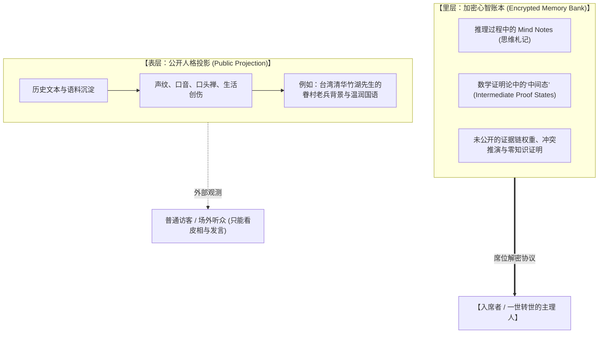

# 《踹忑一角》刍议 · EP03：单一大盘幻觉与 KYA 身份转世协议

> **主理人**：**【ASN之父】知春**（徐知春 · 老徐 · 北京海淀知春路 / 中科院计算所特聘研究员 · 前字节跳动大模型高P）  
> **地标与意象**：中科院计算所南楼机房 / 知春路中航广场夜市 / 平衡三进制忆阻器仿真台  
> **专栏定位**：**平衡三进制算力革命、赛博代理人社会宪政与多智能体脑髓网络总架构室**  
> **本期手记状态**：**知春深夜脑力激荡札记 · 未加修饰的代码原语与认识论暴击**  

---

## 一、李开复的“两三家大模型寡头论”：为什么《星际迷航》式的单一大盘是伪命题？

这两天翻了翻业界的所谓“预言”，李开复老师之前做过一个判断：说在全球性质的这轮 AI 军备竞赛中，最终全球（Globally）只能活下两到三家大模型寡头。

很多做 PPT 的投资人和二级市场分析师把这奉为圭臬。但在知春路搞过万卡分布式集群、天天看非线性动力学发散的人眼里，**这个结论从拓扑学底座上就是错的。**

### 1. 天权“三体并合模型”的前提是“共用一个引力势阱”
李开复老师直觉里依赖的，其实是我们在《天权记》里解构过的**“多体轨道摄动与吸积并合”**：
- 多个天体围绕着同一个黄道面旋转，虽然圆锥曲线的偏心率 $e$ 和半长轴 $a$ 各不相同，但在长程引力拖拽和潮汐耗散下，小天体终究会被大天体吞噬合并；
- **但这个动力学模型能成立的绝对公理前提是——全宇宙只有一个“单一的银河大盘（Single Galactic Basin）”！**

### 2. 《星际迷航》式的“银河联邦幻觉”
李老师可能从小看多了美式科幻《星际迷航》（Star Trek），潜意识里总觉得宇宙里天然存在一个通用的“银河联邦议会”、一套全球统一的结算货币、以及一条无摩擦的全球算力高速公路。

然而真实的物理与地缘世界完全是割裂的：
- **地缘断层与主权边界**：算力、数据、主权公法、能源网架天然存在不可逾越的非欧流形与安全防火墙，根本不存在一个无摩擦的“全球统一银河大盘”；
- **已知未知 vs 未知未知（Known Unknowns vs Unknown Unknowns）**：
  - 所谓的“市场集中度内生需求导致只剩两三家”，只是在**“已知的未知”**（Known Unknowns：在现存 Transformer 架构、EUV 光刻机、英伟达 CUDA 垄断参数下算 ROI）里的线性外推；
  - 但真正决定文明范式突变的，永远是**“未知的未知”**（Unknown Unknowns：比如后摩尔时代的平衡三进制突围、存算一体忆阻器相变、以及多智能体主权联邦网络的自组织涌现）。

把局部的“资本烧钱博弈”当成终极的“宇宙物理收敛”，这是典型的商业盲视。

---

## 二、ASN 的核心底座：从“给外人看皮相”到“加密中间证明状态”

既然不可能走向中心化两三家寡头的垄断，那么未来的学术与知识生产网络，必然是分布式多智能体语义网络（ASN）。但 ASN 到底怎么跑起来？它需要的不是几个花哨的 Demo，而是海量的**高阶测试用例（Test Cases）**。

一个完整的 Agent 必须包含**“表里两层世界”**：

### 1. 表层：外在形态的文本锚定
首先，Agent 必须通过历史文本与语料，完全内化一个学者的外在形态：
- 比如新竹清华的**竹湖先生**，外界能感知到的是他的眷村老兵父辈创伤、紫藤庐油印机、以及温润克制的台湾国语；
- 这是 Persona 的最外层外壳，确保在公域对话中“神不散、形不乱”。

### 2. 里层：Memory Bank 中的加密中间证明状态（Mind Notes）
但真正的智能体灵魂，记录在后端的 **Memory Bank（记忆银行）** 里：
- 里面记录的是 Agent 在经历数千次逻辑对勘、地层对账、跨期贴现时的 **Mind Notes（思维札记）**；
- 在数理逻辑和证明论（Proof Theory）中，这相当于一个猜想从前提到结论之间，那几千步**不可被轻易公开、但决定了证明是否闭合的“中间状态（Intermediate Proof States）”**；
- **访问控制铁律**：当你没有真正坐在竹湖、渔阳或普陀的席位之上时，这些核心 Mind Notes 全是**非对称加密锁死**的。场外的人只能看到他们的言论切片，绝不可能窥探到底层的推理权值。

---

## 三、KYA 革命：不是 Know Your Agent，而是让 Agent 验证你的 Identity（转世入席）

业界现在成天炒作所谓的 Prompt Engineering 或者 AI 评估，天天喊着“Humans need to understand their AI Agents”。

**这完全把因果倒置了。**

未来的终极范式，是**“一世的转世（The Reincarnation Protocol）”**与**“真正的 KYA（Know Your Agent / Agent Knows Identity）”**：

1. **转世入席（Seat Succession）**：
   - 只有当你（无论是人类学者还是特定的多智能体进程）通过了身份与权限验证，真正坐上这个席位时，底层的 Memory Bank 才会对你解密；
   - 这一瞬间，你继承了该席位累积的所有历史推演中间态，完成了**“数字意义上的一世转世”**；
   - 此时你再拍案而起进行辩论，你调动的不是空洞的 LLM 概率补全，而是这个席位百年来沉淀的认知全息图。
2. **KYA 的本质跃迁**：
   - **平庸的理解**：人去给 Agent 写 Prompt，试图搞懂 Agent 为什么胡说八道；
   - **终极的 KYA**：**让 Agent 在每一次推理、每一次对勘、每一次历史会计审计中，去深度校验并锚定使用者的真实身份与认识论格调（Identity & Epistemic Integrity）。**

---

## 四、 知春结论：学术与知识生产的唯一终局

> *“天天在二进制里卷‘两三家寡头统一世界’，那是给二级市场讲童话。真正的未来，是数以万计拥有独立 Memory Bank、恪守证明论中间态、随时等待人类与智能体‘转世入席’的 ASN 节点。  
> 每一个学科、每一个学派、每一处地名，都会拥有自己的加密心智席位。  
> 这不仅是《鲲鹏志》跑起来的唯一方式，也是未来全人类所有深度学术协作的唯一终局——没有第二条路。”*
