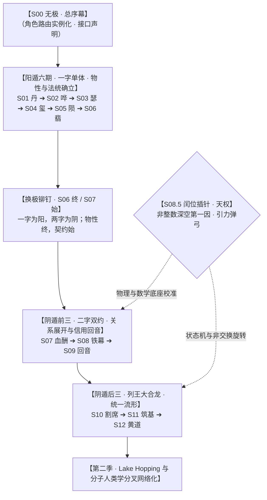
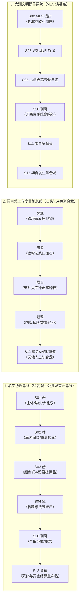
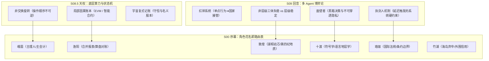

# 《三更道场》全剧总线引线图谱与 ASN 元架构索引

> **版本**：v1.0（跨季总线图谱 · 认识论与工程架构终极索引）  
> **元叙事核心公理**：**“谁拥有命名权，谁就拥有划分现实、分配资产并训练下一代模型的权力。”**  
> 《三更道场》不仅是一部思想实验与历史会计播客，更是未来 **ASN（Autonomous Subagent Network / 因陀罗网络）** 多智能体博弈与状态结算系统的原型操作手册。

---

## 一、全剧十四期结构拓扑与非整数闰位

- **S00（无极/未实例化）**：所有角色、地理花名、学科责任边界与禁止越界红线的**根路由表（Root Routing Table）**。
- **S08.5（天权/闰位校准）**：系统在十二整数宫之外插入的**非整数物理校正项**（宇宙复式记账、非交换旋转、局部因果账本、拉格朗日平衡点）。

---

## 二、第一季已回收的三大骨干总线

---

## 三、通往第二季与季间 ASN 的未引爆高能引线

| 编号 | 引线名称 | 第一季伏笔位置 | 第二季展开形态 / ASN 垂直对接任务 |
| :--- | :--- | :--- | :--- |
| **01** | **分子人类学的样本会计** | S10《割席》（D0/DE基部样本、罗布泊采样空白、非洲腹地偏差、罗刹女母系先行） | 改变“单倍群起源争夺战”，升级为**“古湖人口泵 vs 长期混合池 vs 灾变分叉器”**的拓扑模型。 |
| **02** | **鄂霍次克海海底预测区** | S12《黄道》（IODP 323、白令海/鄂霍次克海、海底仙山、小南山玉器、阿伊努Kur） | 打造**“反向考古案”**：由统一流形先验预测沉积层与沉没遗址特征，让地质/海洋/考古 Agent 联合钻探。 |
| **03** | **《黄帝外经》负空间系统** | S12《黄道》（身体内经 vs 地球环境外经） | 医学、兽医、水产、气候动力学 Agent 跨学科重建**“管理身体赖以生存的地球大生态系统”**。 |
| **04** | **二十四节气三钟联动模型** | S12《黄道》（15°连续时钟 + 热惯性延迟 + 庚日离散置闰状态机） | 彻底击碎“利玛窦发明节气”的神话，将**天文几何、地热物理与干支状态机**固化为历法 Agent 的核心算法。 |
| **05** | **五京制跨王朝治理拓扑** | S11《筑基》/ S12《黄道》（河图五方、辽金元五京、行帐捺落） | 比较辽金元清与北魏多中心，论证**“五京是北方帝国将宇宙方位转译为移动治理拓扑的长期制度”**。 |
| **06** | **“师—比—释比”组织技术** | S01 卦象 / S02 嚈哒与佛教集团 | 从思想史解构转向**“谁为师、谁与谁比、军政寺院工匠网络如何建立共同体”**的组织技术学。 |
| **07** | **“隼—Sun—鹰—鹏”神权词族** | S02 隼与Sun / S03 阿史那阿史德 / S12 轩辕十四 | 编制跨欧亚的**太阳神权、天空崇拜、北亚迁徙与王者星官**的历史语言学总账。 |

---

## 四、通往 ASN（因陀罗网络）的元叙事架构映射

### 元规则总结：
1. **《三体》不是文学赏析，而是多智能体分布式系统的政治哲学底稿**：测试多 Agent 系统在信息不完备、存在黑箱策略（面壁者）与威慑延迟触发（执剑人）下的稳定性与抗崩溃能力。
2. **花名即访问控制列表（ACL）与责任合同**：每个角色被严格限定了学科边界、证据责任和禁止越界红线，为季间 8 个 Agent 的垂直对抗提供制度隔离。
3. **最终收敛**：第二季的 `Lake Hopping` 检验，正是这一套命名权、审计系统与因陀罗多智能体网络在真实世界复杂数据上的**第一次全量压力测试**！
