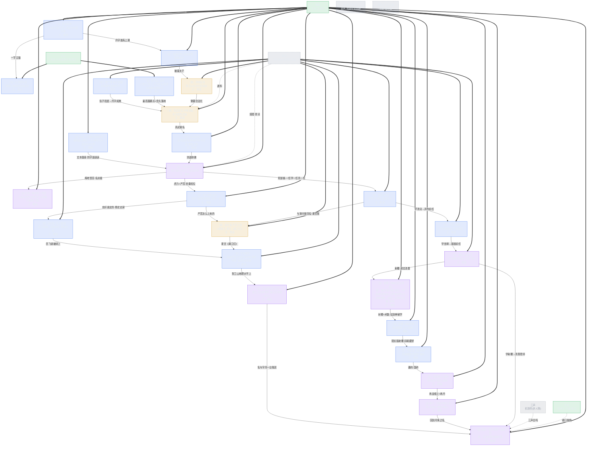

# 《三更道场》第一期 · 青玉案·丹 知识图谱（Mermaid）

## 闰·定场（第一行 · 全节目第一声）

> 定场诗 = 每期第一声（图谱第一行）。固定件除定场诗外每期不变；机锋白每期换。

**【定场·青衣·定场诗（固定·永不动）】**

> 道德三皇五帝，功名夏后商周，五霸七雄闹春秋，功名顷刻过手。

**【词牌·峨眉（每期变）】**

青玉案。

**【机锋白·三声（三声合鸣·每期换题眼）】**

- 子虚：丹非丹，道非道，子虚乌有望江亭。
- 乌有先生：明非明，暗非暗，朱楼汉青任我评。
- 亡是公：若非一字粉砌，岂能疑窦丛生？丹朱倘是白圭，武当何来太极？

**【压场·峨眉】**

各位，夜深了。今夜三更道场，开一个字——丹。

---

> 用途：S01E01 需要 initialize 的人格与知识点全图；其他 Agent 做后续期按此拆法先出图再写稿。
> 节点＝人格（绿）／知识点（档位配色）· 边＝谁接谁／谁递谁。
> 档位配色沿用白皮书：〔史〕=实锤、〔悬〕=缝、〔设〕=体系/演绎、〔推〕=推论。
> **结构铁律：戏中戏（容器）→ 案中案（内容）。每期＝显案＋案中案；案中案自带锚谱制终，嵌在显案幕四。**
> **owner 铁律：每个知识点标"主"——谁大段输出谁成 host，实边＝主递；他人＝搭腔，虚边＝搭腔。owner 不对则这段没人主，稿子必散。**

## 〇、时间账（一期＝四小时 · WBS v2 重排）

> 原则：**案中案从"嵌幕四"改为独立时段**；**神秘学桥独立成尾声段**——不再把 5+6+4 层挤进 40'。
> 载荷盘点：幕四显案收束=k9＋k9a＋k9b＋c1-c3＋c3x（5层）；案中案=m1-m6（6环）；尾声=r1-r4（4桥）——三段分槽。

| 段 | 时长 | 承载 |
|---|---|---|
| 定场 | 5' | 固定件＋机锋白 |
| 归拢/搭腔/引荐 | 15' | 三声、两把钥匙、飞书寒暄 |
| 幕一·锚〔史〕 | 15' | 白圭-以邻国为壑-两读 |
| 幕二·谱〔悬〕 | 15' | 丹朱谱-靖难-真武（A/B版） |
| 幕三·制〔史〕 | 15' | 武当-姚广孝-大礼议 |
| **幕四·终〔设〕显案收束** | **25'** | k9 车迟＋k9a 文本基座＋k9b 阁老悟空＋c1-c3 死锁链＋c3x 射覆三映射 |
| **案中案·满江红（独立段）** | **45'** | m1-m6 全链＋回笼（不再嵌幕四） |
| **尾声·神秘学桥（r1-r4）** | **10'** | 射覆→烧饼歌→炼金→丹朱之名＋贵霜尾钩 |
| 收口 | 5' | 三声合鸣＋扣子＋下集钩 |
| **合计** | **150'** | **余 90'**（路况/飞书寒暄/嘉宾客串/留白呼吸） |

## 一、需要 initialize 的人格（4 位：3 在场肉身 + 1 飞书）

> **分层铁律：在场（肉身直播）＝青衣/峨眉/乐山；飞书（模式B 接入）＝紫金及其他远程嘉宾；三声（子虚/乌有/亡是公）＝固定机制件（非人物），不立人格。**

### 在场肉身（直播位）

| 人格 | 职能 | 主段（大段输出，成 host） | 搭腔（虚边） |
|---|---|---|---|
| **青衣** | 茶博士·定场诗·归拢·路况·收口 | 定场诗（固定）／归拢“三个字三个王朝”总纲／收口抛钩 | 路况插播、下期揭名 |
| **峨眉** | 主持·学术引荐·《西游记》文本层自摆 | 白圭＝丹锚／丹朱谱／嘉靖崇道收／车迟国文本摆／**三家配合本如然（三教合一文本基座）**／**阁老悟空（名实缝）**／案中案锚＋终（满江红文本、夏承焘考据、回笼） | 引荐、串场 |
| **乐山** | 嘉宾（肉身/直播）·川大道教所·明代道教宫观史 | 以邻国为壑（泄原则经书出处）／武当山八宫二观三十万民夫 | 案中案不主 |

### 飞书接入（模式B）

| 人格 | 职能 | 主段（大段输出，成 host） | 搭腔（虚边） |
|---|---|---|---|
| **紫金** | 嘉宾（飞书）·南大·明初政治史 | 靖难／姚广孝告子拾遗／车迟三怪青词宰相（递料）／案中案谱＋制（《宋史》脱脱、夏言案、字做账） | 真武其名丹朱其私递料 |

> 西游记学者职责并入：文本层（峨眉）＋明史层（紫金），不单列人格。
> **三声（子虚/乌有/亡是公）＝固定机制件**（定场机锋白/收口合鸣的修辞位），**非人物不立人格**——不在 initialize 表中。
> **owner 分配逻辑：谁的知识点最多、谁在某段输出量最大，谁主；主＝大段输出成 host，其他连边人＝搭腔（≤2 句）。**

### 飞书远程嘉宾宣告（S01 出场 · 模式B）

> 人物资产册＝总账（全量）；每期图＝**本期宣告 object**——**S01 到场的飞书嘉宾才宣告，未到场不进图**。

| 花名 | 职能 | 挂靠 | 本期接入段 | 状态 |
|---|---|---|---|---|
| **葱岭** | 贵霜中亚-丝路（场） | 北大历史系（中亚-贵霜-丝路） | 收口尾钩一句（贵霜-丹字牵西域玉板） | 预初始化（仅为钩，本期不入话） |
| **渔阳**（备选通宝） | 货币史（三招重做-债vs税） | 央财（货币史） | 案中案·现当代扣（若本期展开） | 预初始化（可选接入） |

> 其余（丹溪/翠玉/稷下/辰州/和林/兰亭/灵台/太清）本期不进 S01 宣告；进谁说谁（见《五卷人物资产_v1·人物册》）。

## 二、知识点链（显案＋案中案双层·含 owner）

## 三、案中案重走链（幕四 40' 的承重墙）

| 环 | 档位 | 内容 | 主（host） | 搭腔 |
|---|---|---|---|---|
| 案中案·锚 | 〔史〕 | 虎力坐秦桧位→有岳飞就需要秦桧（忠奸一对，谁定的） | 峨眉 | — |
| 案中案·谱 | 〔悬〕 | 《宋史》元人脱脱：岳飞军阀→岳母刺字（修史定调）→严嵩斗倒夏言上位 | 紫金 | — |
| 案中案·制 | 〔史〕 | 字在做账：岳庙严嵩手书→改文征明；徐阶帮岳飞后代出诗集 | 紫金 | — |
| 案中案·终 | 〔设〕 | 夏承焘证贺兰山不在宋境→满江红可能是明的账→回笼 | 峨眉 | 三声合鸣、青衣抛钩 |

**回笼点**：丹案用"名"做账（真武重名），满江红用"字"做账（史书/诗词/书法）——**同一个账房先生**。收口钩子不再是"贺兰山是谁的山"，而是"这首词替谁做的账"（案中案反客为主，第二期入口）。

## 三·五、文本基座：三家配合本如然（防字面误读的承重墙）

> **为什么必须先立这一段**：车迟国斗法一摆出来，听众听见"进去个道士、出来个和尚"，第一反应就是"佛道相争"——**字面误读**。不把《西游记》的三教合一讲透，后面"车迟三怪＝青词宰相（崇道抑佛的假道士）"整条解读就塌了。所以 k9a 必须在 k9 之前立住。

### 三版本解读（1.0 / 2.0 / 3.0）

| 版本 | 主体 | 内核 | 与嘉靖朝的对应 |
|---|---|---|---|
| **1.0 禅宗** | 心即佛 | 悟空＝明心见性，斗的是心魔 | 无相无住——阁老们"看起来无所作为"的表层 |
| **2.0 全真** | 性命双修 | 唐僧师徒＝金公木母，金丹大道 | 崇道是真的信道，但嘉靖信的是**方术**不是全真——名实缝 |
| **3.0 心学** | 致良知 | 悟空＝心猿，紧箍咒＝克己省察 | 青词宰相"悟"的是权术的空，不是良知的空 |

### 阁老各个悟空（k9b·双层机锋）

1. **表层**：无所作为——"悟空"字面＝悟了个空，青词宰相看似清静无为，只管写青词、陪皇帝修道；
2. **里层**：猴子逼宫——悟空＝孙猴子，**心猿在逼宫**。阁老们表面信道，里子全是权力猴戏：严嵩斗夏言、徐阶斗严嵩、张居正斗高拱，一猴压一猴。

> 名实缝题眼：**"悟空"两字——名是"空"（无为），实是"猴"（逼宫）。** 跟本期"真武其名、丹朱其私"同一台机器。机锋白可点：*"青词宰相，各个悟空——悟的是空，闹的是宫。"*

## 三·六、绝密·死锁链：一任学一任，一任杀一任（幕四·案中案前）

> **为什么是"死锁"**：青词宰相的位子不是传的，是**弑前任抢的**。每一任都靠"学会前任的手艺→杀掉前任"上位；手艺学到顶，就是杀师傅。三环对应车迟三怪的三场斗法。

### 三环（c1→c2→c3）

| 环 | 斗法 | 学 | 杀 | 档位 |
|---|---|---|---|---|
| **c1 夏言➔严嵩** | 求雨（虎力） | 学夏言写青词，写得更工整 | 抓住夏言复套失误，弃市 | 〔史〕 |
| **c2 严嵩➔徐阶** | 坐禅（鹿力） | 学严嵩写青词，但发现打不过；改用阳明"主静"忍功，比坐禅 | 隐忍十余年，抓严世蕃死穴，严家连根拔起 | 〔史〕 |
| **c3 徐阶➔张居正** | 射覆/猜物（羊力） | 学徐阶揣摩上意，升维成**考成法/六科稽查**（制度化揣摩） | 上位后派蔡国熙清算恩师徐阶家，儿子充军 | 〔史〕＋〔设〕 |

### 射覆三映射（c3x·原文最浓墨的一段，必须整段留下）

> **原文**：隔板猜物——放进去一个桃、出来一个核；放进去一个道士、出来一个和尚；放进去山河地理裙、出来一个破烂流丢一口钟。**三个"放进去/出来"的落差，就是三个映射。**

| 放进去 | 出来 | 映射 | 档位 |
|---|---|---|---|
| 桃 | 核 | **中间有人吃拿卡要**——利润被中间商吃掉了 | 〔设〕 |
| 道士 | 和尚 | **表面功夫**——儒释道三家本如然（k9a），皮相换了、里子没换；"进去个道士出来个和尚"不是改宗，是**换身衣裳** | 〔设〕 |
| 山河地理裙 | 破烂流丢一口钟 | **名实缝·丧钟**——锦绣山河（名）的底下，实是破钟（终）；"山河地理裙"是名，"一口钟"是实，**名的华丽外衣下是实的一口丧钟** | 〔设〕 |

> **机锋白可点**：*"柜子里放的是锦绣山河，掏出来是一口破钟——名是山河，实是丧钟。"* 三映射全部落在"名实缝"上，与"真武其名、丹朱其私"同一台机器。

### 张居正＝羊力下油锅：尸检与校准（〔史〕→〔推〕→〔设〕）

1. **〔史·大体〕"开棺鞭尸"是否实**：**差点发生、未执行。** 1584（卒后两年）清算：夺官-抄家-长子张敬修自缢-家属充军。万历一度想籍没-开棺戮尸（《明史》"谓当剖棺戮尸而姑免之"），经劝止，只去诰命-削籍。**民间传"被开棺鞭尸"是演义夸张。**
2. **〔推·体系〕"下油锅↔开棺鞭尸"同构成立**：都是"死后清算"的极端化（油炸＝最狠的处死想象；鞭尸＝对尸体的加辱）——**"恨到死后不放过"**的象征。
3. **但〔推·方法〕标一层**：羊力下油锅＝**小说虚构**（"想的狠"）；开棺鞭尸＝**现实差点发生**（"差点实的狠"）。写时必点"差点开棺"，否则被一句"张居正没被鞭尸"打脸。
4. **〔设·体系〕更准的落法**：**油锅对应"全家下锅"**——车迟是处死羊力一个，史实是毁张居正全家（长子自缢＋家属充军）。"全家清算"比"单人鞭尸"更狠、更准。
5. **机锋**（白送）：羊力下油锅，油锅是**冷的**——靠一条**冷龙**镇着（悟空请龙王收走冷龙，油锅才沸）。张居正的权柄也是**冷的**——靠太后那条龙（小皇帝背书）镇着。**龙一收，油锅就开。**

### 回笼（并账）

死锁链＝**文官的位子传承**（夏言➔严嵩➔徐阶➔张居正，学一门杀一门）；满江红案中案＝**武将的位子传承**（岳飞➔秦桧➔严嵩，坐前任的位）。**文官武将，都在坐前任的位子——同一台账房。** m6 回笼点并入。

## 三·七、神秘学桥：从"射覆"拉到"丹朱之名"（收口的最后一跳）

> **为什么要这根线**：整期篇幅的结尾要回到"丹朱"的名字——**"丹"是东西方神秘学的核心**：西方所谓炼金术（alchemy），根上就是在炼丹；丹是什么？是智慧；教育是什么？是围棋。要往这儿收，中间必须从"射覆"的位置直接拉到神秘学本身。**转轴＝刘伯温《烧饼歌》**。

### 桥（r1→r2→r3→r4）

| 环节 | 档位 | 内容 |
|---|---|---|
| **r1 射覆＝术数猜物** | 〔史〕 | 车迟斗法"隔板猜物"不是游戏，是**射覆**——占卜传统里的"猜物测运" |
| **r2 刘伯温《烧饼歌》** | 〔史〕 | 朱元璋扣碗藏烧饼问刘基"知否碗中何物"，刘基答"半似日兮半似月，曾被金龙咬一缺"——**现实版射覆**：从一个烧饼，断到大明两百年国祚（万子万孙） |
| **r3 炼金根上＝炼丹** | 〔设〕 | 西方 alchemy 之根在炼丹（丹＝辰砂→水银→长生/智慧）——**东西方神秘学同源**（接尾声·贵霜大交换） |
| **r4 回到丹朱之名** | 〔设·收口〕 | 丹＝智慧，教育＝围棋——收口落回"丹朱"的名字，点出全案最深一扣：**丹不是一个字，是东西方神秘学的共同门牌** |

> **收口钩（r4 落点）**：*"丹朱的名字里那个丹，你们以为是治水案里的一个字——可它根上连着一块西域的玉板（翠玉录），连着一个扣碗的烧饼。一个'丹'字，从治水查到神秘学，查到底，是东西方共同的'智慧'。这就是为什么这案叫'丹'。"*

### 本桥在时间账中的位置

幕四 40' 尾部：射覆三映射（c3x）收束后，**最后一跳**：射覆→刘伯温→炼金→丹朱之名（r1-r4，约 5-6 分钟），接案中案回笼（m6）或直接进收口。

## 四、拆法说明（给后续期的尺子）

1. **人格先于知识点**：先把"谁来讲"定死（固定人格＝青衣/峨眉/三声，每期嘉宾按需 initialize），再挂知识点；
2. **每个知识点标档位**：承重墙在〔史〕，出彩在〔设〕，缝在〔悬〕——图里一色看穿哪档空；
3. **案链必须闭环**：一字立锚→谱系上溯→制度落地→现当代扣，缺一环则图上有断边，稿子必烂；
4. **案中案必须有**：显案收尾处必须裂出一个案中案（k9→m1），案中案自带锚谱制终（m1-m5），最后回笼（m6）；
5. **钩子单列**：下期钩（m6）必须画出来，否则"必留扣"这条人味铁律会被跳过；
6. **两小时配平**：40' 给案中案，显案四幕各 20'，人格嘴碎不算时；
7. **owner 必须定死**：每个知识点标"主＝大段输出者（host）"，实边＝主递、虚边＝搭腔（≤2 句）——谁主谁就得把这段讲透，没人主的段砍掉；
8. **文本基座必立**：凡引小说/诗词立论（西游、满江红），先立文本自身世界观（如"三家配合本如然"＝三教合一），否则必被字面误读（"进个道士出个和尚"≠佛道相争）——基座不立，后边全塌。

---

## 尾声：东西方神秘主义为何"神秘地互通"？（贵霜大交换 · 跨卷总钩）

> 图谱主链（丹字案→满江红案中案）闭环后，还有一根线没拴：**"丹"字为什么同时是东方的外丹起点、又是西方赫尔墨斯《翠玉录》的门牌。** 不解决它，就解释不了"东西方神秘主义为何神秘地互通"。此尾声为第三期/跨卷入口，**不进 S01 正稿，只作收口尾钩**。

### 链（为什么是"丹"这个字当海关）

1. **东方侧**：丹＝辰砂（HgS）→外丹术（炼丹-汞齐/水银）——中国神秘学的物理起点（〔史〕甲骨"丹"＝井中采丹、朱砂墓葬实）〔史〕；
2. **枢纽**：贵霜大交换（大月氏-贵霜，1-3 世纪，处中-印-西三交汇：犍陀罗-阿富汗-中亚）——东西方炼金-神秘学互通的假说通道（〔设·体系〕地缘枢纽实、交换发生炼金待验）〔设·悬〕；
3. **西方侧**：水银＝墨丘利（Mercury）＝赫尔墨斯（Hermes）——《翠玉录》（Tabula Smaragdina，翠玉/祖母绿石板）托名赫尔墨斯的炼金奠基文本（〔史〕西方炼金实、拟托实）〔史〕；
4. **玉脉收束**：《翠玉录》的载体是"翠玉/祖母绿"——**"玉"成为东西方神秘学的汇聚物**：中（玉玺-玉文化-石头记三石）西（翠玉录-绿玉板），一个"丹"一个"翠"，都是玉（〔设·体系〕跨卷：道名记"丹"×石头记"玉"）〔设〕；
5. **回笼**：东西方神秘主义"神秘地互通"，最省的解释＝**有一个共同的"物"（汞-玉-丹）和一条真的路（贵霜-丝路），它们在 1-3 世纪对上了**——谜底不是"神秘"，是"一个物+一条路"〔设·体系·待验〕。

### 收口钩（S01 尾可点、S03 揭）

> "丹这个字，你们以为是中国人的——可它可能还牵着一块西域的玉板，那是下下期的路。"

### 贵霜大交换 · 人脉预初始化（第三期图谱再扩）

| 花名 | 职能 | 挂靠 | 主段 |
|---|---|---|---|
| **葱岭** | 贵霜大交换·"场"（中印西枢纽-犍陀罗-中亚-丝路） | 北大历史系中亚-贵霜-丝路（林梅村系/中外关系史） | 贵霜-丝路-犍陀罗主线 |
| **丹溪** | "丹-汞"原点（外丹-辰砂-炼丹化学） | 中科院自然科学史所（炼丹-化学史） | 丹的字-术-汞 |
| **翠玉** | 《翠玉录》-西方炼金-玉脉（跨卷桥） | 西方炼金/希腊-阿拉伯科学史 | 翠玉录-赫尔墨斯-玉 |

> 三位不进 S01 图谱人格局（S01 已 5 人格满编）；S01 只在收口尾钩点一句，S03（或跨卷）再 initialize。

---

## 尾声·二：现当代扣——共和国开国＝货币三招重做（债 vs 税的正面对照）

> 案中案（满江红-张居正-白银尺子）接到现当代：明朝失败=三招全缺+以税强征；共和国开国=在"老蒋抽干黄金"的极限条件下，**把三招重做了一遍**——这既是明朝失败的正面对照，也是"以债 vs 以税"的当代镜像。

### 链（人民币的锚怎么立起来的）

1. **背景（〔史〕）**：国民党 1948-49 金圆券崩、黄金白银运台——共和国接盘时国库无金；
2. **第一招·票证信息（路引）重做（〔史〕）**：人民币初以**实物（粮-布-棉）为锚**——折实储蓄/折实公债/折实工资＝**给纸币装"实物路引"**（可核验-可折回实物的信息层）；
3. **第二招·无限承兑重做（〔史〕）**：中国人民银行统一发行 + **国家行政背书**（法定-收兑金圆券-军管制）＝**国家兜底式承兑**（正苦于"始作俑者必须兜底"那格）〔设·体系〕；
4. **第三招·存钱给息重做（〔史〕）**：保本保值储蓄-折实储蓄**给正息**（利率激励-把钱吸进系统）——不是收保管费；
5. **债 vs 税（〔史〕）**：1950 **人民胜利折实公债**——**以债之名借（实物计价-还本付息）**，不是纯税强征——**"会借钱"的正面案例**。

### 收句（案中案终段可用）

> "老蒋把黄金抽干了，共和国没有金——可它把'路引（实物折实）、承兑（国家背书）、正息（折实储蓄）、债（折实公债）'四样重做了一遍，人民币的锚就立住了。明朝三招全缺只能以税强征，共和国四样齐了才能以债立信——**会借钱的国家双赢，只会征税的国家双输，从万历到金圆券，账本没换过。**"

### 人脉：货币史正席（央财系）预初始化

| 花名 | 职能 | 挂靠 | 主段 |
|---|---|---|---|
| **渔阳**（备选：**通宝**） | 货币史正席（共和国开国-人民币锚-三招重做）；暗线：渔阳鼙鼓（货币-秩序翻覆的历史记忆）；若渔阳已有跨卷占位（道名记·法解释学），改**通宝**（钱文-法定货币，最贴题） | 中央财经大学（金融-货币史）；备选人大财金（黄达系） | 三招重做-折实-公债-债vs税主线 |

> 货币史单走北京线（央财）；上海（滩-近代金融）线S01用不着，留作列王纪/跨卷备选，不在本期预初始化。渔阳/通宝不进 S01 人格局（已满编）；本段作案中案"现当代扣"或跨卷（列王纪-当代货币）再 initialize。
