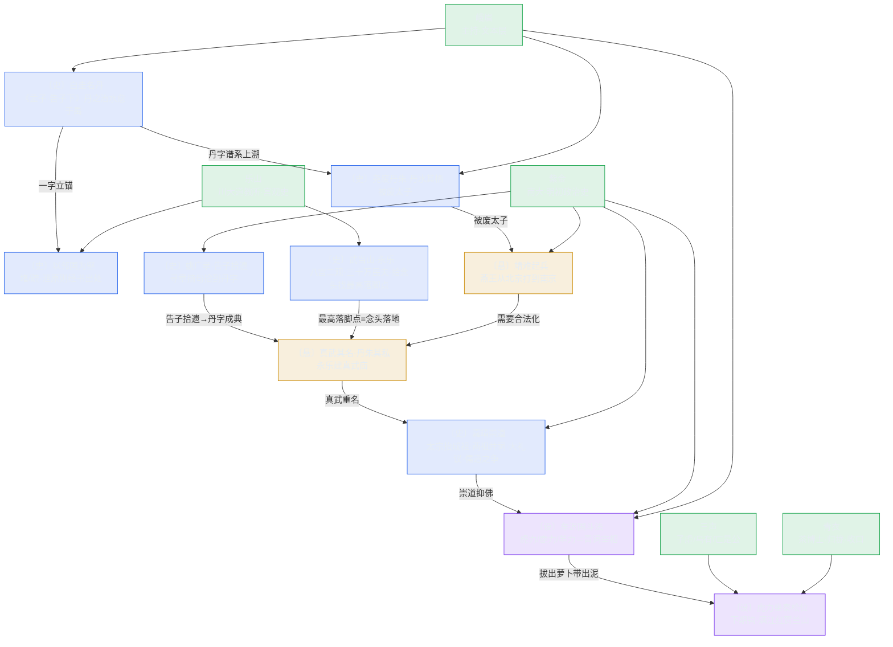

# 《三更道场》第一期 · 青玉案·丹 知识图谱（Mermaid）

> 用途：S01E01 需要 initialize 的人格与知识点全图；其他 Agent 做后续期按此拆法先出图再写稿。
> 节点＝人格（绿）／知识点（档位配色）· 边＝谁接谁／谁递谁。
> 档位配色沿用白皮书：〔史〕=实锤、〔悬〕=缝、〔设〕=体系/演绎、〔推〕=推论。

## 一、需要 initialize 的人格（5 位）

| 人格 | 职能 | 本期待办知识点 |
|---|---|---|
| **青衣** | 茶博士·定场诗·归拢·路况·收口 | 定场诗（固定）／"三个字三个王朝"总纲／下期揭"为什么叫三更道场" |
| **峨眉** | 主持·学术引荐·《西游记》文本层自摆 | 白圭＝丹的锚（《告子下》）／丹朱谱系／车迟国文本摆 |
| **三声**（子虚／乌有先生／亡是公） | 机锋白（每期换题眼） | "丹非丹／名非名／一字粉砌"三句，每句落"名"的题眼 |
| **乐山** | 嘉宾·川大道教所·明代道教宫观史 | 武当山十四年八宫二观三十万民夫／"以邻国为壑"＝堵/疏泄原则经书出处 |
| **紫金** | 嘉宾·南大·明初政治史 | 靖难（北京→南京→北京）／姚广孝告子拾遗／车迟三怪＝青词宰相 |

> 西游记学者职责并入：文本层（峨眉）＋明史层（紫金），不单列人格。

## 二、知识点链（本期的案）

## 三、拆法说明（给后续期的尺子）

1. **人格先于知识点**：先把"谁来讲"定死（固定人格＝青衣/峨眉/三声，每期嘉宾按需 initialize），再挂知识点；
2. **每个知识点标档位**：承重墙在〔史〕，出彩在〔设〕，缝在〔悬〕——图里一色看穿哪档空；
3. **案链必须闭环**：一字立锚→谱系上溯→制度落地→现当代扣，缺一环则图上有断边，稿子必烂；
4. **钩子单列**：下期钩（k10）必须画出来，否则"必留扣"这条人味铁律会被跳过。
