# 《三更道场》第一期 · 青玉案·丹 知识图谱（Mermaid）

> 用途：S01E01 需要 initialize 的人格与知识点全图；其他 Agent 做后续期按此拆法先出图再写稿。
> 节点＝人格（绿）／知识点（档位配色）· 边＝谁接谁／谁递谁。
> 档位配色沿用白皮书：〔史〕=实锤、〔悬〕=缝、〔设〕=体系/演绎、〔推〕=推论。
> **结构铁律：戏中戏（容器）→ 案中案（内容）。每期＝显案＋案中案；案中案自带锚谱制终，嵌在显案幕四。**
> **owner 铁律：每个知识点标"主"——谁大段输出谁成 host，实边＝主递；他人＝搭腔，虚边＝搭腔。owner 不对则这段没人主，稿子必散。**

## 〇、时间账（一期＝两小时）

| 段 | 时长 | 承载 |
|---|---|---|
| 定场 | 5' | 固定件＋机锋白 |
| 归拢/搭腔/引荐 | 15' | 三声、两把钥匙、飞书寒暄 |
| 幕一·锚〔史〕 | 20' | 显案立锚 |
| 幕二·谱〔悬〕 | 20' | 显案谱系（A/B版） |
| 幕三·制〔史〕 | 20' | 显案制度落地 |
| 幕四·终〔设〕＋**案中案重走** | 40' | 显案收束→案中案入口→案中案全链→回笼 |
| 收口 | 8' | 三声合鸣＋扣子＋下集钩 |

## 一、需要 initialize 的人格（5 位）

| 人格 | 职能 | 主段（大段输出，成 host） | 搭腔（虚边） |
|---|---|---|---|
| **青衣** | 茶博士·定场诗·归拢·路况·收口 | 定场诗（固定）／归拢"三个字三个王朝"总纲／收口抛钩 | 路况插播、下期揭名 |
| **峨眉** | 主持·学术引荐·《西游记》文本层自摆 | 白圭＝丹锚／丹朱谱／嘉靖崇道收／车迟国文本摆／**三家配合本如然（三教合一文本基座）**／**阁老悟空（名实缝）**／案中案锚＋终（满江红文本、夏承焘考据、回笼） | 引荐、串场 |
| **三声**（子虚／乌有先生／亡是公） | 机锋白（每期换题眼） | 定场机锋白／收口三声合鸣（"名与字同一账房"） | — |
| **乐山** | 嘉宾·川大道教所·明代道教宫观史 | 以邻国为壑（泄原则经书出处）／武当山八宫二观三十万民夫 | 案中案不主 |
| **紫金** | 嘉宾·南大·明初政治史 | 靖难／姚广孝告子拾遗／车迟三怪青词宰相（递料）／案中案谱＋制（《宋史》脱脱、夏言案、字做账） | 真武其名丹朱其私递料 |

> 西游记学者职责并入：文本层（峨眉）＋明史层（紫金），不单列人格。
> **owner 分配逻辑：谁的知识点最多、谁在某段输出量最大，谁主；主＝大段输出成 host，其他连边人＝搭腔（≤2 句）。**

## 二、知识点链（显案＋案中案双层·含 owner）

```mermaid
flowchart TD
    %% ===== 人格层 =====
    qy["青衣<br/>茶博士·归拢·收口"]:::p
    em["峨眉<br/>主持·文本层"]:::p
    sx["三声<br/>子虚/乌有/亡是公"]:::p
    ls["乐山<br/>川大道教所·宫观史"]:::p
    zj["紫金<br/>南大·明初政治史"]:::p

    %% ===== 显案层（丹字案·按四幕） =====
    k1["〔史〕白圭名丹<br/>《孟子·告子下》丹之治水愈于禹<br/>主：峨眉"]:::s
    k2["〔史〕以邻国为壑<br/>堵/疏·泄原则经书出处<br/>主：乐山"]:::s
    k3["〔史〕尧废丹朱·丹水其栖<br/>被废太子<br/>主：峨眉"]:::s
    k4["〔悬〕靖难起兵<br/>燕王从北京打到南京<br/>主：紫金"]:::x
    k5["〔悬〕真武其名·丹朱其私<br/>永乐建真武庙<br/>主：峨眉"]:::x
    k6["〔史〕姚广孝·告子拾遗<br/>寻章摘句拾到丹字<br/>主：紫金"]:::s
    k7["〔史〕武当山·永乐<br/>八宫二观·三十万民夫·给念头找最高落脚点<br/>主：乐山"]:::s
    k8["〔史〕嘉靖崇道<br/>太宗抬成祖·两祖并祠·大礼议·儒道之争<br/>主：峨眉"]:::s
    k9["〔设〕车迟国斗法<br/>虎力/鹿力/羊力＝青词宰相<br/>主：峨眉"]:::t
    k9a["〔史·文本〕三家配合本如然<br/>儒释道三教合一·1.0禅宗/2.0全真/3.0心学<br/>主：峨眉"]:::s
    k9b["〔设·机锋〕阁老各个悟空<br/>①表无所作为(悟'空')②里猴子逼宫(心猿)<br/>主：峨眉"]:::t

    %% ===== 案中案层（满江红案·嵌幕四） =====
    m1["〔史〕虎力坐秦桧位<br/>有岳飞就需要秦桧·忠奸一对<br/>主：峨眉"]:::s
    m2["〔史〕《宋史》元人脱脱<br/>岳飞军阀→岳母刺字·修史定调<br/>主：紫金"]:::s
    m3["〔悬〕夏言案·严嵩上位<br/>斗倒夏言·夏言《满江红》<br/>主：紫金"]:::x
    m4["〔史〕字在做账<br/>岳庙严嵩手书改文征明·徐阶帮岳飞后代出诗集<br/>主：紫金"]:::s
    m5["〔设〕夏承焘证贺兰山<br/>贺兰山在宋境外·满江红地理对不上<br/>主：峨眉"]:::t
    m6["〔设·回笼〕名与字同一台账房<br/>钩：这首词替谁做的账<br/>主：峨眉"]:::t

    %% ===== 主递（实边）· 搭腔（虚边） =====
    em ==> k1
    ls ==> k2
    em ==> k3
    zj ==> k4
    em ==> k5
    zj -.->|递料| k5
    zj ==> k6
    ls ==> k7
    em ==> k8
    em ==> k9
    zj -.->|搭腔·青词| k9
    em ==> k9a
    em ==> k9b
    em ==> m1
    zj ==> m2
    zj ==> m3
    zj ==> m4
    em ==> m5
    em ==> m6
    qy -.->|收口抛钩| m6
    sx -.->|三声合鸣| m6

    %% ===== 显案关系（案链） =====
    k1 -->|一字立锚| k2
    k1 -->|丹字谱系上溯| k3
    k3 -->|被废太子| k4
    k4 -->|需要合法化| k5
    k7 -->|最高落脚点=念头落地| k5
    k6 -->|告子拾遗→丹字成典| k5
    k5 -->|真武重名| k8
    k8 -->|崇道抑佛| k9
    k9a -->|文本基座·防字面误读| k9
    k9 -->|阁老悟空·名实缝| k9b

    %% ===== 案中案关系（嵌幕四·满江红重走） =====
    k9 -->|虎力=严嵩·坐秦桧位| m1
    m1 -->|忠奸谁定的·修史定调| m2
    m1 -->|严嵩怎么上来的| m3
    m3 -->|夏言《满江红》| m4
    m2 -->|岳飞谱被续上| m4
    m4 -->|贺兰山地理对不上| m5
    m5 -->|名与字同一台账房| m6

    classDef p fill:#16a34a22,stroke:#16a34a,color:#e6edf3;
    classDef s fill:#2563eb22,stroke:#2563eb,color:#e6edf3;
    classDef x fill:#ca8a0422,stroke:#ca8a04,color:#e6edf3;
    classDef t fill:#7c3aed22,stroke:#7c3aed,color:#e6edf3;
```

## 三、案中案重走链（幕四 40' 的承重墙）

| 环 | 档位 | 内容 | 主（host） | 搭腔 |
|---|---|---|---|---|
| 案中案·锚 | 〔史〕 | 虎力坐秦桧位→有岳飞就需要秦桧（忠奸一对，谁定的） | 峨眉 | — |
| 案中案·谱 | 〔悬〕 | 《宋史》元人脱脱：岳飞军阀→岳母刺字（修史定调）→严嵩斗倒夏言上位 | 紫金 | — |
| 案中案·制 | 〔史〕 | 字在做账：岳庙严嵩手书→改文征明；徐阶帮岳飞后代出诗集 | 紫金 | — |
| 案中案·终 | 〔设〕 | 夏承焘证贺兰山不在宋境→满江红可能是明的账→回笼 | 峨眉 | 三声合鸣、青衣抛钩 |

**回笼点**：丹案用"名"做账（真武重名），满江红用"字"做账（史书/诗词/书法）——**同一个账房先生**。收口钩子不再是"贺兰山是谁的山"，而是"这首词替谁做的账"（案中案反客为主，第二期入口）。

## 三·五、文本基座：三家配合本如然（防字面误读的承重墙）

> **为什么必须先立这一段**：车迟国斗法一摆出来，听众听见"进去个道士、出来个和尚"，第一反应就是"佛道相争"——**字面误读**。不把《西游记》的三教合一讲透，后面"车迟三怪＝青词宰相（崇道抑佛的假道士）"整条解读就塌了。所以 k9a 必须在 k9 之前立住。

### 三版本解读（1.0 / 2.0 / 3.0）

| 版本 | 主体 | 内核 | 与嘉靖朝的对应 |
|---|---|---|---|
| **1.0 禅宗** | 心即佛 | 悟空＝明心见性，斗的是心魔 | 无相无住——阁老们"看起来无所作为"的表层 |
| **2.0 全真** | 性命双修 | 唐僧师徒＝金公木母，金丹大道 | 崇道是真的信道，但嘉靖信的是**方术**不是全真——名实缝 |
| **3.0 心学** | 致良知 | 悟空＝心猿，紧箍咒＝克己省察 | 青词宰相"悟"的是权术的空，不是良知的空 |

### 阁老各个悟空（k9b·双层机锋）

1. **表层**：无所作为——"悟空"字面＝悟了个空，青词宰相看似清静无为，只管写青词、陪皇帝修道；
2. **里层**：猴子逼宫——悟空＝孙猴子，**心猿在逼宫**。阁老们表面信道，里子全是权力猴戏：严嵩斗夏言、徐阶斗严嵩、张居正斗高拱，一猴压一猴。

> 名实缝题眼：**"悟空"两字——名是"空"（无为），实是"猴"（逼宫）。** 跟本期"真武其名、丹朱其私"同一台机器。机锋白可点：*"青词宰相，各个悟空——悟的是空，闹的是宫。"*

## 四、拆法说明（给后续期的尺子）

1. **人格先于知识点**：先把"谁来讲"定死（固定人格＝青衣/峨眉/三声，每期嘉宾按需 initialize），再挂知识点；
2. **每个知识点标档位**：承重墙在〔史〕，出彩在〔设〕，缝在〔悬〕——图里一色看穿哪档空；
3. **案链必须闭环**：一字立锚→谱系上溯→制度落地→现当代扣，缺一环则图上有断边，稿子必烂；
4. **案中案必须有**：显案收尾处必须裂出一个案中案（k9→m1），案中案自带锚谱制终（m1-m5），最后回笼（m6）；
5. **钩子单列**：下期钩（m6）必须画出来，否则"必留扣"这条人味铁律会被跳过；
6. **两小时配平**：40' 给案中案，显案四幕各 20'，人格嘴碎不算时；
7. **owner 必须定死**：每个知识点标"主＝大段输出者（host）"，实边＝主递、虚边＝搭腔（≤2 句）——谁主谁就得把这段讲透，没人主的段砍掉；
8. **文本基座必立**：凡引小说/诗词立论（西游、满江红），先立文本自身世界观（如"三家配合本如然"＝三教合一），否则必被字面误读（"进个道士出个和尚"≠佛道相争）——基座不立，后边全塌。

---

## 尾声：东西方神秘主义为何"神秘地互通"？（贵霜大交换 · 跨卷总钩）

> 图谱主链（丹字案→满江红案中案）闭环后，还有一根线没拴：**"丹"字为什么同时是东方的外丹起点、又是西方赫尔墨斯《翠玉录》的门牌。** 不解决它，就解释不了"东西方神秘主义为何神秘地互通"。此尾声为第三期/跨卷入口，**不进 S01 正稿，只作收口尾钩**。

### 链（为什么是"丹"这个字当海关）

1. **东方侧**：丹＝辰砂（HgS）→外丹术（炼丹-汞齐/水银）——中国神秘学的物理起点（〔史〕甲骨"丹"＝井中采丹、朱砂墓葬实）〔史〕；
2. **枢纽**：贵霜大交换（大月氏-贵霜，1-3 世纪，处中-印-西三交汇：犍陀罗-阿富汗-中亚）——东西方炼金-神秘学互通的假说通道（〔设·体系〕地缘枢纽实、交换发生炼金待验）〔设·悬〕；
3. **西方侧**：水银＝墨丘利（Mercury）＝赫尔墨斯（Hermes）——《翠玉录》（Tabula Smaragdina，翠玉/祖母绿石板）托名赫尔墨斯的炼金奠基文本（〔史〕西方炼金实、拟托实）〔史〕；
4. **玉脉收束**：《翠玉录》的载体是"翠玉/祖母绿"——**"玉"成为东西方神秘学的汇聚物**：中（玉玺-玉文化-石头记三石）西（翠玉录-绿玉板），一个"丹"一个"翠"，都是玉（〔设·体系〕跨卷：道名记"丹"×石头记"玉"）〔设〕；
5. **回笼**：东西方神秘主义"神秘地互通"，最省的解释＝**有一个共同的"物"（汞-玉-丹）和一条真的路（贵霜-丝路），它们在 1-3 世纪对上了**——谜底不是"神秘"，是"一个物+一条路"〔设·体系·待验〕。

### 收口钩（S01 尾可点、S03 揭）

> "丹这个字，你们以为是中国人的——可它可能还牵着一块西域的玉板，那是下下期的路。"

### 贵霜大交换 · 人脉预初始化（第三期图谱再扩）

| 花名 | 职能 | 挂靠 | 主段 |
|---|---|---|---|
| **葱岭** | 贵霜大交换·"场"（中印西枢纽-犍陀罗-中亚-丝路） | 北大历史系中亚-贵霜-丝路（林梅村系/中外关系史） | 贵霜-丝路-犍陀罗主线 |
| **丹溪** | "丹-汞"原点（外丹-辰砂-炼丹化学） | 中科院自然科学史所（炼丹-化学史） | 丹的字-术-汞 |
| **翠玉** | 《翠玉录》-西方炼金-玉脉（跨卷桥） | 西方炼金/希腊-阿拉伯科学史 | 翠玉录-赫尔墨斯-玉 |

> 三位不进 S01 图谱人格局（S01 已 5 人格满编）；S01 只在收口尾钩点一句，S03（或跨卷）再 initialize。
