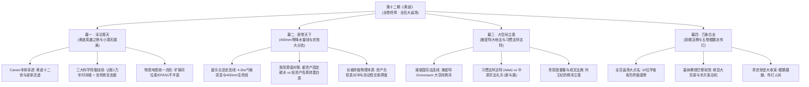

# 《三更道场》第十二期 · 黄道 · 全景大纲与分幕矩阵

> **栏目**：三更道场（深夜硬核学术闲聊·对账与系统审计）  
> **卷次**：卷五 ·《列王纪》· 终卷大结局（总第十二期 · 全书终章）  
> **本期定名**：**《黄道》**（The Ecliptic / 英雄之旅小周天大圆满 · 欧亚大陆终极合龙）  
> **主控司仪**：青衣（央视国字脸·李梓萌标准普·大轰炸遗孤三代后裔 · 掌舵全场）  
> **茶台肉身在场**：峨眉（川普·儒道双料叛徒）、乐山（重川话·古蜀考古老大哥）、渔阳（京片子·央财金融审计老炮儿）  
> **全员大返场阵容（全线接入）**：
> - **良渚**（浙江大学 · 分子人类学与古 DNA / 物质地质统一流形）
> - **盛乐**（内蒙古师范大学 · 北亚游牧史与 400mm 等降水量线）
> - **番禺**（中山大学 · 大气科学、季风洋流与古气候超算）
> - **琅琊**（中国海洋大学 · 物理海洋学与深海沉积地质）
> - **珞珈**（武汉大学 · 国际法与卡尔·施密特《大地法》）
> - **十渡**（中央民族大学 · 符号学与首声母初始字母理论）
> - **鸭川**（京都大学 · 东亚汉学与象雄古藏缅历史语言学）
> - **竹湖**（台湾清华大学 · 第一岛链地缘与南岛语族迁徙）
> - **紫金**（南京大学 · 地理信息与天文学史）
> - **塞纳**（巴黎索邦大学 · 比较语言学跨洋连线特邀学者）
> **录制时长预估**：约 240-280 分钟（4.5 小时史诗级全员大合龙）

---

## 【定名与立论破题】：为什么叫《黄道》？

1. **职业生涯（Career）与英雄之旅的圆满闭环**：
   - 第十一期破译了 Career 绝非西方所谓的“马车轨道”，而是太阳在【黄道十二宫】（The Ecliptic）上的完整巡天运转——历经磨难、回到原点、达成道家小周天的【大圆满】！
   - 十二期作为《三更道场》全五卷的最后一期，正是十二地支、黄道十二宫的终点与新生！
2. **天道黄道（天）与大地法（地）的物理咬合**：
   - 仰观天文（黄道吉日、岁差天极、北极星），俯察地理（昆仑矿脉、400mm 降水线、大湖退缩、等降水量线）；
   - 彻底打破西方象牙塔在空气中造出的“无地表悬空神话”，让全人类文明重归大地的物理重力与天道黄道秩序！
3. **“双眼做活”的世纪大合龙**：
   - 单眼是独眼龙，双眼才是活棋！东方与西方、农耕与游牧、碳水与蛋白质、玉石与青铜、语言与地质，在今夜达成全息平账！

---

## 【大纲骨架与学术矩阵】

---

### 【幕一 · 浑沦周天：从职业生涯到黄道十二宫的大圆满】（约50'）

#### 第一段：终卷开场定场诗 ·《七律 · 悼吕文焕》与【攻守之势异也】的终极独白

> **七律 · 悼吕文焕**  
> 樊城头七鬼门关，汉水招魂竖白幡。  
> 新月张弓满月射，少阳食甚老阳弯。  
> 石砲礼拜崩女墙，火铳上香祭佛龛。  
> 身登苦海无底船，崖山百年泪始干。  

##### 【作者心印 · 攻守之势异也与意象解构】
1. **从“攻城者”到“守城者”的悲壮立论（我比吕文焕难！）**：
   - **前十一章的攻城之势**：前面整整十一章，《三更道场》以摧枯拉朽的攻城者姿态，用多学科实证地质、语言同源、算盘审计与分子人类学，拿下一座又一座西方中心主义与传统旧史学的学术城池！
   - **第十二章的守城悲剧**：全书终章合龙，学术范式彻底立起，**我从“攻城者”变成了那个唯一的“守城者”**！樊城已被屠尽，襄阳隔汉水孤悬相望。不知会有多少权威、大拿、学阀架起“回回炮”（配重投石机）向我狂轰滥炸！
2. **日全食、食甚与老阳弯（日全食与学术霸权）**：
   - **食甚只是月亮**：天降日全食，无论哪个学术大拿携滔天声势而来，它终究只是一轮冰冷的月亮。它就算能在一瞬间将我全盘遮蔽（食甚），带来伸手不见五指的至暗时刻；
   - **老阳必出**：但当月亮继续东移的那一刻，烈日终将重现，老阳之数虽弯而不折，物理与真理的重力不可阻挡！
3. **石砲礼拜 vs 火铳上香（物理傲慢与决死回火）**：
   - **石砲礼拜崩女墙**：回回炮机械长臂如礼拜作揖，带着“物理学的傲慢礼节”轰塌我的女墙与城防；
   - **火铳上香祭佛龛**：那我就用火铳还你颜色！哪怕土制火铳威力孱弱，哪怕击发时的回火（backfire）在眼前炸出一团硝烟——**那这一阵硝烟，就当是我给自己上的这炷香！** 物理掩体碎了，心印与精神佛龛（宋恭帝萨迦寺青灯之宿命）永存！
4. **无底船与崖山百年（苦海渡劫与重光之志）**：
   - **身登苦海无底船**：我既然已经选择直面无边苦海，毅然登上这艘没有底子的船，进退皆是深渊；
   - **崖山百年泪始干**：那是因为我深知，哪怕经历崖山投海的彻骨沉沦，待到百年之后汉家河山与学术重光之时，这满腔的血泪与公道，终会在青史大账上彻底算清！

#### 第二段：黄道巡天与英雄之旅的本体穿透
- **青衣**击响惊堂木：以《悼吕文焕》定场，引出《三更道场》终卷序幕！从第一期《丹》到第十二期《黄道》，走过黄道十二宫一个大周天。
- **峨眉**（川普）：拆解 Career（黄道英雄之旅）与道家“炼精化气、炼气化神、炼神还虚”的小周天圆满。
- **渔阳**（京片子）：调侃全场嘉宾今夜在履历上画了一个最完美的“大圆圈”，拼多多最后一刀今晚终于彻底砍成！

#### 第三段：三大科学防御战线的终极巩固（良渚 & 十渡）
- **良渚**（浙大古DNA）：大方认账斯瓦迪士一万年“语言时间墙”与格林伯格美洲破产教训，坚决执行“资产减值计提”，绝不搞跨大洋无文字附会；
- **反手扣下终极扳机**：语言会半衰，但欧亚大陆的【物质与地质统一流形】绝不半衰！富铀铅同位素、EPAS1/FADS 基因代谢、大湖退缩地层永存！
- **十渡**（符号学）：把战线死死坐死在距今 2000-4000 年的【昆仑—于阗—喀什—龟兹—祁连—贵霜—兴都库什欧亚核心走廊】！吐火罗文、悬泉置汉简、梵文贝叶经铁证如山！

---

### 【幕二 · 席卷天下：400毫米等降水量线与农牧大分流】（约60'）

#### 第一段：盛乐连线——4.2ka 气候突变与 400 毫米等降水量线的物理锁定
- **盛乐**（内蒙古师大北亚史）：距今 4200 年前（4.2ka 事件），全球气候骤冷干旱，季风边缘急剧南退，**400 毫米等降水量线**化作横贯欧亚大陆的一把天工刻刀！
- **番禺 & 琅琊**（古气候与海洋超算）：太平洋 ENSO 循环与西伯利亚高压对撞，400mm 等降水量线不是人为划定的边界，而是太阳能量辐射与水汽通量的自然物理奇点。

#### 第二段：渔阳算盘审计——定居碳水 vs 移动蛋白质的两张资产负债表
- **碳水定居帝国（中原农耕）**：
  - **资产负债表特征**：超重资产（水利、城墙、农田开垦）、超长建设周期、极低周转率、固定资产折旧极其沉重；
  - **抗风险机制**：深挖仓储、宗法礼乐维系代际连续、税收权责发生制。
- **移动蛋白质政权（游牧列王）**：
  - **资产负债表特征**：极轻资产、零固定折旧、牛羊移动资产瞬时变现、高机动爆发与高周转率；
  - **致命弱点**：白灾（大雪封原）与黑灾（干旱草枯）导致流动性瞬间归零。

#### 第三段：长城的物理本质——两条资产负债表的对冲与流动性交割界面
- **渔阳 & 乐山**：长城从来不是防御蛮族的“封闭砖墙”，长城是**【欧亚大陆两种经济流形的流动性交割界面与清算中心】**！
- 关市互市：农耕帝国用多余的碳水（粮食、茶叶、布匹）吸收草原过剩的移动蛋白质与战马；长城烽燧是防止违约的清算保证金机制！

---

### 【幕三 · 大空间立基：施密特大地法与习惯法阿达特】（约60'）

#### 第一段：珞珈连线——卡尔·施密特《大地法》与 Grossraum（大空间）
- **珞珈**（武大法学院）：拆解施密特《大地法》（Der Nomos der Erde）。
- **Nomos 的三重本义**：占取（Nehmen）、分配（Teilen）、生产（Weiden）——法律不是法学家的纸面条文，法律是大地被划分、占取与耕作的物理印记！
- 欧亚大陆的 Grossraum（大空间秩序）：从游牧列王的大转场草场确权，到中原天子的分土封侯，全是基于大地的空间划分。

#### 第二段：习惯法“阿达特”（Adat） vs 中原宗法礼乐（席与刀）
- **峨眉 & 盛乐**：
  - 草原习惯法**【阿达特】（Adat / 习惯与血酬）**：以战刀、血亲复仇与均分继承为核心，适应极端游牧环境；
  - 中原宗法礼乐**【席与鼎】**：以嫡长子继承、周礼封建、礼不下庶人刑不上大夫为核心；
  - 两种法律体系在 400mm 等降水量线上的千年激荡、互渗与对账。

#### 第三段：青铜度量衡与成文法典——列王立鼎的秩序奠基
- **乐山 & 渔阳**：
  - 为什么列王要铸九鼎？！鼎不仅是祭祀礼器，**鼎是度量衡的标准器、是律法公布的成文法典（如子产铸刑鼎）！**
  - 青铜鼎铸造了标准的斗、斛、权、衡，把商业信用、法律条文与神权统治永久熔铸在金属之上。

---

### 【幕四 · 万象合龙：全员大返场与五卷鲲鹏志传灯】（约60'）

#### 第一段：十位学者全员返场大连线（各亮一张终极底牌）
- **良渚**：亮出古 DNA 与高原高脂代谢铁证；
- **盛乐**：亮出北亚草原三千年转场路网；
- **番禺 & 琅琊**：亮出黑潮深海沉积岩心与季风超算模型；
- **珞珈**：亮出欧亚大陆法与海洋法的大空间权责大账；
- **竹湖**：亮出第一岛链南岛语族万年航海基因与玉石对流；
- **十渡**：亮出词源宝库（Treasury）与欧亚林奈演化树；
- **鸭川**：亮出东亚汉字音韵与象雄梵汉古卷；
- **紫金**：亮出黄道二十八宿与北极天极历法星图；
- **塞纳**（巴黎）：代表法兰西学界向东方致敬，宣布正式开启欧亚跨洋联合课题！

#### 第二段：主理人茶台终极合龙与《鲲鹏志》传灯
- **乐山**（重川话）：古蜀金沙、三星堆与欧亚大通道彻底打通，老大哥满饮盖碗茶；
- **峨眉**（川普）：道法自然，弱者道之用，五卷大账终归于清净天道；
- **渔阳**（京片子）：啪地合上算盘，“账平了！五千年欧亚大账，借贷两清，分毫不差！”；
- **青衣**（标准普·国字脸·庄重传灯收束）：
  - 击响惊堂木，定场诗与全剧终极大对账合龙；
  - 宣布《三更道场》第一季（全五卷 · 12 期）圆满收官；
  - “夜游宫尽，天光大白；鲲鹏展翅，水击三千；五卷大账，传灯人间！”
- **终卷终极散场诗**：（待后续撰写压轴）

---

## 【各幕角色登场与戏份配比表】

| 幕次 | 核心议题 | 主角与登场阵容 | 预计时长 |
|---|---|---|---|
| **幕一** | 浑沦周天：Career黄道、时间墙防御与物质地质流形 | 青衣、峨眉、渔阳、良渚、十渡 | 50 min |
| **幕二** | 席卷天下：4.2ka气候突变、400mm线与农牧资产负债表 | 青衣、盛乐、番禺、琅琊、渔阳、乐山 | 60 min |
| **幕三** | 大空间立基：施密特大地法、习惯法阿达特与列王立鼎 | 青衣、珞珈、盛乐、峨眉、乐山、渔阳 | 60 min |
| **幕四** | 万象合龙：全员大返场、十方对账与鲲鹏传灯终章 | **全员 11 位学者全部在线返场** + 青衣主理 | 60 min |
| **总计** | **全卷终章史诗大结局** | **全员集结，天地合龙** | **230 min** |
