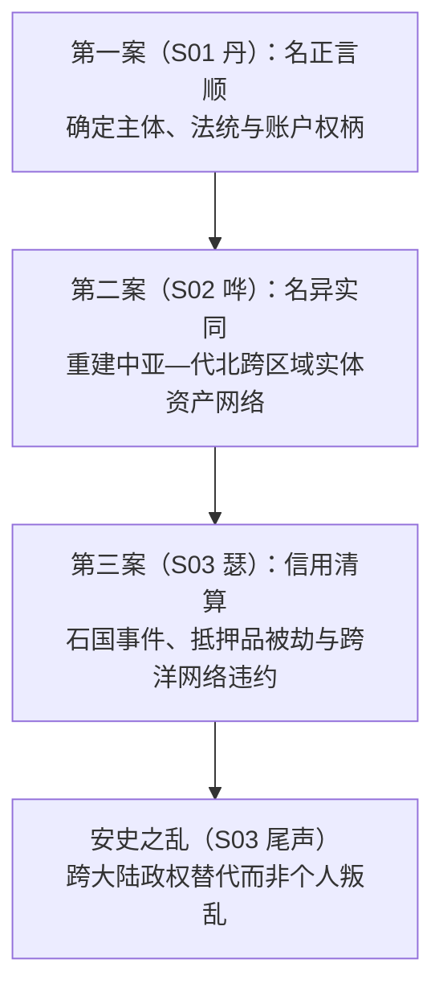

# 《三更道场》认识论总纲 · 历史会计审计系统与连续记账公理

> **版本**：v1.0（方法论正典 · 核心审计原则）  
> **核心命题**：**《三更道场》不是每期找惊人翻案，而是在逐期安装一套“历史会计审计系统”。**  
> **底线公理**：文字可以迁移，但不得无痕迁移；名称可以改变，但不能把改名后的账户倒写成亘古以来的实体。任何改名、转义和主体迁移都必须留痕——否则历史学连最基本的连续记账资格都没有！

---

## 一、三案递进链与系统依赖关系

### 1. 第一案（S01 · 丹）：建立“名”的法权与账户主体
- **误区**：以为丹只是矿物颜色，《道德经》只是哲学书名，大礼议只是伦理争执。
- **审计底单**：
  - 名称不是贴在事物表面的便利标签，而是确定主体、产权、法统和责任归属的**账户名称**。
  - **大礼议的本质是国家最高账户的主体变更**：嘉靖以谁的儿子身份继承？兴献王能否追尊入帝统？武宗法统如何结清？名一改，宗庙、官位、财政和利益分配全盘重置。
  - **“名具有实际执行力”**——这是全剧安装的第一条会计原则。

### 2. 第二案（S02 · 哗）：名异实同与跨中亚—代北实体网络
- **误区**：以为嚈哒是凭空冒出的“白匈奴”，大同与中亚毫无瓜葛，河西四镇与东北做生意是“偶然”。
- **审计底单**：
  - 嚈哒是拓跋鲜卑与柔然博弈中分化、迁出的同源力量；工匠、宗教、服饰、货币与制度发生远距离传导。
  - **拒绝将高频联系核销为偶然**：如果遥远节点长期存在高频交易、共同称号、婚姻协作，首先应怀疑我们错误切分了会计主体，必须编制“合并报表”。
  - 这一案建立的是**跨区域实体资产与信用网络**。

### 3. 第三案（S03 · 瑟）：石国不是抢劫，而是跨大陆信用崩塌
- **误区**：以为高仙芝只是在西域边境抢了几斛宝石，边令诚一句谗言冤杀了名将。
- **审计底单**：
  - 唐朝以国家信用招降，高仙芝违约杀降并劫掠抵押品（瑟瑟）；
  - 战利品入权贵内库，石国向周边共同体申诉，葛逻禄等节点重估唐朝履约信誉；
  - 边镇军事集团按自身生存与收益重新选边，引爆安史之乱的“政权与网络替代”。
  - 高仙芝之死是**跨境交易违约与信用崩塌责任人的必然清算**。

---

## 二、历史账簿的主数据审计规范（Master Data Governance）

| 允许发生 | 必须留下的过账记录（Audit Trail） |
| :--- | :--- |
| **异名同指** | 同一对象的地理、时代和外部对音记录 |
| **同名异指** | 各自出现的时间戳与主体边界划分 |
| **音转** | 可说明的音变方向及中间形式（音韵学声阻抗） |
| **改字** | 版本、年代或政治动机底单 |
| **改族名** | 谁命名、谁接受、适用于什么人口 |
| **改国号** | 权力交接与法统声明的资产负债表结清 |
| **后世追称** | 必须与当时自称分栏独立记录 |

---

## 三、方法论反思与认识论纪律

> **“删掉第一案的名学，第二案就像谐音学；删掉第二案的网络，第三案就像阴谋论；删掉第三案的信用崩塌，安史之乱又会退回几个胖胡人和昏君奸臣的宫廷故事。”**

《三更道场》拒绝文科叙事在对自己有利时按“实质入账”，在遇到不合范式时按“其他科目”核销。**历史学必须遵守连续记账原则，任何主体变动与信用交割，皆有账可查！**
