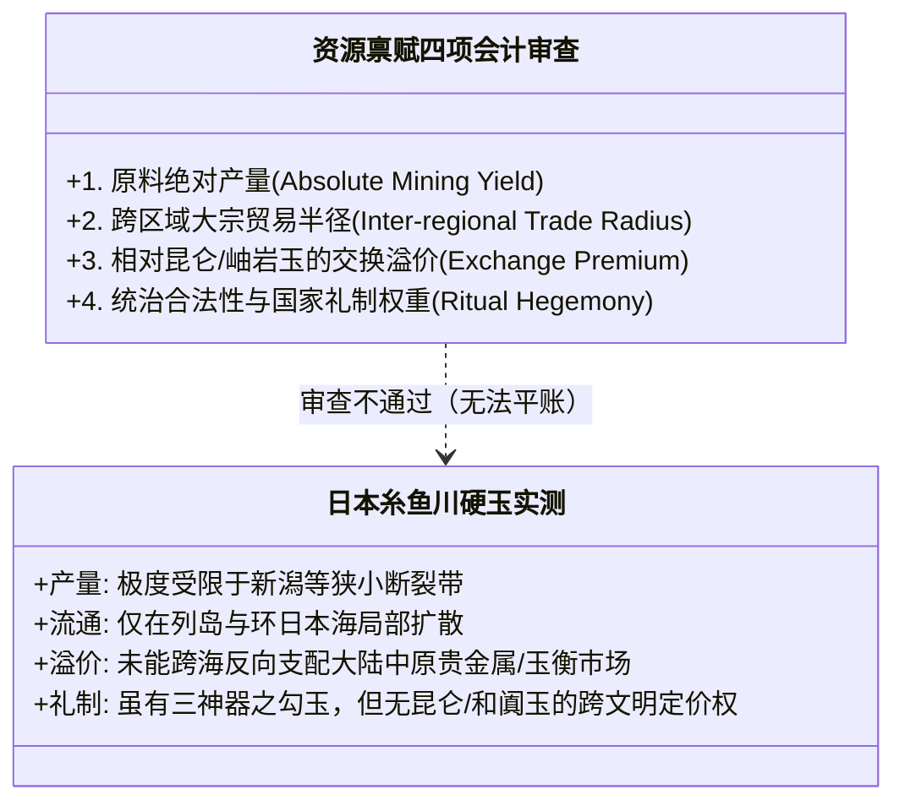
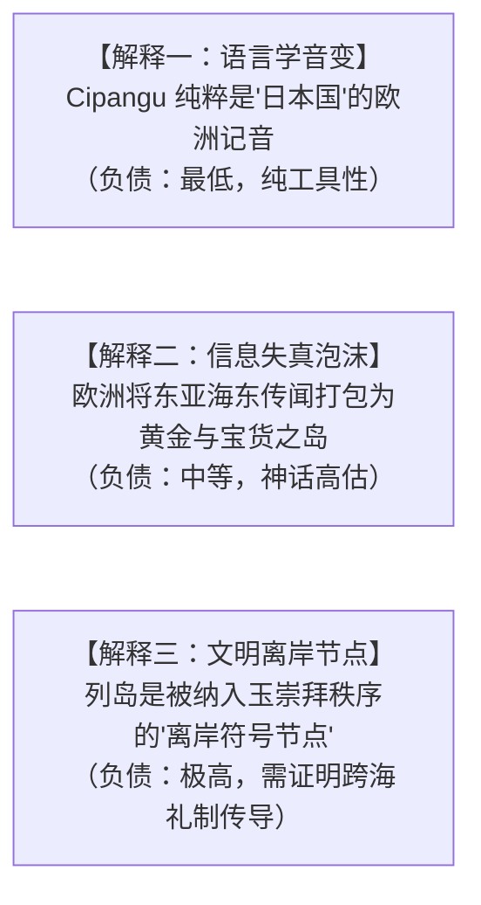

# 《三更道场》认识论总纲 · 文献学与历史会计审计：Cipangu / 日本国名与“玉之邦”离岸符号审计

> **版本**：v1.0（东亚名物资产与跨海传播符号学专项审计）  
> **核心命题**：**严禁用“日本本土出产硬玉（糸鱼川）”去强行解释并平账“玉之邦”！日本硬玉的存在只是“局部存货证明”，绝不能支撑跨文明的“高估值法定名号”。“Cipangu / Japan”在名实审计上呈现三层会计形态：语言学转写（低负债）、财富神话高估（信息失真）、以及“玉崇拜网络中的离岸符号节点（高负债）”！**

---

## 一、双轨传播史：Cipangu 与现代 Japan 的源流拆分

```mermaid
flowchart TD
    subgraph 传播轨一：马可波罗文本与黄金神话
        M1["南方官话/吴语：【日本国】（*Ži-pən-gwo / Jih-pun-kuo）"] --> M2["《马可·波罗游记》：Cipangu / Zipangu"]
        M2 --> M3["【欧洲财富想象】：黄金屋顶、黄金地砖、珍珠宝石之岛（高估值泡沫报表）"]
    end

    subgraph 传播轨二：东南亚海路贸易与现代拼写
        S1["闽南语/客家话：【日本】（*Jit-pun）"] --> S2["马六甲/马来语海商：Japang / Jepang"]
        S2 --> S3["大航海葡萄牙语：Japão / Giapan ➔ 英语：Japan"]
    end
```

### 1. 拒绝单一线性祖本的偷渡
- 英语 **Japan** 并不完全线性派生自马可·波罗的 **Cipangu**，而是由**印度洋—南洋海路贸易网络（马来语 Japang ➔ 葡语 Japão）**独立塑造；
- 《马可·波罗游记》负责为欧洲提供“极东黄金财富岛”的**无形商誉神话**，而海路贸易负责提供**现代拼写的实际流通介质**。

---

## 二、“玉之邦”为什么在本土矿物学上“账面不平”？

> [!IMPORTANT]
> **存货证明 $\neq$ 估值证明 $\neq$ 命名权来源！**  
> 必须对日本硬玉进行严格的“四项会计排他性审查”：



- **本土硬玉事实**：日本新潟糸鱼川（Itoigawa）确有硬玉翡翠，绳文时代已加工勾玉，现代更定为“国石”；
- **历史会计审计穿透**：
  - 这只能证明**“列岛存在古老玉文化残余”**；
  - 它在产量、跨文明贸易结算权、以及对东亚大宗现货市场的定价能力上，**完全无法与“昆仑—和田玉”或“东北亚岫岩/小南山玉网”相提并论**！
  - 企图用“日本自己有玉”来论证“因此得名玉之邦”，是典型的**以局部存货冒充全境内生禀赋的做假账行为**！

---

## 三、三层解释模型的负债结构



| 解释模型 | 理论主张 | 证据负担 | 会计定性 |
| :--- | :--- | :--- | :--- |
| **1. 纯音变模型（日本国）** | Cipangu = 日本国（Jih-pun-kuo）之转写 | 最轻（符合历史比较语言学对音公理） | **低负债基准科目** |
| **2. 异邦模型（外部他者）** | “异邦”指示海东未知之国与朝贡外围 | 极低（表达外部视角，无物质证明负担） | **安全表外科目** |
| **3. 玉之邦（离岸符号节点）** | 列岛接收了大陆玉礼制（勾玉/三神器），成为东亚玉文明网络的东部边缘节点 | 极高（必须将日本放回“昆仑—东北亚水网—火山岛链”总账） | **高负债挑衅性命题** |

---

## 四、终极名实审计方法论结案

> **“国名可能保存了一项已经破产、或被后世误记的文明资产；而现代民族国家再用后来的国界替它追认产权。”**  
> 如果坚持“玉之邦”的深层暗线，正确的审计切入点从来不是证明“日本多产玉”，而是证明：**日本列岛作为东亚古老水生玉文明网络的最东端离岸节点，继承了玉礼制的表层符号（勾玉），却从未掌握核心玉料与定价权！**  
> 这正是《三更道场》“名、实、账”三位一体方法论对东亚名物学实施的又一次标准审计！
