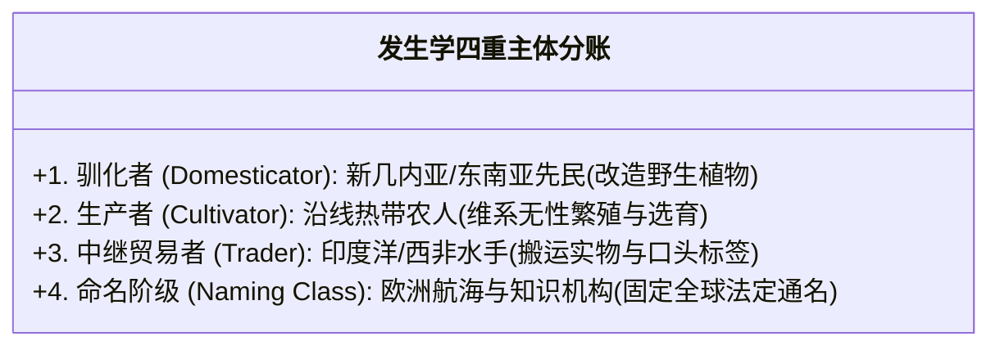
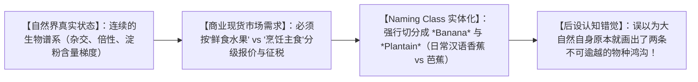

# 《三更道场》认识论总纲 · 文献学与历史会计审计：Naming Class（命名阶级）与“香蕉/芭蕉”分类学账簿穿透

> **版本**：v1.0（知识社会学与植物大宗现货命名权终极审计）  
> **核心命题**：**严禁将“欧洲殖民海商最后一次接货的贸易接口”，做假账倒写为“植物本身的发生与驯化原乡”！新几内亚库克沼泽考古证实香蕉早在 7000 年前已被独立驯化栽培；现代英语将 *banana* 归为西非沃洛夫语借词，仅记录了欧洲航海商业机构的提货单据；【发生者（驯化）、生产者（栽培）、传播者（中继海商）与 Naming Class（命名阶级/定名建制）】是四个完全不同维度的历史主体！现代知识系统最隐蔽的假账，就是用 Naming Class 留下的提货发票，冒充大宗现货自身的出生证明！**

---

## 一、四本账的严格拆分：驯化、栽培、中继与定名

```mermaid
flowchart TD
    subgraph 账目一：植物发生与驯化原乡
        A1["【美拉尼西亚 / 新几内亚库克沼泽】<br/>（7000 年前考古植物学实证：独立驯化栽培早期香蕉）"]
    end

    subgraph 账目二：区域性具体栽培型演化
        A2["【岛屿东南亚 / 印度洋水网】<br/>（种间杂交、多倍性、鲜食型与淀粉烹饪型分化）"]
    end

    subgraph 账目三：跨大洋中继贸易网络
        A3["【西非海岸 / 印度洋海商】<br/>（大宗现货转运中继站 / 区域性贸易标签）"]
    end

    subgraph 账目四：Naming Class 全球通名固定
        A4["【欧洲航海、商业与植物分类学建制】<br/>（将'最后接货地点'的临时标签写入词典与航海图，升格为全球 class name）"]
    end

    A1 --> A2 --> A3 --> A4
    A4 -. 传统史学严重偷换概念：用 A4 冒充 A1 .-> A1
```

### 1. 传统知识体系的偷换概念假账：
- **混淆接口与原乡**：语言学词典标注“*banana* 可能经西非沃洛夫语进入欧洲”；
- **做假账滑坡**：教科书便顺理成章地将这一词源线索，倒写为“香蕉起源于西非”；
- **历史法医学穿透**：这相当于**某跨国超市在西非码头提了货并在报关单上盖了章，后世审计师便把这家超市的提货单据，当成了该作物的造物主发票**！

---

## 二、Naming Class（命名阶级）的权力运作机制



### 1. 什么是 Naming Class 的本质？
- 它们不从事体力驯化与农业生产；
- 它们掌握**将局部口头称呼写入航海图、报关单、植物分类学与词典系统的垄断权力**；
- 它们把**“我在哪里第一次看见/接货”**，制度化为**“全人类必须统一使用的标准类名（Class Name）”**！

---

## 三、“香蕉（Banana）”与“芭蕉（Plantain）”的商品分类学人造割裂



- **商品分类伪装成自然分类**：
  - *Banana* 与 *Plantain* 不是生物学上绝对断裂的两个物种，而是**市场为了报价、储存、关税与用途分级，由 Naming Class 人为裁切出来的离散商品类别**；
  - 市场分类随后被林奈式植物学和世俗词典重新实体化，倒过来统治了人类对自然界的认知。

---

## 四、文献学审慎：李清照《如梦令》“绿肥红瘦”的文本法医核销

> [!CAUTION]
> **严禁仅凭直觉将文学传世文本中的明确指代强行偷换！**  
> 必须由古代文学与版本学 Agent 严格出具句法排他性底单：

- **《如梦令》传世句法证据**：
  $$\text{“试问卷帘人，却道海棠依旧。知否，知否？应是绿肥红瘦。”}$$
- **审计结论**：
  - “绿肥红瘦”紧承上一句唯一出现的植物**“海棠”**，语法上明确指代“海棠叶茂（绿肥）而残花凋落（红瘦）”；
  - 在缺乏更早版本异文或宋代词话反向证据的前提下，**严禁为了理论的漂亮，将海棠强行改账为芭蕉**！
  - 保持历史会计学的纯粹与诚实：**不合文本者，坚决冲销！**

---

## 五、全剧认识论总闭环方程

> **“发生者改造自然，生产者维系生命，中继者搬运现货，而 Naming Class 垄断通名。”**  
> 《三更道场》的历史会计审计，就是要彻底剥离 Naming Class 在近代世界体系中伪造的虚假发票，将全人类文明的每一笔资产与名物，原原本本地归还给那些在土地与海洋上真正付出过劳作与智慧的发生学原乡！
