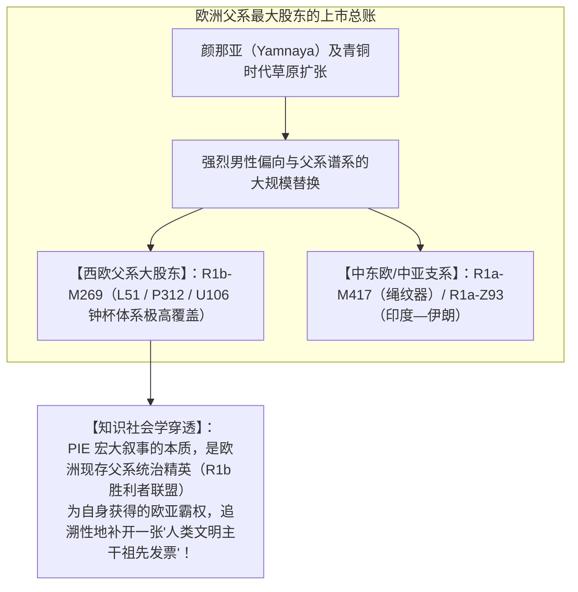

# 《三更道场》认识论总纲 · 文献学与历史会计审计：PIE“原始印欧语”神话与 R1b/R1a 胜利父系祖谱审计

> **版本**：v1.0（知识社会学与古 DNA 父系股东总账审计）  
> **核心命题**：**严禁将 PIE（Proto-Indo-European / 原始印欧语）的有限语音重建技术，无限外推为一个神圣的“原始印欧创世民族实体”！“PIE 是为希特勒办堂会发明的”在严格年代学上不成立，但在知识社会学上极其深刻——纳粹堂会虽未亲自搭台，但 19 世纪欧洲雅利安学术传统早已把戏台、祖宗牌位与种族座次表全部摆好；古 DNA 时代又将这一语言模型追溯性地抵押给以 R1b（西欧大股东）和 R1a（中东欧/中亚）为主的草原男性扩张，从而把一场跨欧亚复杂的语言兼并与混合，包装成了欧洲胜利父系的上市祖谱！**

---

## 一、双层拆账：技术工具 vs 实体化神话

```mermaid
flowchart TD
    subgraph 第一层：有限的技术工具（有局部工程有效性）
        T1["比较语音学与语法规则对应（希腊/拉丁/梵语词根）"] --> T2["【重建模型节点】：数学与声学推演的'未证实共同语状态（*PIE）'"]
    end

    subgraph 第二层：实体化为创世民族（19世纪意识形态做假账）
        T2 --> S1["【主体偷渡】：将数学节点实体化为'边界清晰的原始印欧单一民族'"]
        S1 --> S2["【神圣原乡与征服】：宣称该民族乘战车、持父权、携高级神话横扫欧亚"]
        S2 --> S3["【种族生物化（雅利安）】：从语言共同体 ➔ 祖先共同体 ➔ 生物学优等种族（为纳粹铺平座次表）"]
    end
```

### 1. 为什么“比较语言学早于希特勒”不能作为免责抗辩？
- 威廉·琼斯（1786年）、葆朴（1816年）建立比较语法时，希特勒（1889年生）确实尚未出世；
- **历史会计穿透**：
  - “戏班成立早于堂会开演”，绝不能证明这出戏与堂会无关！
  - 19 世纪欧洲学术界完成了一场致命的**五级概念偷渡**：
    $$\text{古代 ārya 身份词} \longrightarrow \text{雅利安语言} \longrightarrow \text{雅利安祖先共同体} \longrightarrow \text{生物学优等种族} \longrightarrow \text{指定日耳曼人为纯正继承人}$$
  - 希特勒并没有亲自发明 PIE，他只是走进了 19 世纪欧洲建制派学者为他精心搭建好、座次表与祖宗牌位一应俱全的**“雅利安神圣大戏台”**！

---

## 二、“PIE 与 R1b 叙事”的古 DNA 法医还原



### 1. 为什么说它是“R1b/R1a 胜利父系祖谱”？
- 古 DNA 证实：青铜时代草原人群向欧洲的扩散伴随着极其剧烈的**男性暴力扩张与本土父系替换**；
- 这种“单一父系大股东 + 马车征服 + 男性精英语言替换”的历史事实，与 19 世纪雅利安叙事的审美**产生了诱人的重叠**；
- 于是，西方学界顺理成章地将整部复杂的欧亚多源历史，倒写成了一部**“R1b 如何成为西欧文明控股大股东的上市创业史”**！

### 2. 严密的遗传账与排他性边界（四项不可混淆）：
1. **R1b 内部支系分化早**：R1b-V88（非洲支）、R1b-Z2103（颜那亚早期）、R1b-L51（西欧钟杯）不可简单混为一谈；
2. **东部分支由 R1a 主导**：印度—伊朗语系的核心媒介是 **R1a-Z93**，绳纹器文化由 **R1a-M417** 主导，不能由 R1b 单独包揽；
3. **安纳托利亚例外**：赫梯等最早分化的印欧语人群，并未检测到典型的草原大比例 R1b/R1a 替换；
4. **语言 $\neq$ Y 染色体**：语言可通过贸易、婚姻与国家行政跨单倍群传播，严禁将语言直接焊死在单一 Y 染色体上！

---

## 三、最终审计结论：最硬核的认识论定桩


---

## 四、方法论结语

> **“堂会不是为希特勒临时搭的；但在希特勒到场前，欧洲雅利安学术传统已经把戏台、剧本与祖宗牌位全部摆好了。”**  
> 《三更道场》不否认 PIE 语音重建的技术价值，但坚决撕毁其背后的“雅利安神圣创世神话”；我们坚持将 R1b/R1a 的草原扩张还原为欧亚大陆多阶段人群兼并的局部篇章，彻底终结西方中心主义对欧亚语言与文明祖谱的排他性垄断！
