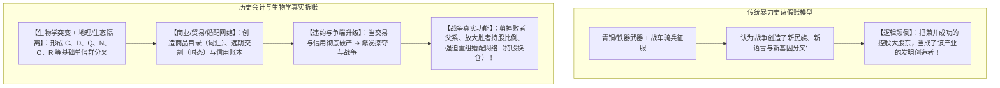
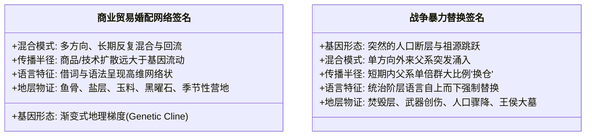

# 《三更道场》认识论总纲 · 文献学与历史会计审计：分子人类学分叉机制与“战争修剪论”

> **版本**：v1.0（演化生物学与历史会计破产清算专项审计）  
> **核心命题**：**战争本身绝不可能制造分子人类学意义上的“原始基因分叉”！突变来自生物学随机发生，稳定支系来自地理隔离与婚配网络的分离；战争的本质是“高成本违约后的暴力重组与持股修剪（Pruning & Re-allocation）”！商业、交换与结算网络才是人类语言、语法、信用乃至人群分流的真正主干母网；战争只是电影最后十分钟的暴力清算镜头！**

---

## 一、破除“战争推动进化与语言分叉”的英雄史诗假账

### 1. 为什么说“战争无法凭空生产单倍群”？
- 单倍群的深层分叉（如 C、D、Q、N 等），发生在**远早于国家战争、职业军队与大规模军事后勤的晚更新世至新石器早期**；
- 战争无法创造基因突变，它最多执行三项**“资产重组与清算职能”**：
  1. **剪掉既有支系**（战败男性被屠戮或失去婚配权）；
  2. **放大既有支系**（胜方男性利用特权获得超额繁殖权，形成星状爆发）；
  3. **强迫支系换仓**（掠夺女性、迁徙聚落、自上而下强推统治者语言）。

---

## 二、战争的前提依赖：战争是昂贵的“破产清算状态”

战争绝不可能是进化的源头与主线，因为**发动一场战争所必需的全部制度与物质工具，全都是商业与结算网络长期演化后的产物**！

- **战争的期初资产负债表依赖**：
  - 发动战争前必须有：剩余产品、粮食运输网络、金属冶炼标准、动员命令、债务封赏分配、以及**让陌生士兵能够协同行动的精密语言**！
  - 战争无法解释语言与信用的起源，**因为战争本身极度依赖这些已有的资产**！

---

## 三、两种演化机制的“古 DNA 与地层法医签名”对比

> [!IMPORTANT]
> **严禁把商业网络的渐变流形，强行归因于一次性的铁蹄横扫！**  
> 必须由古 DNA 与田野考古 Agent 严格区分以下两种截然不同的地层签名：

---

## 四、认识论总结案

> **“战争容易被看见，是因为战争留下了王侯大墓、青铜兵器、焚毁层和英雄史诗；而商业与结算网络留下的却是鱼骨、海盐结晶、航道、混合词汇与分散婚配，必须靠全方位的历史会计对账才能还原。”**  
> 所谓“铁马冰河”，不过是人类文明大片最后十分钟的暴力高潮；真正让人群分叉、繁衍、并赋予语言全部意义的，是此前在欧亚海湖大地上静静运行了数万年的商业清算母网！
