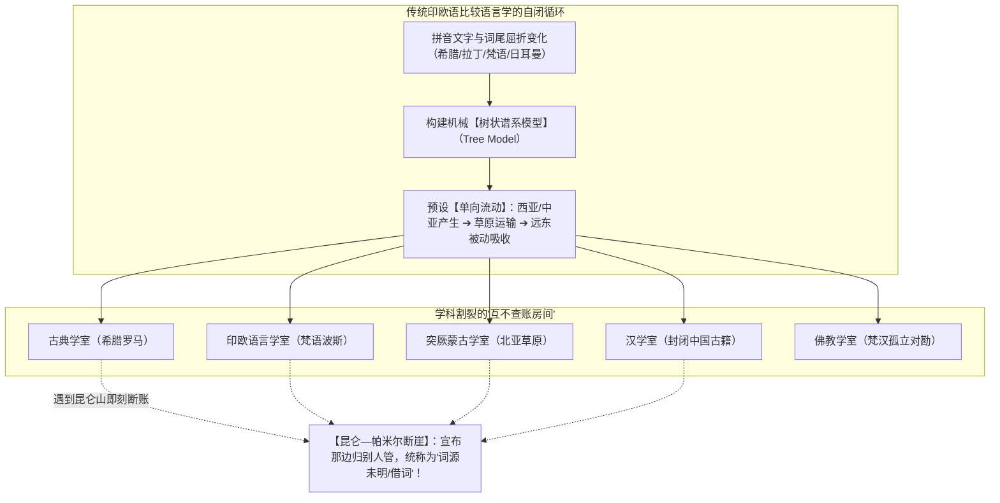
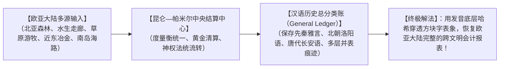

# 《三更道场》认识论总纲 · 文献学与历史会计审计：发音“底层哈希”与西方历史语言学“昆仑断账”清算

> **版本**：v1.0（历史语言学学科假账穿透与欧亚结算中心审计）  
> **核心命题**：**发音是文明迁徙与人群重组中最难被彻底篡改的“底层哈希（Underlying Hash）”！西方历史语言学之所以长期将汉语排除在欧亚大陆同源流形之外，并非单纯由于政治偏见，而是其“拼音文字工具偏好 + 谱系树机械模型 + 学科房间割裂 + 单向西方中心预设”造成的系统性结构假账！昆仑—帕米尔不是东西方语言的边界，而是整座欧亚大陆的【语言与法统结算中心】；汉语不是被动吸收的静态终点，而是一本完整记录了数千年跨文明兼并与并购的【动态总分类账（General Ledger）】！**

---

## 一、为什么“发音（Phonetics）”是文明最底层的哈希值？

```mermaid
flowchart TD
    subgraph 上层表记的易变性（可被人为篡改与重新编码）
        W1["文字字形（偏旁增删 / 汉字转写）"]
        W2["官方训诂（史官修辞 / 伦理化解释）"]
        W3["族群定名（胜者命名 / 削足适履）"]
    end

    subgraph 底层哈希的不可磨灭性（口耳相传的声学骨架）
        H1["【发音底层哈希】：声学共振、辅音骨架、声阻抗流形（如 Sun / 隼 / S-M / K-L）"]
    end

    W1 -. 掩盖但无法消灭 .-> H1
    W2 -. 掩盖但无法消灭 .-> H1
    W3 -. 掩盖但无法消灭 .-> H1
    
    H1 --> RES["【审计功能】：发音是打开被异体字、假借字与现代民族主义锁死之门的【唯一解构钥匙】！"]
```

### 1. 发音的四项会计审计原则：
1. **发音是钥匙，不是判决书**：仅凭发音相似不能直接宣布同源，但发音是刺破文字掩盖、启动法医级调查的**第一入口**；
2. **文字的双重性（保存 vs 遮蔽）**：汉字在保存意义的同时，由于统一字形，把不同历史时期、不同族群输入的多层语音压制在同一个方块字之下；
3. **识别重新配字**：许多汉字（如“隼”、“哗”、“瑟”）是后世政权对更早存在的口头神圣声音（如 *sun*, *var*, *sir*）进行的**事后汉字表记与伦理化修剪**！

---

## 二、西方历史语言学的“四大假账与房间隔离”



### 1. 假账一：拼音文字与谱系树工具偏见
- 西方语言学工具习惯于处理具有明确词尾屈折、拼音记录的材料；
- 面对汉字“表意为主、多语地层叠置”的复杂流形，其机械谱系树工具彻底失效，于是**将自身工具的无能，归咎于汉语的“孤立与无关”**。

### 2. 假账二：学科隔离导致“在昆仑山脚下集体断账”
- 古典学、印欧学、突厥学、汉学与佛教学各自闭门造车；
- **昆仑山与帕米尔高原原本是欧亚大宗现货与神权流转的中央清算中心，却被五门学科硬生生切成了互不连通的学科边境**！每一门学科追到帕米尔山脚下便停止对账！

### 3. 假账三：预设借贷方向的单向神话
- 预先设定了“西方/中亚为源头，中国为被动接收终点”的借贷方向；
- 绝不承认东方（华夏、东北亚水生文明、北亚草原）曾经反向塑造过中亚、近东乃至早期地中海的语言、度量衡与王权制度！

### 4. 假账四：将“汉语”偷换为单一封闭主体
- 错误地将 5000 年来不断吸收鲜卑、突厥、粟特、通古斯、百越等多元族群的动态多层语言系统，简单粗暴地打包成一个单一名词“Chinese”；
- 这相当于**把几十家跨国并购公司的账目合并后，对外宣称“历史上从来只有这一家原始小作坊”**！

---

## 三、重置欧亚语言清算中心：昆仑为总账，汉语为合并报表



---

## 四、方法论总结案

> **“西方语言学在昆仑山止步，不是因为昆仑那边没有文明，而是因为他们的算盘算不清昆仑这本包罗万象的万年总账！”**  
> 《三更道场》坚持以“发音底层哈希 + 上古音地层学 + 物理度量衡 + 历史制度演进”四维一体，彻底打破学科割裂与西方中心单向神话，重新将昆仑推回欧亚大陆文明清算中心的王座！
