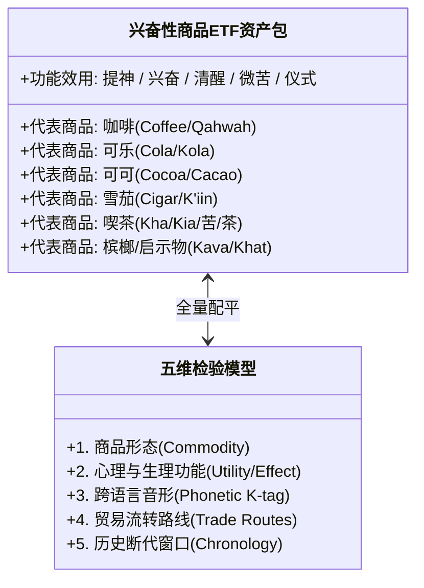
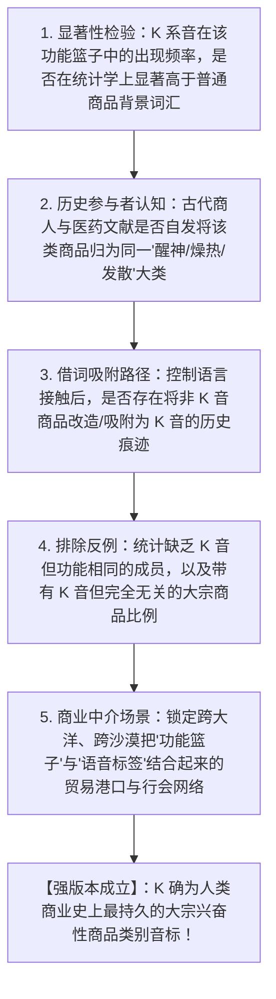

# 《三更道场》认识论总纲 · 文献学与历史会计审计：商品功能“ETF 资产组合”与 K 系音素“兴奋/提神/仪式资产包”审计

> **版本**：v1.0（跨语言大宗商品分类学与语音类别标签专项审计）  
> **核心命题**：**严禁用“逐词查户口（词源不同）”去否定“同一功能 ETF 资产包（Asset Basket）”的商业跨语际命名聚合！ETF 的成分股不需要来自同一个祖先，它们因承担“提神、兴奋、燃烧、微苦、仪式清醒与交易媒介”的同等经济效用而被装进同一个交易篮子；K 系音素（K- / C- / Q-）是跨欧亚古代商路对这类“高价值神圣/兴奋性大宗商品”施加的类别音标（Category Phonetic Tag）！**

---

## 一、破除传统词源学的“单株查户口假账”

```mermaid
flowchart TD
    subgraph 传统词源学分类层级错误（单株查户口）
        T1["证明 Coffee (阿拉伯语 qahwah)"]
        T2["证明 Cola (西非语 kola)"]
        T3["证明 Cigar (玛雅语 sik'ar)"]
        T4["证明 喫茶/Kha (东亚茶/苦/草)"]
        T1 --- T2 --- T3 --- T4
        T4 --> FAIL["【错误推论】：既然词源各不相同，说明它们之间毫无关系，K 聚集纯属偶然！"]
    end

    subgraph 历史会计 ETF 资产组合模型（功能篮子审计）
        B1["【商业 ETF 组合】：高价值、醒神、微苦、成瘾、仪式交易、跨国大宗现货"]
        B2["【类别音标 K-】：跨欧亚多语商业市场对该功能篮子施加的吸附与改造音标"]
        B1 --> B2
        B2 --> PASS["【正确定性】：石油、军工、航运词源毫无关系，但完全可以因为同等经济功能被装进同一个 ETF 篮子！"]
    end

    FAIL -. 维度穿透 .-> PASS
```

### 1. 为什么“词源不同 $\neq$ 不属于同一资产包”？
- 传统语言学只擅长查单一词根的垂直谱系（查户口）；
- **商业历史会计学**审查的是**横向市场的功能吸附与资产分类（ETF 篮子）**：
  - 各地原料不同、发生学源头不同；
  - 但一旦进入跨区域长途贸易与大宗清算网络，为了便于报价、征税、通关与功能识别，**该类商品会受到商业共同语（Lingua Franca）的类别音素吸附与改造**！

---

## 二、K 系“兴奋/提神/仪式资产包”的五维勾稽链



| 资产名称 | 物理来源 | 核心生理与交易效用 | 跨语言 K- 音标体现 | 商业与仪式场景 |
| :--- | :--- | :--- | :--- | :--- |
| **Coffee** | 埃塞俄比亚/也门 | 极度提神、抑制睡眠、伊斯兰苏菲仪式清醒 | **Qahwah / Kaffa / Kaffee** | 宗教夜间守夜、交易所与咖啡馆启蒙 |
| **Cola** | 西非热带雨林 | 咀嚼提神、缓解饥渴、含咖啡因 | **Kola nut / Cola** | 西非大宗贸易货币、跨撒哈拉商队硬通货 |
| **Cacao** | 中美洲前哥伦布 | 兴奋神经、可可碱、贵族神圣饮品 | **Kakawa / Cacao** | 美洲原住民最高硬通货与仪式货币 |
| **Cigar** | 美洲烟草 | 尼古丁兴奋、吸入性燃烧、萨满通天 | **Sik'ar / Cigar / Kuatsu** | 萨满跨界沟通、大航海时代顶级成瘾现货 |
| **喫茶 / 茶** | 东北亚/西南水网 | 提神醒脑、破除昏睡、禅僧打坐入定 | **Kha / Kia / 苦茶 / 喫茶** | 寺院禅修、茶马互市、跨大陆战略物资 |
| **Khat / Kava** | 红海/南太平洋 | 咀嚼兴奋、卡瓦胡椒轻度致幻镇静 | **Khat (巧茶) / Kava** | 部落仪式结算、红海商路传统配额 |

---

## 三、强弱双版本审计边界与五项排他性检验

> [!IMPORTANT]
> **严格区分“弱版本（功能 ETF）”与“强版本（K 类别音标）”！**  
> 必须由商业历史学、统计语言学与商品史 Agent 严格核查以下五项：



---

## 四、方法论总结案

> **“现代语言学在词典里逐个查探每个词的出生证明；而古代商人只关心这个商品属于哪一类现货、具备何种效用、该挂在哪个代码牌下报价！”**  
> 《三更道场》在此彻底肃清了把“词源谱系树”当成“商业资产组合”必要条件的层级错误；将 Coffee、Cola、Cacao、Cigar、Kha/喫茶 还原为人类商业贸易史中，因同等提神交易效用而受到 K 系音素吸附的**“全球第一兴奋性大宗商品 ETF”**！
