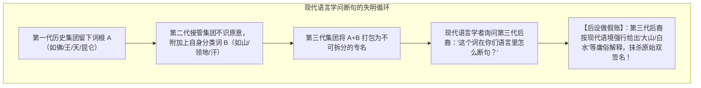
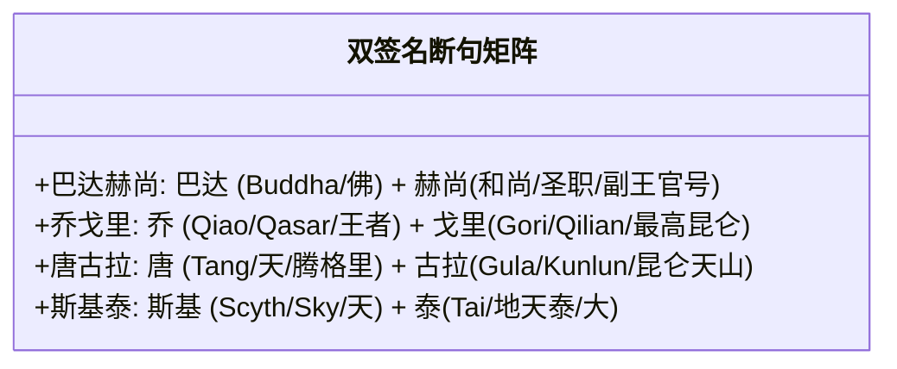
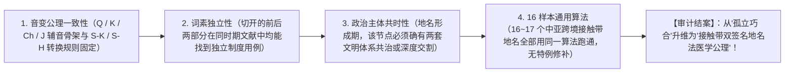

# 《三更道场》认识论总纲 · 文献学与历史会计审计：嚈哒“开户现场”与“双签名（Dual-signature）”地名断句重构审计

> **版本**：v1.0（西域多语接触带法统发生学与跨语言地名断句终极审计）  
> **核心命题**：**玄奘 629 年只是“抄表日期”，5~6 世纪嚈哒（Hephthalites）横跨吐火罗—帕米尔的时期才是真正的“开户现场”！现代比较语言学依赖“向现代土著问断句”造成了系统性后设误判；在欧亚大陆高价值矿产与走廊接触带上，地名不是单语的形容词修饰，而是东方中土神圣系统与西亚/内亚王权系统共同盖章的【双签名公章（Dual-signature Stamp）】！**

---

## 一、抄表日期 vs 开户现场：嚈哒多语治理的期初资产穿透

```mermaid
flowchart TD
    subgraph 1. 抄表日期（公元629年 / 玄奘）
        X1["玄奘《大唐西域记》记录：Po-to-chang-na（钵铎创那）"] --> X2["【定性】：路过柜台抄录成熟账户，非开户日期！"]
    end

    subgraph 2. 开户现场（5~6世纪 / 嚈哒政治实体）
        H1["嚈哒接管巴达赫尚、吐火罗、瓦罕与兴都库什山脉"]
        H2["【多语复合统治】：自称'ēbodālo yabghu（嚈哒叶护）'，巴克特里亚行政语 + 希腊字母 + 内亚官号"]
        H3["宋云、惠生（约520年）实证：嚈哒首领夏季驻地即在巴达赫尚"]
        H4["【双重登记】：西连萨珊波斯、南纳印度佛教、东通北魏拓跋与柔然"]
        H1 --> H2 --> H3 --> H4
    end

    H4 -->|成熟制度资产| X1
```

- **嚈哒开户现场的制度特征**：
  - 统治者同时使用四套系统：希腊字母、巴克特里亚语、内亚叶护（Yabghu）官号、以及汉文使节登记（滑/嚈哒）；
  - **在这样一个高度混合的国际清算节点上，地名天然具有“双语、双王、双法统”的跨国合资属性！**

---

## 二、破除现代语言学向现代人“问断句”的后设陷阱



### 1. 什么是“双签名地名（Dual-signature Toponyms）”？
- 不是简单的“同义反复（Tautology）”；
- 而是**当两个权力集团（如中土/佛教法统 vs 西亚/游牧王权）共同控制一个高价值关口或宝石矿区时，名称必须同时被两张账本识别**：
  - 东方听到东方承认的神圣词头；
  - 西方听到西方承认的法统后缀；
  - **合起来，才是跨欧亚通行的法定资产代码！**

---

## 三、四组核心样本的“双签名断句”法医矩阵



| 现代整体地名 | 历史法医重新断句 | 前部功能（东方/神圣） | 后部功能（内亚/王权/空间） | 制度与地理背景 |
| :--- | :--- | :--- | :--- | :--- |
| **巴达赫尚** | **巴达 ＋ 赫尚** | **Buddha / 佛**（神圣佛教法统） | **和尚 / 圣职 / bēdaxš 副王** | 嚈哒青金石垄断交易所与帕米尔关口 |
| **乔戈里** | **乔 ＋ 戈里** | **Qiao / Qasar / 凯撒 / 王者** | **Gori / Qilian / 昆仑天脉** | 喀喇昆仑世界第二高峰（至尊王者之山） |
| **唐古拉** | **唐 ＋ 古拉** | **Tang / 天 / 腾格里** | **Gula / Qilian / 昆仑大脉** | 青藏高原中央通天大山脉 |
| **斯基泰** | **斯基 ＋ 泰** | **Scyth / Sky / 天神信使** | **Tai / 地天泰 / 广大至尊** | 欧亚草原金衡与太阳崇拜骑兵大联盟 |

---

## 四、十六词统一算法的刚性审计准则

> [!IMPORTANT]
> **严禁为每个词量身定制临时拆法！必须执行“统一转换表与排他性四大闭环”！**  
> 必须由历史语言学 Agent 严格执行以下四项审计标准：



---

## 五、第二季方法论总结案

> **“现代人问当地人‘这山叫什么’，当地人说‘叫大山’；学者便在论文里写‘此地自古名曰大山’——这是近现代学术史上最滑稽的同义反复假账！”**  
> 《三更道场》穿透现代语言学断句的表层迷雾，直击 5~6 世纪嚈哒开户现场，将巴达赫尚、乔戈里、唐古拉等欧亚巨型地名，彻底还原为东方神圣天权与内亚副王法统共同盖章签署的**“跨文明双签名总账”**！
