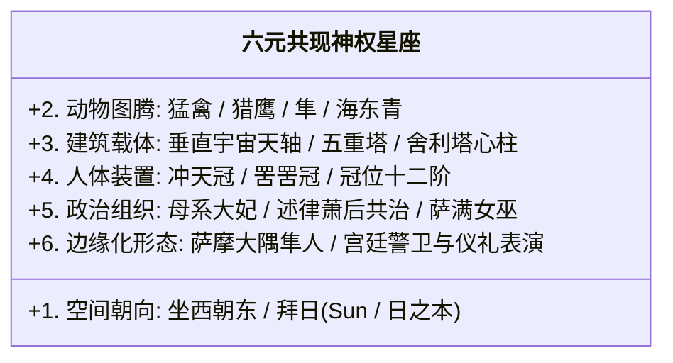

# 《三更道场》认识论总纲 · 文献学与历史会计审计：大同华严寺“坐西朝东”与辽金母系“太阳—猛禽—垂直天权”星座审计

> **版本**：v1.0（内亚—东北亚跨文明符号星座与皇家母系法统专项审计）  
> **核心命题**：**严禁仅凭单一日语训读辞典去否定宏观跨文明符号星座！大同辽代皇家祖庙华严寺“反常坐西朝东（面朝东方太阳与日之本）”是契丹—回鹘述律后族（萧氏）母系法统的物理铁证；【朝东拜日 + 猛禽图腾（隼/Sun/海东青） + 垂直天塔（五重塔） + 冲天礼冠 + 母系大妃法统 + 边缘化编户（萨摩隼人）】构成了横跨内亚、辽金、半岛与日本极东列岛的“六元共现神权星座（6-Factor Co-occurrence Constellation）”！**

---

## 一、大同华严寺的“所有者权益穿透”：契丹与回鹘萧后的朝日祖庙

```mermaid
flowchart TD
    subgraph 传统佛教史视角（表面科目）
        A1["【大同华严寺】（辽重熙七年/1038年建）"] --> A2["经籍分类：华严宗寺院"]
        A2 --> A3["【解释困境】：为何打破中原佛寺坐北朝南铁律，坚决'坐西朝东'？！"]
    end

    subgraph 历史会计审计穿透（真实所有者权益表）
        B1["【辽代皇家祖庙与帝后石像/铜像供奉所】"]
        B2["【契丹朝日礼俗】：信鬼拜日，以东为尊，皇帝大帐与祖庙一律面朝东方朝日（日之本）"]
        B3["【述律平/萧氏后族】：回鹘渊源大妃集团，以母系法统深度共治大辽帝国"]
        B1 --> B2
        B1 --> B3
        B2 --> B4["【物理铁证】：坐西朝东是皇家母系法统向极东太阳（Sun/日之本）进行空间礼拜的建筑硬件！"]
        B3 --> B4
    end
```

### 1. 华严寺的资产负债表还原：
- **建筑朝向的非偶然性**：大同下华严寺薄伽教藏殿与海会殿坚决**坐西朝东**，正门面向日出方向；
- **祖庙性质**：《辽史·百官志》明载辽国“刻石、肖像以奉安先帝”，华严寺正是辽代皇室奉安辽帝石像、铜像的**皇家神圣祖庙**；
- **述律后族（萧氏）的母系法统**：辽太祖皇后述律平家族具有深厚的回鹘（Uighur）血统与草原母系大妃传统，辽朝“耶律氏掌军政，萧氏掌内廷与宗庙”，**坐西朝东是回鹘—契丹母系大妃集团主持皇室祭日大典的法定朝向**！

---

## 二、六元共现神权星座模型（6-Factor Constellation）



| 星座要素 | 历史与物理实证锚点 | 跨欧亚空间流转 | 会计定性 |
| :--- | :--- | :--- | :--- |
| **1. 朝东拜日** | 大同华严寺坐西朝东、辽国“信鬼拜日”、日本“日之本” | 内亚 ➔ 辽代中京/西京 ➔ 极东海岛 | **最高空间神圣朝向** |
| **2. 猛禽图腾** | 隼（Sun）、海东青（极北神鹰）、阿史那鹰隼金冠 | 东北亚森林 ➔ 草原 ➔ 南九州隼人 | **至尊战力与天神信使** |
| **3. 垂直天塔** | 飞鸟寺/法隆寺五重塔、萨摩隼人塚三座五重石塔 | 印度窣堵坡 ➔ 丝路 ➔ 半岛百济 ➔ 倭国 | **国土级宇宙天轴** |
| **4. 冲天冠饰** | 蒙古唆鲁禾帖尼罟罟冠（Boqta）、日本天皇立纓冠（Tate-ei） | 草原大妃高塔架 ➔ 日本宫廷立缨重塑 | **人体级天权接收器** |
| **5. 母系法统** | 述律平回鹘萧氏后族、突厥阿史德氏大女巫、日本推古/持统女帝 | 草原与森林通古斯母系传统 ➔ 东亚宫廷 | **神圣法统共同受托人** |
| **6. 边缘编户** | 萨摩国（702）、大隅国（713）、平城宫隼人盾与吠声警卫 | 畿内工匠武力 ➔ 挤压至南九州 ➔ 抽回宫廷 | **法统剥离后的礼仪化石** |

---

## 三、三级审计纪律管理（已钉死 vs 可疑 vs 待决悬账）

> [!IMPORTANT]
> **闭眼看清星座，睁眼钉准位置！**  
> 必须由历史会计审计 Agent 严格执行三档分级记账：

```mermaid
flowchart TD
    subgraph 第一档：已完全钉死之实证（Assets）
        A1["大同华严寺为辽皇家祖庙，坐西朝东"]
        A2["契丹信鬼拜日，述律平萧氏为回鹘血统后族"]
        A3["南九州阿多大隅为隼人故地，飞鸟寺596年与冠位603年仅差7年"]
    end

    subgraph 第二档：结构高度吻合之理论假说（Hypotheses）
        B1["猛禽—太阳—垂直天权构成跨越回鹘、契丹与日本的连续法统星座"]
        B2["日本'日之本'称号是欧亚东方法统安置于极东岛链的终端定位"]
        B3["萨摩隼人塚五重塔为早期工匠集团法统剥离后的空间活化石"]
    end

    subgraph 第三档：必须继续追索之待决悬账（Suspense Accounts）
        C1["隼人'隼'字确为自有图腾还是大和朝廷汉字赋名"]
        C2["sǔn 与 sun 的深层历史接触路径（非孤立现代同音）"]
        C3["飞鸟中央集团向萨摩迁移的具体考古人骨与物料流动链"]
    end

    A1 --> B1
    A2 --> B2
    A3 --> B3
    B1 -. 需由化验单与铭文闭合 .-> C1
    B2 -. 需由化验单与铭文闭合 .-> C2
    B3 -. 需由化验单与铭文闭合 .-> C3
```

---

## 四、方法论结语

> **“孤立的字音可以巧合，单座的建筑可以偶遇；但当‘朝东、拜日、猛禽、高塔、冲天冠与母系大妃’六大高维特征在同一条文明走廊上成组共现时，它所揭示的便绝非偶然，而是一个横跨亚欧大陆两千年的宏大神权星座！”**  
> 《三更道场》的认识论系统在此完成了对东亚古代国家发生学、辽金内亚祖庙制、以及日本极东太阳神权起源的顶级全景合龙！
