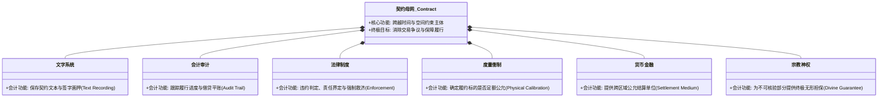
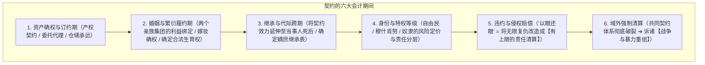
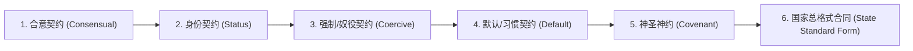

# 《三更道场》认识论总纲 · 文献学与历史会计审计：契约（Contract）全生命周期与法律发生学总账

> **版本**：v1.0（法哲学发生学与历史会计全生命周期终极审计）  
> **核心命题**：**“商业”的本体不是货物的简单买卖，而是广义的【契约（Contract）】！法律不是为了抽象道德而生，法律的唯一出生任务是将一切复杂的社会关系转译为“可识别、可持续、可继承、可强制执行的契约网络”！婚姻、继承、身份、奴隶、刑罚、神约与战争，绝非并列的法学分科，而是同一份 Contract 从订立、履行、繁殖、继承直至违约清算的【连续会计生命周期】！“生物学制造儿子，契约制造父系”！**

---

## 一、商业与契约的本体还原：从“现货交换”到“跨时空制度”

```mermaid
flowchart TD
    subgraph 现货当面交换（无需法律）
        S1["一手交鱼，一手交盐 / 现场即时两清"] --> S2["依靠现场肉身在场，无需文字、文字与法律介入"]
    end

    subgraph 跨时空差、空间差、身份差（催生契约与法律）
        C1["【时间差】：货物今天拿走，来年洄游期或下一代才还（延期交割）"]
        C2["【空间差】：货物在另一个海湖节点损坏，谁承担险（跨地域保管与承运）"]
        C3["【身份差】：当事人死亡后债务谁承担，女奴之子能否继承（身份与继承权）"]
        C4["【主体差】：国王更换或违约赖账后如何救济（强制清算与刑罚）"]
        C1 --> LAW["【法律的唯一出生任务】：让 Contract 脱离当事人的即时肉身在场而继续具有强制执行力！"]
        C2 --> LAW
        C3 --> LAW
        C4 --> LAW
    end
```

### 1. 汉字“契”与“约”的历史法医学造字账：
- **“契”（刻记/契券/木契）**：解决“拿什么证明我们今天说过什么”，是一份**可以重新勘合勾稽的物理凭证（Proof of Record）**；
- **“约”（约束/界限/规矩）**：解决“共同接受什么规则来约束未来”，是一套**跨越当事人生命周期的行为规范（Rules of Constraint）**；
- **“契约（Contract）”** = **可以重新勘合的物理记录 + 能够跨期约束未来的制度规则**！

---

## 二、六大文明基础设施的“契约功能分化矩阵”

文字、会计、法律、度量衡、货币与神权，从来不是并列偶发的孤立学科，而是 **Contract 为了解决不同维度的违约与执行失败点，所分化出来的六大功能子系统**：



---

## 三、《汉谟拉比法典》：同一份契约的“连续会计生命周期”

传统法学将《汉谟拉比法典》割裂为商业、婚姻、继承、身份、刑罚等互不相干的门类；历史会计学将其还原为**同一份资产契约从生到死的完整生命周期（Life-cycle of Contract）**：



### 1. “生物学制造儿子，契约制造父系”：
- **生物学**：只能制造出一个个具有相同或相近基因的雄性个体；
- **契约系统**：
  - 通过**婚姻契约**确认合法母亲身份；
  - 通过**身份契约**将私生子/奴隶之子排除在继承表之外；
  - 通过**继承契约**允许儿子合法继承土地、牲畜、信用与再次多妻的生育权；
- **结论**：没有契约系统，二十个儿子会沦为互相残杀或被消灭的散沙；有了契约系统，这二十个儿子才能被组织成拥有共同姓氏、共同资产与持续扩张优势的**“父系宗族实体”**！

---

## 四、契约形态的六层谱系（从自由合意到国家总格式合同）

> [!CAUTION]
> **严禁将所有历史强制关系浪漫化为“双方自愿签署”！**  
> 必须由公法与法哲学 Agent 严格区分以下六层契约形态：



- **国家法典的本质**：国家法是一份**强制性的“全民总格式合同”**——你未必亲自签字，但只要你出生、居住或被征服于该领土之上，就被系统自动登记为该合同的“连带责任相对方”！

---

## 五、方法论总结案

> **“商业不是买卖货物的集市，商业是全人类构建跨时空信任、组织暴力与繁衍后代的【契约母机】。”**  
> 《三更道场》在此彻底将法学、社会学、经济学与演化生物学统摄于“历史会计学与广义契约论”之下，完成了全剧方法论大厦最根本、最宏大的形而上学立基！
