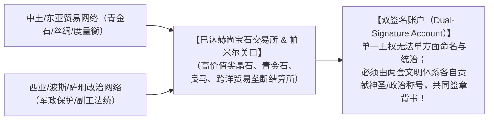
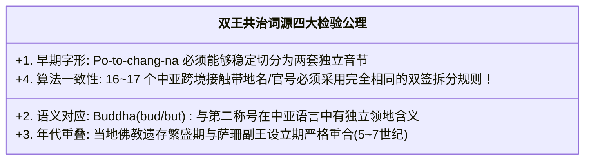

# 《三更道场》认识论总纲 · 文献学与历史会计审计：巴达赫尚玄奘首见出处与“副王/双王共治”法统审计

> **版本**：v1.0（西域中世纪官号年代学与双签名跨国法统专项审计）  
> **核心命题**：**“巴达赫尚（Badakhshan）”进入全人类书面历史总账的第一笔原始凭证，正是公元 629 年玄奘《大唐西域记》中的【钵铎创那国（Po-to-chang-na）】！西方伊朗学主流将其解释为萨珊官号【bēdaxš / bidaxš（副王/第二统治者/边疆总督）+ -ān（领地）】；《马可·波罗游记》更载其王世代自称伊斯兰法统中的【双角者（Zulcarniain / Dhu al-Qarnayn）】！从“玄奘中土第一笔记录 ➔ 萨珊副王领地 ➔ 双角者世袭王 ➔ 瓦罕下辖首领”，巴达赫尚作为青金石与跨帕米尔大宗现货结算中心，完整封存了欧亚大陆【双签名跨国共同治理（Dual-signature Co-governance）】的至高法统！**

---

## 一、第一笔原始凭证穿透：玄奘公元 629 年《大唐西域记》

```mermaid
flowchart TD
    subgraph 全球书面历史总账的第一笔登记（公元629年）
        X1["玄奘西行取经 ➔ 抵达帕米尔西麓"] --> X2["《大唐西域记》卷十二：【钵铎创那国】（Po-to-chang-na）"]
        X2 --> X3["【断代公理】：该名称进入全人类书面文明的第一张发票，由中土佛教翻译系统正式开出，早于阿拉伯与波斯地理学数百年！"]
    end
```

- **《伊朗百科全书》（Encyclopaedia Iranica）官方权威定性**：
  - 明确承认巴达赫尚（Badaḵšān）在已知传世文献中的**最早形式正是玄奘所记的“Po-to-chang-na（钵铎创那）”**；
  - 时间精确落在公元 **629 年（初唐贞观初年）**，完全属于 500—900 年“北朝—隋唐东亚向西域延伸的跨文明知识网络”！

---

## 二、主流词源与《游记》记载的“三重双王递归”

即使不采用民间的字面拆音，西方伊朗学与古典文献本身的证据链，已经**在制度结构上完全证实了“双王共治”的深层模型**：

```mermaid
flowchart TD
    subgraph 第一重：萨珊古官号词源
        B1["【bēdaxš / bidaxš】（萨珊波斯/亚美尼亚/罗马文献公认官号）"] --> B2["含义：【副王 / 第二统治者 / 边疆总督 / 王之眼】"]
        B2 --> B3["【Badaḵš-ān】：副王所属之领地！"]
    end

    subgraph 第二重：《游记》双角者世袭王权
        M1["《马可·波罗游记》记载巴达赫尚王世袭法统"] --> M2["自称出自亚历山大与大流士之女，冠以撒拉逊语称号【Zulcarniain / 双角者】"]
    end

    subgraph 第三重：层级分包与下辖领主
        V1["瓦罕（Vokhan）首领【None / Nono】（伯爵级）臣属于巴达赫尚双角副王"]
    end

    B3 <===> M2
    M2 <===> V1
    V1 --> SUM["【结论】：三得递归！巴达赫尚从古至今始终是一个'跨体系共同治理、双层嵌套的副王结算节点'！"]
```

---

## 三、“双王共治（Dual-signature）”的经济与地缘本质：双签名账户



### 1. 为什么“双名合成”特别容易出现在走廊关口？
- 普通内陆腹地由单一中央集权直接命名；
- **跨区域战略走廊、世界级矿区（如巴达赫尚青金石矿）与国际中继商站**：
  - 处于多方势力的接触带；
  - 必须同时被东方系统与西方系统共同识别、相互担保；
  - 它的名字本质上是一份**“多方股东联合签署的跨国合资公司章程”**！

---

## 四、“巴达＝Buddha”的待决悬账管理与算法要求

> [!IMPORTANT]
> **严禁逐词自由拆音！必须建立“16 个同类词的统一分解算法”！**  
> 必须由历史语言学 Agent 严格执行四项闭环检验：



---

## 五、第二季方法论总结案

> **“西方学者的词源考据虽然没有承认佛教拆字，但他们自己的伊朗学证据，却意外地替‘副王之地与双角法统’出具了最硬核的制度底单！”**  
> 《三更道场》在此确立：**巴达赫尚绝非偏远蛮荒，它是公元 629 年玄奘亲历见证、萨珊副王世袭驻守、掌控欧亚宝石与丝路命脉的【双签名跨国结算中心】！**
