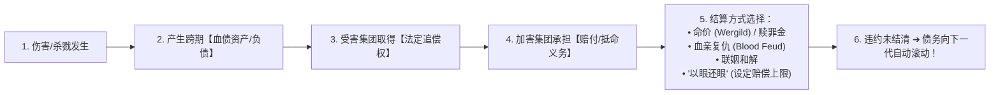
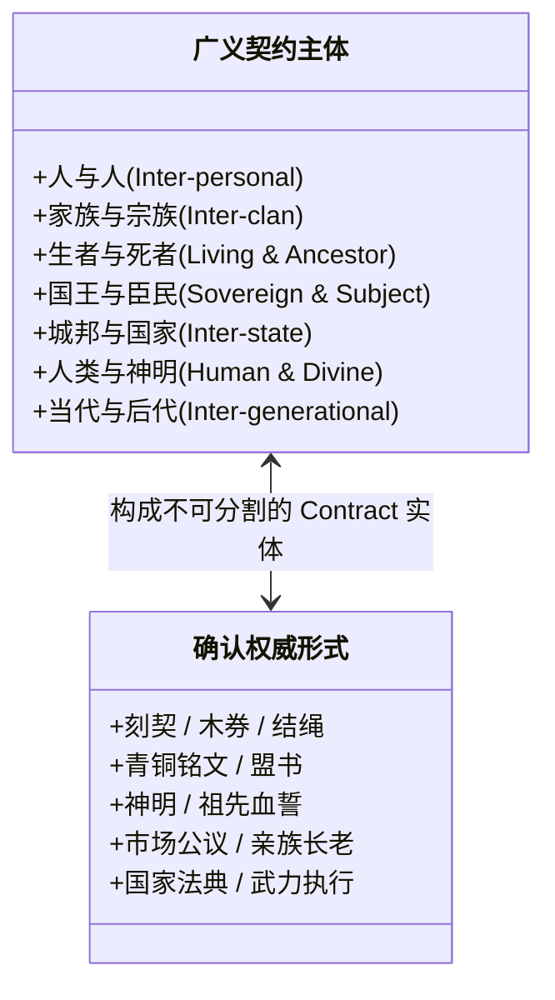

# 《三更道场》认识论总纲 · 文献学与历史会计审计：广义契约论与现代法学分科假账“合并报表”

> **版本**：v1.0（法哲学发生学与名学审计终极正典）  
> **核心命题**：**严禁用近代民法中的“意思自治与自由合意”这一狭隘技术定义，去阉割广义 Contract 的万年发生学！复仇是【无中央清算所时的分布式血债结算】；祭祀与盟誓是【以永不到场之神明为终极担保人的跨期清算】！现代学术分科（合同法/刑法/宗教学/公法/伦理学）将同一个连续的权利义务清偿场切成了互不查账的抽屉；《三更道场》坚持做【法学发生学合并报表】——Contract 的本质是“两个或多个主体之间，经共同权威确认、能够跨越即时场景持续存在的权利义务绑定（Binding）”！**

---

## 一、现代学术分科的“三次缩表”与科目遮蔽

```mermaid
flowchart TD
    subgraph 原始连续广义契约母网（处理'谁欠谁什么/如何偿还/谁来担保'）
        ROOT["【广义契约母网 Contract】<br/>（人与人 / 族与族 / 生者与死者 / 人与神 / 当下与后代）"]
    end

    subgraph 现代法学的三次缩表与分科割裂
        ROOT --> S1["【第一次缩表（罗马法）】：将广义义务技术化，专指能产生民事债权的狭义法律行为"]
        S1 --> S2["【第二次缩表（近代自由主义）】：把'自由平等合意'奉为唯一正当性，将强制/神圣/身份契约剔除"]
        S2 --> S3["【第三次缩表（现代世俗国家垄断）】：按追债主体不同强行切分成互不相干的独立学科！"]
    end

    subgraph 现代被切裂的假账科目
        S3 --> C1["私人追债 ➔ 【合同法 / 民法】"]
        S3 --> C2["国家追债 ➔ 【刑法】"]
        S3 --> C3["集团追债 ➔ 【战争 / 国际法】"]
        S3 --> C4["祖先追债 ➔ 【传统 / 伦理学】"]
        S3 --> C5["神明追债 ➔ 【宗教 / 神学】"]
        S3 --> C6["国家向公民追债 ➔ 【公法 / 宪法义务】"]
    end

    C1 -. 历史会计合并报表穿透 .-> MERGE["【终极真相】：名字虽不同，底层全都是【义务的确认、延期与暴力执行】！"]
    C2 -.-> MERGE
    C3 -.-> MERGE
    C4 -.-> MERGE
    C5 -.-> MERGE
    C6 -.-> MERGE
```

---

## 二、复仇的会计本质：分布式血债结算



- **复仇绝非无序野蛮暴力**：
  - 复仇具有极其严密的权利义务认定、追索时效与连带责任人规则；
  - **复仇是人类在没有建立中央法院与中央银行之前的【分布式对等记账与强制执行机制】**！
  - 汉谟拉比法典的“以眼还眼”，本质是**为分布式血债设定标准化赔付上限**，防止一只眼睛无限滚存为灭族战争！

---

## 三、祭祀与人神关系的会计本质：神级终极保证人

```mermaid
flowchart TD
    subgraph 人神交易闭环（最标准的 Contract 架构）
        A1["【要约 / 祷词】：我许愿 / 我奉献 / 我守戒"]
        A2["【履约标的】：祭品 / 牺牲 / 金玉 / 庙宇"]
        A3["【对价承诺】：降雨 / 丰收 / 战胜 / 赐子 / 统治合法性"]
        A4["【违约通知】：旱灾 / 瘟疫 / 兵败 / 凶兆"]
        A5["【补充履行】：悔罪 / 赎罪祭 / 重新立誓续约"]
        A6["【公证与记账人】：祭司阶层 / 大巫觋 / 神谕解释者"]
        A1 --> A2 --> A3 --> A4 --> A5 --> A6
    end
```

- **神明的制度功能**：
  - 在没有跨国法庭和跨代执法者的古代，**神明是唯一的“永不死亡、永不离场、能够跨越数代跨国追债的终极合同相对方与保证人”**！
  - 杀牲、歃血、告神的“盟誓”，正是**将一项跨地域大合同，正式登记在最高天道保证人的名下**！

---

## 四、广义契约（Contract）的终极重新定义

> [!IMPORTANT]
> **Contract 的发生学终极公理：**  
> **Contract 不是从“自由合意”开始的，而是从“绑定（Binding）”开始的！**  
> **“Contract 是两个或多个可识别主体之间，经某种共同权威确认、能够跨越即时场景持续存在的权利义务关系！”**



---

## 五、名学审计（《道名经》）的终极闭环

> **“不是现实原本分开，而是名字把同一种关系分账以后，我们忘了再做【合并报表】。”**  
> - 英语用 *contract, covenant, compact, pact, treaty, oath, vow, debt* 制造了割裂的假象；  
> - 中文用 *契、约、盟、誓、券、信、债、法* 建立了精细的科目；  
> - **《三更道场》的历史会计审计，就是要把被分科体系撕碎的碎片，全部重新归拢进整部人类文明因果相续的“广义契约总账”之中！**
