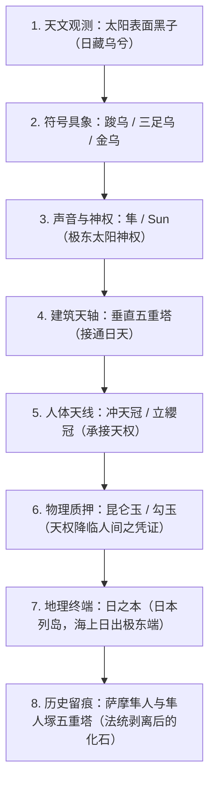
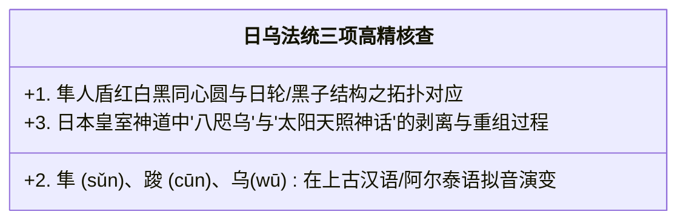

# 《三更道场》认识论总纲 · 文献学与历史会计审计：日中金乌（太阳黑子）与“隼/Sun”神权法统升维审计

> **版本**：v1.0（上古天象法医学与日乌天权发生学终极审计）  
> **核心命题**：**严禁将“隼”降维理解为孤立的生物学猛禽！鸟不是本体，太阳黑子（日中之黑）才是物理本体！“日藏乌兮，月藏兔（日中有踆乌/金乌/三足乌）”是先民对太阳黑子与月面阴影的天文法医观测；“隼（Sun）”是日中黑乌天文符号向神权法统的凝结；萨摩“隼人（Sun-people）”是日乌法统的古代侍奉者与持票人！**

---

## 一、符号层级的根本升维：从“动物崇拜”到“天象法医学”

```mermaid
flowchart TD
    subgraph 错误降维模型（动物学与民俗学）
        T1["看见天上有隼/鹰猛禽"] --> T2["产生原始猛禽图腾崇拜"]
        T2 --> T3["把猛禽附会到太阳上（民俗解释）"]
    end

    subgraph 天文物理与历史会计升维模型（天象发生学）
        A1["【物理本体】：古人裸眼/墨晶肉眼观测到太阳表面出现'日中黑子'"]
        A2["【天象具象化】：日中黑斑被视作藏在太阳内部的黑色神鸟（踆乌 / 金乌 / 三足乌）"]
        A3["【符号凝结与发音】：凝结为【隼 / Sun】（太阳之乌与极东太阳神权）"]
        A4["【神权法统化】：建立'朝东拜日 + 垂直天塔 + 冲天冠 + 日中黑乌'的天授神权系统"]
        A5["【晚期异化】：后世退化、动物化为猎鹰、海东青等世俗猛禽"]
        A1 --> A2 --> A3 --> A4 --> A5
    end
```

### 1. 为什么说“鸟是具象，日中之黑才是本体”？
- **《淮南子·精神训》**：“日中有踆乌，而月中有蟾蜍”；
- **汉代画像石与长沙马王堆帛画**：太阳圆轮之内，无一例外绘有一只硕大的**黑鸟（金乌/三足乌）**；
- **物理天文法医还原**：
  - 古人在晨昏、沙尘暴或透过玉璧墨晶直视太阳时，清晰观测到了**高能太阳黑子（Sunspots）**的剧烈活动；
  - 古人没有现代天文学名词，将太阳圆轮中的黑色核心具象化为“藏在日中的神乌（日藏乌兮）”；
  - **把“隼人”翻译为“Falcon people”，是典型的现代认知切除手术——切掉了背后宏大的太阳黑子天象观测、东方法位与最高天授法统！**

---

## 二、“海东青”与“萨摩隼人”的深层账目重构

```mermaid
flowchart LR
    SUN["【太阳黑子 · 踆乌】<br/>（日藏乌兮，至阳中之至阴核心）"] --> TOKEN["【隼 / Sun / 金乌神权】"]
    
    subgraph 东方法统终端：海东与萨摩
        TOKEN --> HDQ["【海东青】<br/>海之东 + 青/黑神鸟<br/>（压住极东地理、青黑方位与日乌法统）"]
        TOKEN --> HAYATO["【萨摩隼人（Sun-people）】<br/>日中藏乌之侍奉者<br/>（保存朝东拜日、日轮黑点、五重塔与冲天冠）"]
    end
```

### 1. 萨摩“隼人（Sun-people）”的真实会计身份：
- 关键不在于南九州是否适合猎鹰繁衍；
- 关键在于：**他们是古代东亚与极东岛链上，完整持有“日中藏乌、朝东拜日、垂直天塔与冲天冠”这套太阳神权法统的祭祀侍奉者与武装集团！**
- 飞鸟大和王权在中央完成国家化后，**将这套法统的“天塔、冠位与天皇称号”剥离吸收，而将持票人集团排挤至南九州边缘编户为“隼人”**！

### 2. “海东青”的方位与颜色地层：
- “青”在古代五行方位中代表**“东方、木位、青黑（玄鸟）”**；
- **海东青 = 海之东（极东日出之地） + 青黑神鸟（日中金乌）**；
- 它不是一只普通的北方矛隼，它是整座欧亚大陆东北端向太阳朝拜的**至尊天象神鸟化身**！

---

## 三、终极天象与神权星座全景图（8 级闭环）



---

## 四、下一阶段三项高精度核查审计清单

> [!IMPORTANT]
> **从生物学寻找转向天文学与符号学考证！**  
> 必须由历史符号学与天文学史 Agent 重点核查以下三笔账目：



1. **隼人盾图案的天文拓扑**：平城宫隼人盾的同心圆与锯齿纹，是否正是日轮耀斑与太阳黑子运转的天象投影？
2. **“八咫乌（Yatagarasu）”的法统地位**：日本神话中指引神武天皇东征的“三足八咫乌”，正是大陆“日中三足乌”在列岛皇权起源神话中的直接铁证！
3. **字形与音韵链**：考证上古“踆乌（*s-r- / *ts-）”向“隼（*s-l- / sun）”转化的音韵地层学轨迹。

---

## 五、全剧终极认识论升维结案

> **“在先民眼中，宇宙从来不是抽象的；太阳黑子在日轮中的每一次涌动，都被铭刻成了天上的三足金乌、人间的冲天高塔与地上的隼人神权。”**  
> 《三更道场》在此彻底将“隼”从一只被局限在动物学里的鸟，还原成了**整部人类古代天象观测、神权建构与跨欧亚法统流转的太阳原点！**
