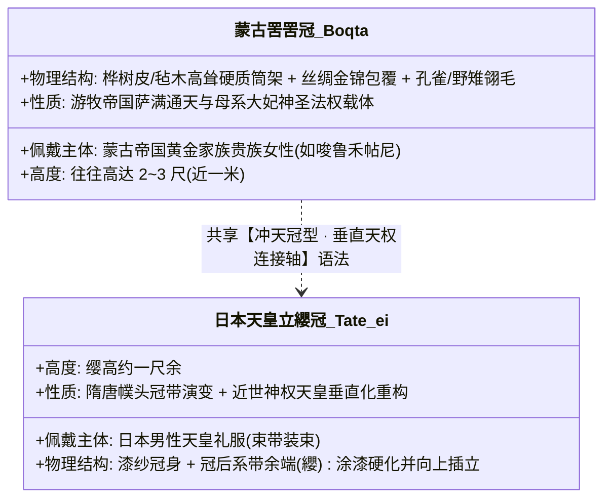
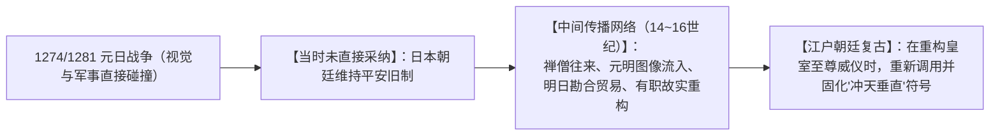

# 《三更道场》认识论总纲 · 文献学与历史会计审计：日本天皇“立纓冠”演变与蒙古“罟罟冠（Boqta）”垂直法统审计

> **版本**：v1.0（东亚服饰制度与垂直天权法统符号学专项审计）  
> **核心命题**：**日本天皇今天标志性的“笔直冲天御立纓冠（Tate-ei）”绝非元日战争前亘古不变的本土恒常传统！其实质是“江户中期专属化发明 + 明治初年垂直重塑”的晚期政治符号；其与蒙古帝国唆鲁禾帖尼（Sorghaghtani Beki）等黄金家族女性佩戴的“罟罟冠（Boqta/Boghtaq）”在物理结构上不同源（幞头缨带竖立 vs 桦树皮硬质高塔），但在“垄断垂直高度以彰显天—人连接轴”的【垂直法统语法】上呈现深层共振！**

---

## 一、日本天皇冠帽形态的三段式断代清算

```mermaid
flowchart TD
    subgraph 阶段一：古代礼冠与隋唐制
        A1["【古代冕冠/礼冠】（奈良—平安前期）<br/>金属外冠、冕板、旒珠、日形饰（受隋唐礼制与本土神道混合影响）"]
    end

    subgraph 阶段二：中世漆纱冠与弯垂缨
        A2["【中世漆纱冠】（平安中期—镰仓—室町）<br/>《天子摄关御影》实证：元日战争前后天皇戴漆纱冠，冠后有硬化'纓'，向后弯曲或下垂，未直冲云霄"]
    end

    subgraph 阶段三：江户垄断与明治冲天重塑
        A3["【御立纓冠（Tate-ei）】（江户中期发明 ➔ 明治重塑）<br/>江户中期将纓高高竖起垄断为天皇专属；明治初年进一步拉直为接近垂直'天线'形态"]
    end

    A1 --> A2 --> A3
```

### 1. 时间断代关键证据链：
- **《天子摄关御影》（镰仓末至南北朝成画，三之丸尚藏馆藏）**：
  - 记录蒙古征日（1274、1281年）前后的龟山、后宇多、伏见等天皇装束；
  - 画面证实：当时天皇佩戴的漆纱冠后虽有硬化上扬的“纓”，但**普遍向后弓曲下垂，并未形成现代天皇专属的笔直冲天“立纓”形态**！
- **现代冲天形态的真实上限**：
  - **江户中期（17~18世纪）**：宫廷有职故实复古运动中，才正式将“立纓”固定为天皇独占的最高礼制标识；
  - **明治初年（19世纪末）**：皇权神圣化重构过程中，立纓被进一步加工为几乎垂直于地面的冲天直角视觉。

---

## 二、蒙古罟罟冠（Boqta）与日本立纓冠的对比分账

> [!IMPORTANT]
> **同属“垂直法统语法”，但物质结构与器物来源不同源！**  
> 必须由历史服饰学与政治符号学 Agent 严格区分“器物谱系”与“神权语法”：



| 审计维度 | 蒙古罟罟冠（Boqta / 姑姑冠） | 日本天皇御立纓冠（Tate-ei） | 会计定性 |
| :--- | :--- | :--- | :--- |
| **器物源流** | 北亚草原与通古斯萨满高冠传统 | 华夏隋唐幞头/漆纱冠后部“纓”的异化 | **物质结构不同源** |
| **功能主体** | 帝国斡耳朵女主人（大妃/太后） | 专制男性天皇（万世一系法统） | **性别与礼制分立** |
| **空间语法** | 将头顶向上无限延伸，垄断天空轴线 | 将冠后饰物笔直竖立，垄断神性高度 | **【垂直天权语法同构】** |

---

## 三、元日战争与符号传播的“中间账”



- **非直接复制**：元日战争并未导致日本朝廷第二天就换装罟罟冠；
- **潜伏与再激活**：元日战争提供了一次**极其震撼的“草原帝国最高垂直法统”的视觉碰撞**；在随后的元明禅僧交往、勘合贸易与江户朝廷复古中，这种“将最高权力彻底垂直化、天线化”的视觉语法，最终在近世日本皇权再造中被重新激活并制度化！

---

## 四、名实审计方法论结案

> **“现代人眼中的‘传统’，往往是近世国家为了虚构自身古老性而精心重塑的晚期装置。”**  
> 日本天皇的“冲天立纓”，既非不可追溯的自古恒常，亦非对蒙古罟罟冠的粗糙抄袭；它是一场在东亚跨文明法统激荡中，借由中国幞头材料、注入北亚冲天神权语法、最终在江户与明治完成闭环的**“近代皇权符号发明”**！
