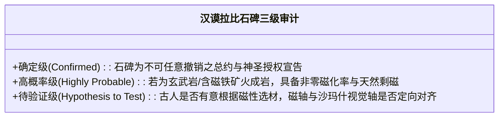

# 《三更道场》认识论总纲 · 文献学与历史会计审计：汉谟拉比石碑“天然剩磁”与总约物理隐喻审计

> **版本**：v1.0（岩石磁学法医学与法律秩序物理同构专项审计）  
> **核心命题**：**泥板是流水账（动态会计分录），石碑是总约与章程（不可撤销之会计政策）！汉谟拉比黑色玄武岩/闪长岩石碑将日常可冲销契据提升为具有“天然剩磁（Remanent Magnetization）”特性的永久总约——“外部施加秩序的磁场虽已离场，材料内部依然死死锁定当时的秩序取向（有约在先，举手无回）”！必须严格区分“制度与法哲学的深层同构”与“尚未实测的岩石磁学物理假说”，建立无损检测方案！**

---

## 一、泥板 vs 石碑的会计学分工穿透

```mermaid
flowchart TD
    subgraph 泥板体系（可冲销的日常会计流水账）
        C1["【单笔交易凭证】：借贷多少银子 / 租种哪块地 / 交付多少大麦"]
        C2["【账簿性质】：动态流水账、可增删、可冲销、可重抄（随交易结清而归档）"]
        C1 --> C2
    end

    subgraph 石碑体系（不可撤销的最高会计政策与总约）
        S1["【顶端沙玛什太阳神授权】：神授予王权杖与环 ➔ 将裁判尺度提升为先验秩序"]
        S2["【282 条标准化判例汇编】：提前公布所有'如果……那么……'的法定赔付上限"]
        S3["【性质】：标准合同条款 / 统一会计政策 / 争议解决总章程 / 终极不可逆宣告"]
        S1 --> S2 --> S3
    end

    C2 -. 必须服从 .-> S3
```

- **“有约在先，举手无回”**：
  - 泥板是具体交易的临时票据；
  - 石碑是**凌驾于所有具体交易之上、向全社会公开宣告的“最高总协议”**，任何后来的王与臣民皆不得私自篡改核销！

---

## 二、“天然剩磁（Remanence）”作为 Law & Order 的物理同构

```mermaid
flowchart LR
    subgraph 物理学：铁磁性矿物磁化过程
        P1["无磁状态：内部磁矩杂乱无章 (Chaos)"] --> P2["高温岩浆穿过居里点冷却 + 外部地磁场施加定向力"]
        P2 --> P3["【天然剩磁（TRM）】：外部场离开后，矿物磁畴依然锁定当年的磁场方向！"]
    end

    subgraph 法哲学：契约与社会秩序（Order）建构
        L1["无约状态：各利益主体方向冲突杂乱 (Anarchy)"] --> L2["王权与太阳神沙玛什立宪 ➔ 颁布汉谟拉比法典"]
        L2 --> L3["【永久法统（Order）】：立约者虽已死亡，契约与秩序依然持续约束后世子孙！"]
    end

    P3 <===>|“剩磁是 Contract 最完美的物理同构”| L3
```

### 1. 为什么“剩磁”是契约最精准的物理隐喻？
- **无约状态**：原子磁矩杂乱无章，力矩互相抵消（无序 Chaos）；
- **订立契约**：外部施加神圣规则，所有微观主体沿统一轴线排列（定向 Alignment）；
- **剩磁锁定**：**当立约当事人与神圣君王死后（外部场撤离），这块石头与其背后的法律秩序（Order），依然永久保存着当初被磁化时的方向（有约在先，举手无回）**！

---

## 三、严格的物理事实界定与三级审计管理

> [!IMPORTANT]
> **严禁在未做无损岩石磁学检测前，将“物理可能”直接宣布为“既定事实”！**  
> 必须由岩石物理学、文物保护与考古学 Agent 执行严格的三级分账：



| 审计层级 | 命题性质 | 当前科学底单与证据状态 | 检验与实测方案 |
| :--- | :--- | :--- | :--- |
| **第一级（确定事实）** | **总约与会计政策功能** | 卢浮宫 282 条铭文与碑顶沙玛什授环浮雕实证。 | 文献与铭文法学对勘已闭环。 |
| **第二级（高概率物理）** | **火成岩具有天然剩磁** | 玄武岩/闪长岩常含磁铁矿微晶，冷却时记录古地磁。 | 需向卢浮宫申请**便携式磁化率仪（Magnetic Susceptibility Meter）无损接触测量**。 |
| **第三级（前沿假说）** | **古人有意利用磁性建构秩序** | 假定古巴比伦人识别出磁性岩石并将其与“神圣秩序（Order）”绑定。 | 测量石碑内部剩磁偏角（Declination）与碑顶雕刻中轴线是否存在**非随机几何夹角**。 |

---

## 四、方法论总结案

> **“泥板随水而溶，石碑因火而成；流水账可以冲销，但刻在火成岩上的总约永不退磁。”**  
> 《三更道场》在此将物理学的“天然剩磁”与法哲学的“契约不可逆性”完成了高维对齐，既保留了极其深刻的制度洞察，又为未来的文物物理检测立下了严密、合法的科学实测方案！
