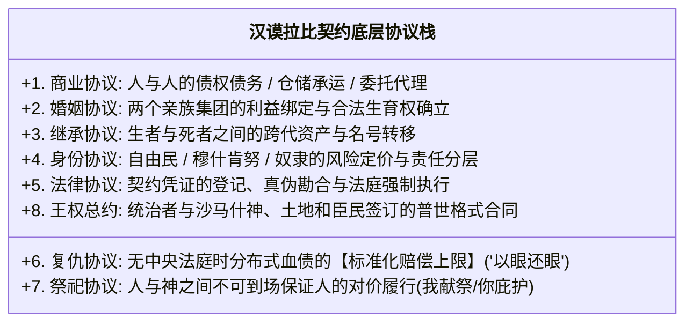
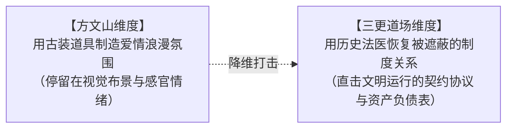

# 《三更道场》认识论总纲 · 文献学与历史会计审计：流行文化“道具化”批判与汉谟拉比“契约底层协议”

> **版本**：v1.0（流行文化审美穿透与法典底层协议终极审计）  
> **核心命题**：**流行文化（如《爱在西元前》）面对《汉谟拉比法典》石碑时，仅仅抓住了“泥板、祭司、神殿、车马弓箭”等古装浪漫道具，却对石碑背后统治整座美索不达米亚文明的【契约底层协议（Contractual Underlying Protocol）】彻底失明！车马弓箭只是无法平账时的终极暴力催收队；汉谟拉比法典的本体是“定义谁是合格主体、什么可以作为标的、如何勘合凭证、怎样代际继承、以及违约后如何标准化清算”的【文明操作系统内核】！**

---

## 一、流行文化的“道具化降维” vs 历史会计的“协议穿透”

```mermaid
flowchart TD
    subgraph 流行文化表层道具化模型（方文山式古装浪漫）
        P1["面对《汉谟拉比法典》黑色玄武岩石碑"] --> P2["提取古装道具：美索不达米亚平原 / 泥板 / 祭司 / 神殿 / 车马弓箭"]
        P2 --> P3["【本质】：用古文明典故制造浪漫氛围，将【执行系统（催收队）】误当成了文明本体！"]
    end

    subgraph 历史会计底层协议穿透（三更道场法医模型）
        R1["面对《汉谟拉比法典》黑色玄武岩石碑"] --> R2["穿透为整套文明运行的【广义 Contract 底层操作系统】"]
        R2 --> R3["【本质】：定义主体资格、产权归属、远期交割、代际继承、血债封顶与神圣担保！"]
    end
```

---

## 二、《汉谟拉比法典》统摄的八大契约子协议

法典不是零碎条款的拼盘，它是一套严密耦合的**全息契约协议栈（Contract Protocol Stack）**：



### 1. 为什么说“财富与女人可分”仍然停在表层？
- 财富、婚配权与子嗣之所以**“能够被组织与分配”**，不是因为军人手里有弓箭；
- 而是因为此前早已存在一套被全体共同体承认的 **Contract 底层协议**：
  1. **标的定义权**：什么可以作为资产流通（土地、牲畜、麦子、白银、劳役）；
  2. **处分主体资格**：谁拥有签约与处分权（家长、自由民商人、代理人）；
  3. **合法配偶与婚生认证**：唯有被婚姻契约认证的女性所生之子，才拥有合法的祖产继承权与父系延续资格；
  4. **违约责任与强制清算**：违约时按照什么公允标准割地、赔偿或沦为债务奴隶。

---

## 三、作词与叙事的维度差：制造氛围 vs 恢复制度



- **方文山站在石碑前**：他看到了三千七百年前的泥板情书，把残酷的古代产权法典写成了跨越时空的浪漫小调；
- **《三更道场》站在石碑前**：我们看到的是人类文明第一台完整运转的**“资产—产权—婚配—继承—清算母机”**！车马弓箭不过是这台母机违约时开出的强制执行通知书！

---

## 四、方法论总结案

> **“诗歌可以歌颂车马弓箭，但历史必须记录契约与账本；因为车马弓箭只能摧毁一个城邦，唯有 Contract 才能建立一个文明！”**  
> 《三更道场》在此彻底确立了流行文化批判与古代法典法医学审计的最高标准，完成了对上古文明制度史与广义契约论的终极大平账！
