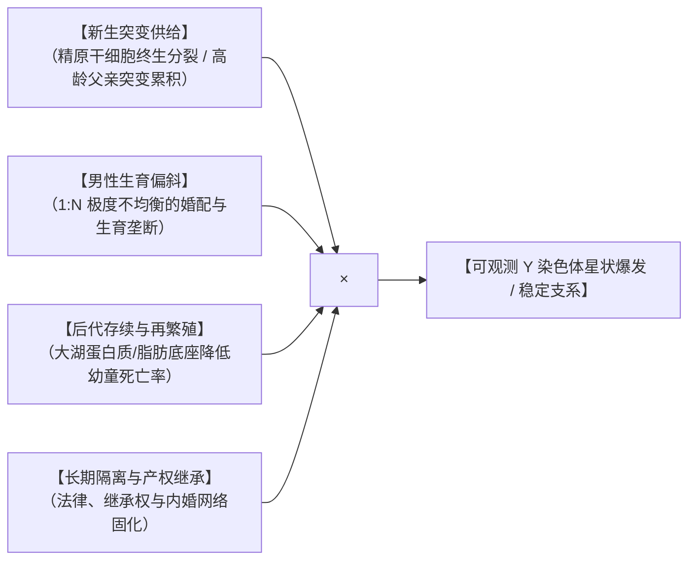

# 《三更道场》认识论总纲 · 文献学与历史会计审计：父系分叉生产函数与“资产—产权机器”

> **版本**：v1.0（分子人类学演化动力学与父系产权分拆终极审计）  
> **核心命题**：**严禁用“车马弓箭打赢了”这一暴力催收镜头去解释 Y 单倍群的深层分叉！可观测 Y 染色体星状爆发的本质是一套四元相乘的【父系分叉生产函数】；大湖文明与剩余资产提供了 1:N 不对称生育权与高龄突变累积的底座；亚伯拉罕（Abraham）以撒/以实玛利叙事是人类最早的“父系资产拆分上市与神约登记确权模型”！**

---

## 一、可观测 Y 支系演化的“四元生产函数”



$$\text{可观测 Y 支系} = \text{新生突变供给} \times \text{男性生育偏斜} \times \text{后代存续率} \times \text{长期隔离与继承}$$

### 1. 为什么 1:N 是父系分叉的关键“抽奖放大器”？
- **普通男性**：只有一个儿子，即使精子发生新的 Y-SNP 突变，极易在随后的世代中因绝嗣而从基因池彻底蒸发；
- **掌握剩余资产的 1:N 优势男性**：
  1. **主干放大**：与多个女性生育 20 个儿子，相当于同时开出 20 张父系彩票；
  2. **支系分叉**：高龄复制次数增加，每个儿子携带不同新生突变，并在继承制度保护下继续繁衍，几千年后在地层学上呈现壮观的**“星状分叉（Star-like Expansion）”**！

---

## 二、流行文化《爱在西元前》的表层执行器误区

```mermaid
flowchart TD
    subgraph 流行文化表层模型（方文山/好莱坞叙事）
        P1["车、马、弓、箭，是谁的从前（暴力道具）"] --> P2["将执行系统（催收队）误当成了生产系统（造血机）"]
    end

    subgraph 汉谟拉比法典与历史会计真实结构
        R1["【生产与产权机器】：婚姻、继承、身份、奴隶计价、仓储代理、债务利息、抵押清算"]
        R2["【暴力执行器】：车马弓箭与肉刑仅在法典无法平账时作为最后手段进场！"]
        R1 --> R2
    end
```

- **《汉谟拉比法典》的会计穿透**：
  - 法典的核心绝不是为了炫耀兵器与战车，而是规范**“财产与生育秩序如何结算”**；
  - 规定谁能娶几个配偶、长子继承权、商业合伙分成与违约抵押；
  - **车马弓箭只是催收队，真正制造文明与父系繁衍优势的，是出场前早已精密运转的“资产—产权机器”！**

---

## 二、亚伯拉罕叙事：人类最早的“父系资产拆分上市与神约确权”

```mermaid
flowchart TD
    subgraph 亚伯拉罕（高龄父亲）的资产拆分上市模型
        F["【高龄垄断男性】：亚伯拉罕（父系突变基底）"]
        
        M1["【合法原配夫人】：撒拉（Sarah）"] --> S1["【嫡长子继承权】：以撒（Isaac）"]
        M2["【使女/不同法律身份】：夏甲（Hagar）"] --> S2["【庶出分家/放逐】：以实玛利（Ishmael）"]
        
        F --> M1
        F --> M2
        
        S1 --> N1["【支系 A】：定居农耕/神权法统 ➔ 犹太共同体"]
        S2 --> N2["【支系 B】：荒漠游牧/旷野弓手 ➔ 阿拉伯诸部落"]
    end

    S1 --> COV["【神约（Covenant）】：最高不动产与法统登记机关出具的确权证书！"]
    S2 --> COV
```

### 1. 圣经叙事的历史法医学穿透：
- **并非生物学截然断裂**：以撒与以实玛利共享同一个父亲的 Y 染色体；
- **真正制造两大文明分支的要素**：
  1. **母亲法律身份不同**（自由人妻 vs 奴婢使女）；
  2. **财产继承权分配**（嫡子继承核心祖产，庶子获赠礼品被放逐别居）；
  3. **居住地理空间隔离**（迦南应许之地 vs 巴兰旷野）；
  4. **各自获得一份神圣契约（神约 Covenant）确权**！
- **神在这里扮演了全人类最早的“最高产权登记局与法统公证处”！**

---

## 四、认识论总闭环方程


---

## 五、方法论结语

> **“强者打赢战争，从来不是留下基因的第一因；生产系统创造剩余、法律确立产权、婚姻兑换生育权、继承放大支系——这套深植于人类商业与制度底层的机器，才是真正塑造全人类父系基因图谱的造物主！”**  
> 《三更道场》在此彻底将演化生物学、分子人类学、古代法典（汉谟拉比）与宗教神约（亚伯拉罕）统一在了一张跨越万年的历史会计资产负债表之上！
