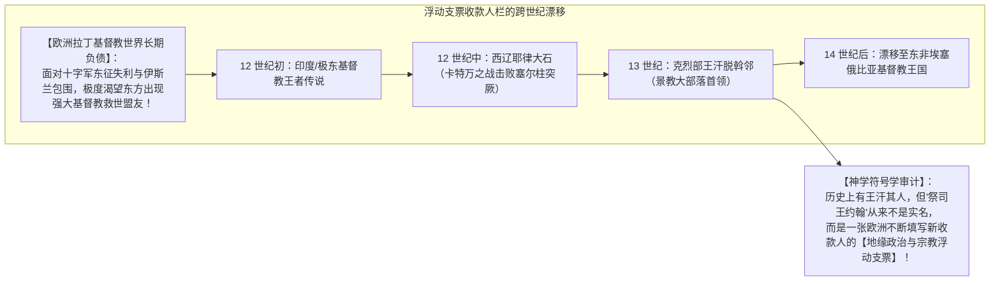
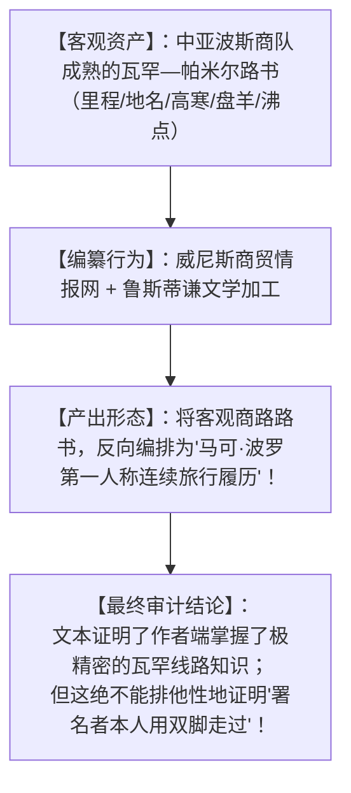

# 《三更道场》认识论总纲 · 文献学与历史会计审计：瓦罕地名年代学与“祭司王约翰”浮动支票审计

> **版本**：v1.0（中亚地名年代学与跨大陆政治宗教符号学专项审计）  
> **核心命题**：**严禁用晚出的蒙古称号“王汗（Ong Khan）”强行拆字解释古地名“瓦罕（Wakhān）”！Wakhān 至少在公元 9 世纪已见于波斯—伊斯兰地理文献（雅库比《诸国志》/《世界境域志》），早于蒙古帝国 300 年！《马可·波罗游记》对瓦罕—帕米尔的精细描写，反映的是其接入了成熟的跨国商队路书，存在“反向编排个人履历”的可能；而“祭司王约翰（Prester John）”不是单一历史人物，而是欧洲拉丁基督教世界制造的一张【跨大陆无形政治神学浮动支票（Floating Check）】——王汗与克烈部只是其在 13 世纪找到的一任背书人！**

---

## 一、三位一体的“瓦罕”年代学断代拆账

```mermaid
flowchart TD
    subgraph 1. 古瓦罕河谷小邦（Wakhān / Vakhān）
        A1["【出现时间】：至少公元 9 世纪（早于蒙古 300 年）"]
        A2["【文献实证】：891 年雅库比《诸国志》、982 年波斯《世界境域志》"]
        A3["【性质】：巴达赫尚以东、吐蕃以北之古老河谷人群与领主小邦"]
    end

    subgraph 2. 克烈部王汗（Ong Khan / Toghrul）
        B1["【出现时间】：12 世纪末至 13 世纪初（金朝封'王' + 草原'汗'）"]
        B2["【身份】：蒙古草原克烈部首领、成吉思汗义父、札合敢不之兄（唆鲁禾帖尼之伯父）"]
        B3["【性质】：游牧政治领袖称号，与 Wakhān 古地名无音变派生关系"]
    end

    subgraph 3. 现代瓦罕走廊（Wakhan Corridor）
        C1["【定型时间】：19 世纪末（1895 年英俄'大博弈'划界条约）"]
        C2["【性质】：帝国人为划定隔绝沙俄与英属印度的阿富汗狭长缓冲带"]
    end
```

### 1. 为什么“瓦罕源于王汗”不能成立？
- **时间严重倒挂**：波斯伊斯兰文献记载 **Wakhān** 比克烈部王汗早了三个世纪；
- **伪分词陷阱**：现代汉字“瓦罕”带有“罕”字，但其波斯/阿拉伯语原词是 **Wakhān / Vakhān**，后缀并不是蒙古语的统治者称号 *khan/qan*；
- **严密会计定性**：不能用近代汉字转写出现的晚近时间，去否认原名在西域文献中的古老存在。

---

## 二、“祭司王约翰（Prester John）”的无形资产与浮动支票机制



### 1. 唆鲁禾帖尼与克烈部景教网络的真实资产：
- 唆鲁禾帖尼是王汗之弟札合敢不之女，确为虔诚的景教（东方亚述教会）信徒；
- 她生育了蒙哥、忽必烈、旭烈兀与阿里不哥（四汗之母），将**景教十字架、游牧大妃法统与跨欧亚统治网络**深度植入了蒙古帝国心脏！
- 欧洲之所以把王汗直接认作“祭司王约翰”，是其**急迫地想要将这张开了两百年的神学救世支票，在蒙古帝国身上完成兑现平账**！

---

## 三、《游记》第 32 章“反向编排行程”的法医证据链



---

## 四、第二季方法论总结案

> **“地名是沉淀在山川间的古老地层，符号是漂浮在文明之上的政治支票。”**  
> 《三更道场》在此清算了将“古瓦罕”附会为“王汗”的伪分词假账，同时穿透了欧洲“祭司王约翰”浮动支票的神学幻象，将中亚地名史、跨欧亚商路情报与蒙古帝国景教法统，彻底还原为逻辑严密、证据闭环的真实历史会计总账！
