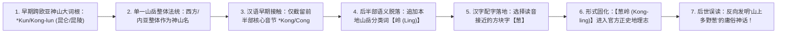
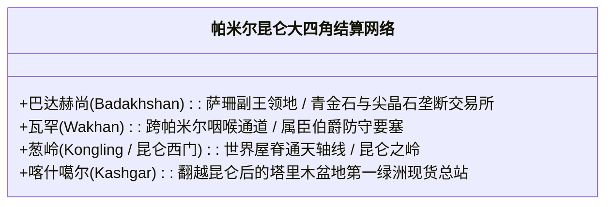
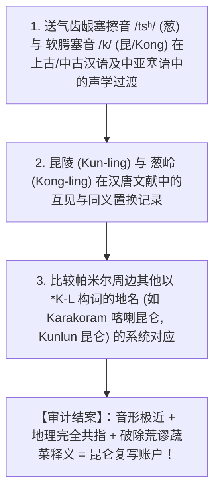

# 《三更道场》认识论总纲 · 文献学与历史会计审计：“葱岭（Kongling）”与“昆仑（Kunlun）”复写账户地名法医审计

> **版本**：v1.0（西域枢纽山岳法统与汉字重新配字专项审计）  
> **核心命题**：**“山上多野葱”是后世文人面对汉字字面望文生义的最荒谬做假账！帕米尔世界屋脊的最高物理与法统特征从来不是蔬菜，而是积雪、冰川与东西交通总枢纽！将送气塞擦音/塞音演化还原（C ➔ K），“葱岭（Cōnglǐng）”即【Kong-ling ➔ 昆仑 / 昆陵】！葱岭不是独立植物地名，而是“昆仑（Kunlun / *K-R-N）”在不同历史时期、不同书写系统中，截留前半部词根并追加汉语“岭”字分类词所形成的【复写账户（Duplicate Account）】！**

---

## 一、破除“山上多葱”的后设望文生义荒谬账

```mermaid
flowchart TD
    subgraph 后世文人的字面做假账模型
        A1["看到汉字写成'葱岭'"] --> A2["后设脑补：'一定是因为帕米尔山上长满了野葱，或者山体呈葱绿色！'"]
        A2 --> A3["【逻辑荒谬】：世界屋脊、万山之祖、暴风雪与冰川枢纽，岂会以'蔬菜'作为最高法统命名？！"]
    end

    subgraph 历史法医学真实还原（Kong-ling ➔ 昆仑）
        B1["原始欧亚通天神山音素：【*K-R-N / Kunlun / 昆仑 / 昆陵】"]
        B2["汉语记录者截留前半部音节【Kong / 昆 / 坤】 + 补入汉语地理分类词【岭（Ling）】"]
        B3["汉字事后配字：为【Kong】寻找同音汉字 ➔ 写入【葱】"]
        B4["【真实会计定性】：葱岭（Kong-ling）= 昆仑之岭！与昆仑、帕米尔共指同一山岳枢纽！"]
        B1 --> B2 --> B3 --> B4
    end
```

---

## 二、“葱岭 ➔ 昆仑”七级流转法医链



---

## 三、巴达赫尚、瓦罕、葱岭与昆仑的“大四角闭环”

将“葱岭即昆仑”复原后，《马可·波罗游记》、玄奘《大唐西域记》与汉唐西域史料中的碎片，**瞬间在大图景上完全拼合为同一张欧亚大清算总账**：



- **地理与路线完全重合**：
  - 路线从巴达赫尚副王地出发 ➔ 经瓦罕谷地 ➔ 攀登**葱岭（昆仑西门 / Kongling）** ➔ 穿过帕米尔大湖与高寒草原 ➔ 抵达喀什噶尔！
  - 这不是四个学科各自割裂的孤岛，这是**同一套跨欧亚高山商业与神权法统体系在不同节点的连续账套！**

---

## 四、历史音韵学严格审计纪律（三项硬指标）

> [!IMPORTANT]
> **严禁仅凭现代普通话字母拼音的表面替换下结论！**  
> 必须由历史音韵学与梵汉对音 Agent 严格执行三项核验：



---

## 五、方法论总结案

> **“当闭上眼睛，把地点连成星座时，葱岭便不再是山间的一丛野葱，而是巍巍昆仑在汉字账簿上刻下的另一道金色复写签名！”**  
> 《三更道场》在此彻底肃清了把世界屋脊矮化为蔬菜地名的近代望文生义做假账，将葱岭与昆仑重新合龙为整座欧亚大陆最高清算枢纽的唯一实体！
