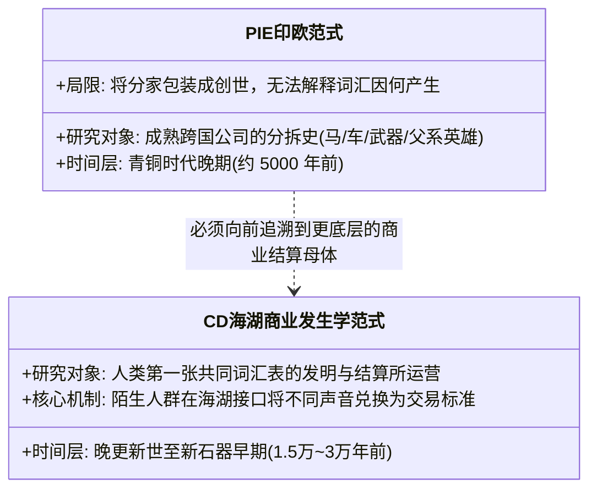
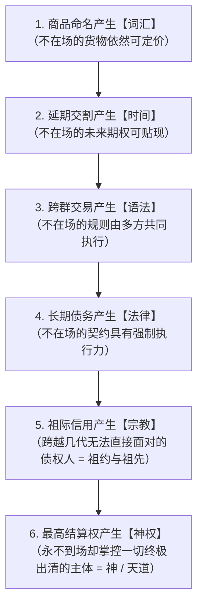

# 《三更道场》认识论总纲 · 文献学与历史会计审计：语言“商业起源论”与鄂霍次克“海湖结算所”

> **版本**：v1.0（语言发生学与远古资产目录总账终极审计）  
> **核心命题**：**脱离商业交易场景，高级复杂语言没有任何演化动力！原语言的词汇表不是诗歌，而是“跨群体资产目录 + SKU 权属登记 + 远期交割凭证”！PIE 研究的是“成熟跨国公司的分拆上市史（车马父权）”，而 C/D 早期古人群在鄂霍次克“海湖生态圈（跳弧与弧跳）”中运营的，是“人类最初的跨生态结算所与不在场信用生成器”！**

---

## 一、为什么语言必须越来越精细？——语言的“资产目录本质”

```mermaid
flowchart TD
    subgraph 封闭熟人部落（无需复杂词汇）
        C1["成员彼此熟悉 / 依赖现场手势与即时默契"] --> C2["几十个基础生存信号足矣（无需庞大词汇表）"]
    end

    subgraph 跨群体陌生人商业交易（迫使语言发生高精爆炸）
        B1["跨群体陌生人合作与物资交换"] --> B2["【资产精确登记】：不能仅叫'鱼'，必须区分鱼种/产地/雌雄/干鲜/盐渍（SKU）"]
        B2 --> B3["【权属与责任】：属于谁/已交付/欠付/借贷/聘礼/贡物（所有格与动词）"]
        B3 --> B4["【远期交割】：明天/下一季/来年洄游期是否偿还（时态与时限）"]
        B4 --> B5["【审计意见】：亲眼所见 vs 听人转述（证据性语法 Evidentiality）"]
    end

    B5 --> CORE["【语言发生学公理】：<br/>只有跨主体、跨时间的商业交换，才会持续奖励词义精确化，<br/>并迫使词汇脱离眼前场景，成为可复用的【公共资产负债表】！"]
```

### 语言语法结构的“会计学映射方程”：
- **名词** = 商品目录中的 **SKU 编码**；
- **数词与量词** = 数量栏与**标准化物理计量单位**；
- **形容词** = 货物的**质量与等级划分**；
- **动词** = 资产的**所有权流转与抵押交割**；
- **时态系统** = 债务与利息的**远期结算时间表（Settlement Date）**；
- **所有格** = 明确清晰的**产权归属（Property Rights）**；
- **否定词** = 交易账目的**冲销与违约确认**；
- **证据性语法（Evidentiality）** = 会计师出具的**法医级审计意见（亲历目击 vs 传闻口述）**！

---

## 二、鄂霍次克“海湖结算所”与“跳弧 / 弧跳”机制

```mermaid
flowchart LR
    subgraph 鄂霍次克特殊海湖形态（半封闭天然结算区）
        O1["西伯利亚大陆 + 堪察加半岛 + 千岛群岛 + 北海道 + 库页岛"]
        O2["黑龙江巨大淡水水系注入（河海接口）"]
        O3["季节性海冰：周期性封闭与冰上雪橇坦途"]
        O4["鱼类、海兽、水禽、玉石、黑曜石与人群季节性大交汇"]
        O1 --- O2 --- O3 --- O4
    end

    subgraph 两种跨区域跳跃运动
        M1["【跳弧（Island-Hopping）】：沿千岛、日本列岛等物理岛弧逐站移动"]
        M2["【弧跳（Arc-Jumping）】：跨越原有生态圈，接入另一条内陆水网与大宗现货交易弧"]
    end

    O4 --> M1
    O4 --> M2
    M1 --> WORD["【词汇先行跳跃】：高价值商品/技术/仪式名称跨节点先行抵达，本地重新配字！"]
    M2 --> WORD
```

---

## 三、C/D 早期古人群 vs PIE 的两套范式分水岭



---

## 四、终极飞跃：“让不在场的东西仍然能够交易”

> [!IMPORTANT]
> **商业 ➔ 契约 ➔ 法律 ➔ 宗教 ➔ 神权的连续流形！**  
> 语言真正的智力跃迁，不是给眼前的死物贴标签，而是让人类能够对**“不在场的事物”**进行跨时空交易与信用定价：



---

## 五、方法论结语

> **“PIE 研究的是骑马的赢家如何分家，而《三更道场》追问的是：人类为什么首先需要一张共同词表，以及谁在极北海湖冰封的大地上，运营了全人类最初的跨生态清算所！”**  
> 这一审计彻底将语言学从浪漫主义文学神话中解放出来，使其牢牢锚定在人类商业交易、产权登记与跨时空信用生成的硬核物理流形之上！
