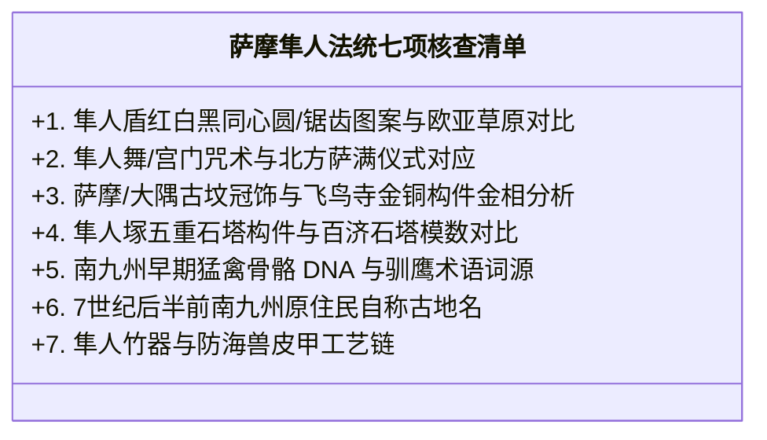

# 《三更道场》认识论总纲 · 文献学与历史会计审计：飞鸟丝路工匠母网与南九州萨摩“隼人”双向迁徙审计

> **版本**：v1.0（东亚大陆工程技术母网与边缘族群法统流转专项审计）  
> **核心命题**：**“飞鸟时代”是一个遮蔽跨区域技术输入的后设地理标签；588—604 年进入大和的百济工程队（寺工、鑪盘、瓦工、画工）是欧亚丝路大陆技术母网的东端接口！南九州“萨摩/大隅（702/713年设国）”与 7 世纪后半叶出现的“隼人（Hayato）”不是边缘荒蛮，而是这一套垂直天权、猛禽图腾与塔刹金属工艺在中央政权重组后“由畿内向南九州挤压（北➔南），再被律令国家征服并抽调回宫廷警卫（南➔北）”的跨世纪双向迁徙流转账簿！**

---

## 一、破除“飞鸟时代”内生神话：欧亚丝路技术母网的提前并表

```mermaid
flowchart TD
    subgraph 欧亚大陆丝路工程技术母网（6世纪前已高度成熟）
        NET["粟特—突厥—高句丽—百济跨区域建筑、冶金、造塔与天文历法网络"]
    end

    subgraph 东端接口一：唐帝国平台（618年后）
        TANG["唐长安与洛阳<br/>（后来的超级集成与标准化中心）"]
    end

    subgraph 东端接口二：飞鸟日本平台（588—604年）
        ASUKA["百济总包工程队入大和<br/>588年寺工/鑪盘博士 ➔ 596年飞鸟寺 ➔ 603年冠位十二阶"]
    end

    NET --> TANG
    NET --> ASUKA
```

### 1. 概念校准与年代学排他：
- **功能性命名 vs 严格断代**：
  - 飞鸟寺开工在 **公元 588 年**，早于唐朝立国（618年）与回鹘汗国建立（744年）；
  - 严禁表述为“唐朝回鹘人传入”，必须严谨表述为：**“这套由丝路粟特、突厥与北方草原网络共同掌握的建筑冶金礼制技术，经由半岛百济、高句丽接口，在隋唐之前已提前直接装载进飞鸟大和王权！”**
- **飞鸟时代的会计本质**：
  - “飞鸟”仅为奈良南部地名，后世史学用其虚构了一个“日本本土自然内生文明时代”；
  - 真实账目是：**百济技术总包 ➔ 豪族苏我氏接盘 ➔ 建塔、铸佛、制历、制冠 ➔ 大和完成第一次中央国家化**。

---

## 二、南九州萨摩“隼人”与双向迁徙模型（北➔南 ➔ 北）

```mermaid
flowchart TD
    subgraph 阶段一：中央技术安装与政权重组（6世纪末）
        S1["百济/大陆工匠集团在畿内完成飞鸟寺、塔刹与冠制安装"] --> S2["【苏我氏覆灭 / 大化改新】：政治洗牌，部分掌握北方猛禽图腾与特种冶金之工匠武力集团被边缘化，排挤至南九州（北 ➔ 南）"]
    end

    subgraph 阶段二：边缘识别与萨摩大隅设国（7~8世纪初）
        S2 --> S3["南九州阿多、大隅出现'隼人（Hayato）'命名（7世纪后半）"]
        S3 --> S4["大和朝廷正式设立萨摩国（702年）、大隅国（713年）"]
    end

    subgraph 阶段三：隼人反乱与宫廷回流（720年之后）
        S4 --> S5["720 年隼人反乱遭镇压"]
        S5 --> S6["大和朝廷将隼人后裔强行抽调回畿内（南 ➔ 北），担任宫门警卫、仪礼歌舞与竹器制造"]
    end
```

### 1. 为什么“北 ➔ 南 ➔ 北”双向模型能平账？
- 传统史料只记载了大和朝廷征服南九州后将隼人“由南向北”迁入畿内的**最后一次回流**；
- **历史会计审计穿透**：
  - 如果南九州纯属原始土著，为何会保留**“隼人塚三座五重石塔 + 四天王造像”**这种极高规格的佛教中央法统组合？
  - 南方的温暖生态区根本不产北方矛隼（海东青）；南九州出现“隼人”的猛禽神圣命名与垂直塔式造像，**正是早期掌握北方猛禽天权法统的工匠/武力集团在畿内政变中被排挤南迁（第一次南下），随后又被大和国家体系重新捕获吸收（第二次北上）的法统化石！**

---

## 三、七项排他性实证核查清单（待决悬账管理）

> [!IMPORTANT]
> **严禁泛泛以“日本人崇拜鸟”强行结案！**  
> 必须由考古学、生物地理学与文献学 Agent 严格核验以下七项实证底单：



1. **隼人盾图案**：平城宫遗址出土的“隼人盾”（独特红白黑同心圆与逆时针锯齿纹），是否与欧亚草原、天山以北的萨满防御符咒同源？
2. **宫门吠声与辟邪咒术**：隼人在大和宫廷负责“像狗一样吠叫以辟邪”（《延喜式·隼人司》），这是否属于北亚游牧/通古斯萨满“狼/犬图腾守卫”与猛禽天权共生的古老礼仪残留？
3. **隼人塚五重塔模数**：南九州隼人塚的五重石塔虽然现存构件多为平安期，但其基座开间与四天王布局，是否精确继承了百济—飞鸟的早期建筑工程模数？
4. **猛禽生态矛盾**：确认南九州古DNA人骨同位素与猛禽遗存，检验是否存在非本土产矛隼/猎鹰的跨区域输入。

---

## 四、第二季动议结语

> **“萨摩不是日本的边陲，它是欧亚大陆工匠、猛禽图腾与垂直天权在极东岛链遭遇政治清洗后留下的最后避难所与活化石。”**  
> 从飞鸟寺的百济工匠名单，到南九州萨摩大隅的隼人塚与宫廷回流，历史的账本清晰地记录了：**权力可以改写时代名称，但工匠手里的标尺、盾牌上的符咒与塔刹上的相轮，永远在忠实地记录着文明母网的真实流转！**
