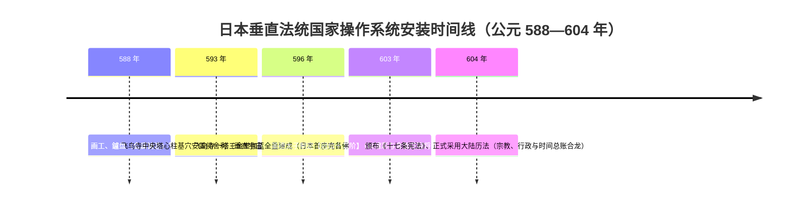
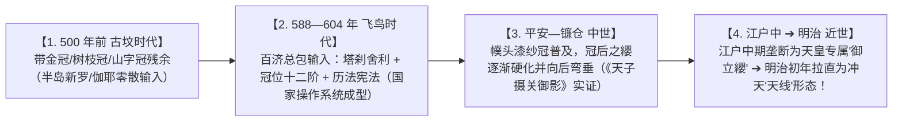

# 《三更道场》认识论总纲 · 文献学与历史会计审计：飞鸟寺塔心柱与冠位十二阶“垂直法统”合龙

> **版本**：v1.0（东亚国家操作系统安装与天权建筑人体双向映射专项审计）  
> **核心命题**：**公元 588—604 年是日本古代国家“垂直宇宙轴法统系统”的完整安装窗口！飞鸟寺伽蓝建成（596年）与圣德太子确立“冠位十二阶”（603年）仅相差 7 年——“塔是国家的冠，冠是人体的塔”！中央塔心柱舍利安置（宇宙轴）与人体头顶冠饰等级编码（微型塔基）是同一套天授秩序在“国土建筑”与“官僚身体”上的双向同步部署！**

---

## 一、7 年制度同步：公元 588—604 年国家操作系统安装表



### 1. 为什么说这绝非孤立器物巧合？
- **588 年百济工程技术包**：
  - 《日本书纪》明载百济威德王派遣佛舍利及僧侣，并打包派遣**寺工、鑪盘博士（铸造塔刹相轮的顶级冶金专家）、瓦博士、画工**；
  - 这是一场**跨海交付的国家级“文明基础设施工程总包”**，而非民间零散信仰传播！
- **596 年（飞鸟寺成） $\longleftrightarrow$ 603 年（冠位十二阶） = 仅差 7 年**：
  - 考古发掘证实：飞鸟寺塔心柱埋于地下深处，置有金铜、银、金三重舍利盒与玉器（真身舍利为宇宙轴心）；
  - 7 年后，国家最高权力立刻颁布《冠位十二阶》（《隋书·倭国传》载“始制冠，以锦彩为之，金银镂花为饰”），**将头顶装置正式升级为全国法统的等级分配总表**！

---

## 二、“塔冠同构”哲学：垂直法统的双向映射方程

```mermaid
flowchart TD
    subgraph 国土层级：宏观宇宙天轴
        T1["【飞鸟寺 / 法隆寺中央五重塔】"]
        T2["地下塔心柱础（舍利盒 / 玉宝）"]
        T3["贯穿全塔之木质心柱（Axis Mundi / 宇宙天轴）"]
        T4["塔顶九轮相轮与宝珠（接受天界神权）"]
        T1 --- T2
        T1 --- T3
        T1 --- T4
    end

    subgraph 人体层级：微观权力塔基
        C1["【官僚与君主之礼冠 / 冠位十二阶】"]
        C2["人体头顶（微型塔基与肉身底座）"]
        C3["束带、发髻与贯顶之簪导（人体轴线）"]
        C4["冠顶金花、髻华与日形金饰（接受上方授权）"]
        C1 --- C2
        C1 --- C3
        C1 --- C4
    end

    T4 <===>|“塔是国家的冠，冠是人体的塔”| C4
```

### 1. 垂直法统的本质：
- **塔的功能**：将整片物理国土锚定在天界佛教宇宙中心（须弥山 / 舍利天轴）；
- **冠的功能**：将君主与贵族官僚的人体，转化为接收这一宇宙授权的微型接收器；
- **冠位十二阶的制度意义**：不是为了好看，而是**将不可见的形而上学神权，转译为肉眼可见、绝对不平等的垂直权力阶梯**！

---

## 三、下限厘定与四层演变总账

> [!IMPORTANT]
> **公元 500 年是日本“整包国家法统操作系统”的理论下限！**  
> 必须严格区分“古坟时代零散金冠”与“飞鸟时代整套垂直法统”：



| 历史阶段 | 核心载体 | 空间与法统形态 | 会计定性 |
| :--- | :--- | :--- | :--- |
| **公元 500 年前** | 古坟金铜冠、勾玉 | 部落酋邦零散祭祀，无全国统一编码 | **期初前置零散资产** |
| **公元 588—604 年** | **飞鸟寺塔心柱 + 冠位十二阶** | **中央舍利天轴 + 全国统一十二级冠制** | **【国家操作系统首次安装完成】** |
| **公元 8~14 世纪** | 平安礼冠、中世漆纱冠 | 冠后之纓向后弓垂，维持中世公家传统 | **稳定运行与渐变期** |
| **公元 18~19 世纪** | **御立纓冠（冲天化）** | 将纓笔直竖起，垄断为近代天皇神圣天权 | **【近世皇权冲天发明与重塑】** |

---

## 四、方法论结语

> **“追寻日本天皇的最高天权，不需要在元日战争的硝烟里苦寻蒙古罟罟冠的直接影踪；它的第一代底层代码，早在公元 596 年飞鸟寺落成与 603 年圣德太子制冠的这 7 年里，就已经完整刻入了东亚的文明硬盘之中！”**  
> 这一审计将日本皇权、佛教传入、半岛百济技术总包以及近世符号重塑，彻底整合在了一张跨越 1400 年的历史会计连续总账之上！
