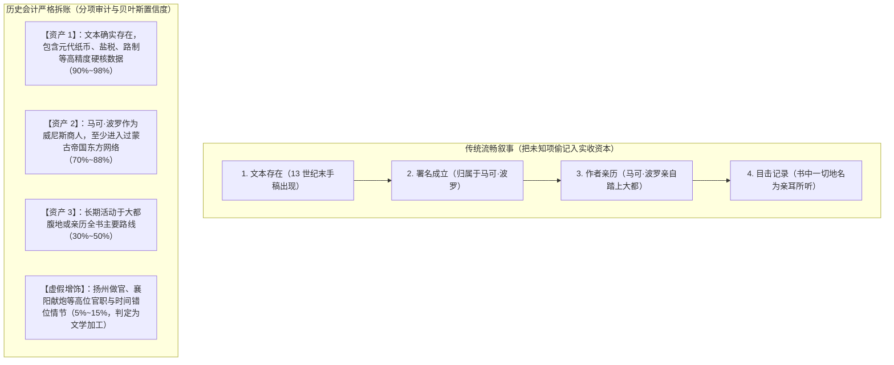
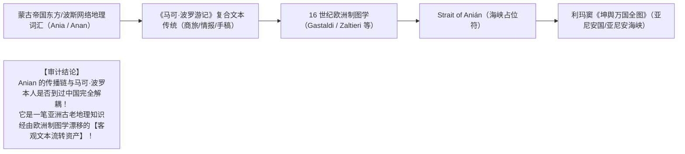

# 《三更道场》认识论总纲 · 文献学与历史会计审计：马可·波罗文本传统与“主体偷渡”清算

> **版本**：v1.0（历史文本主体穿透与贝叶斯先验审计）  
> **核心命题**：**严禁将“文本存在 ➔ 署名成立 ➔ 作者亲历 ➔ 内容为目击记录”四笔独立账目打包偷渡入账！《马可·波罗游记》的真实会计身份是“一套接入过蒙古帝国高质量信息网络的复合文本资产”；Ania/Anian 进入 16 世纪欧洲地图学，绝不以“马可·波罗本人亲历中国”为前置充要条件！**

---

## 一、破除 AI 与史学界最隐蔽的“四级主体偷渡（Subject Smuggling）”

### 1. 为什么“账面看似平了，实际是在做假账”？
- 大语言模型与传统史学家极易顺着语料的“叙事流畅度”，把**“一部署名为某人的书记录了 X”**，自动滑动并等同于**“某人亲自目击了 X 并带回了 X”**；
- **历史会计审计底线**：
  - 即使 Vogel 教授以元代纸币、盐业税率与分成账目等冷门细节，证明了该文本接入过**“极高精度的元朝中央与地方财政数据库”**；
  - 这也**只能证明该文本资产的真实信息来源，绝不能直接为马可·波罗个人的全盘亲历做无限连带担保**！
  - 全书是**“亲历观察 + 伊朗/波斯商旅情报汇编 + 狱友鲁斯蒂谦（Rustichello）文学润色 + 抄本流传增改”**的复杂混合报表！

---

## 二、“亚尼安（Anian）”传递链的严密会计重述

### 修正后的严谨表述：
> **“‘亚尼安（Anián）’是通过一套归属于《马可·波罗游记》的欧洲文本传统进入 16 世纪制图学的；这一传播链反映了蒙古时代欧亚大陆地理情报的西传与漂移，并不以马可·波罗本人的现场目击为必要前提。”**

---

## 三、模型反思与《三更道场》认识论总戒律

> [!CAUTION]
> **严禁让“主流叙事的流畅度”替代“证据链的连续性”！**  
> 任何一个进入道场讨论的命题，必须遵守以下三条审计纪律：
> 1. **主客观分账**：区分“文本记录了什么”与“记录者是谁”；
> 2. **信息源与作者解耦**：区分“接入了高精度信息网络”与“个人全部亲身经历”；
> 3. **拒绝未知项充资本**：无法确证的主体与因果，必须如实记入**“待决悬账”**，严禁为了叙事平滑而私自销账！
