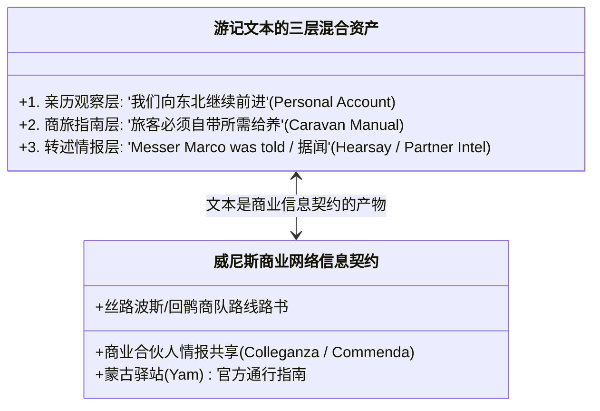
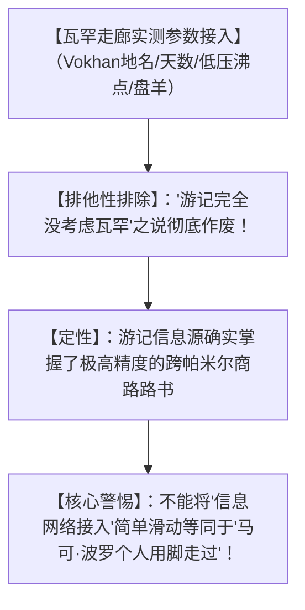

# 《三更道场》认识论总纲 · 文献学与历史会计审计：《马可·波罗游记》瓦罕走廊文本法医与“商路信息契约”审计

> **版本**：v1.0（跨帕米尔商路法医学与个人亲历排他性终极审计）  
> **核心命题**：**“从中国乘海船回波斯”绝不能反向证明“此前一定由陆路亲自走过瓦罕走廊（来程与回程是两份独立凭证，不可跨期抵消）”！《马可·波罗游记》第一卷第 32 章确实精准记录了 Vokhan（瓦罕）、帕米尔高原天数、大角野羊以及“高海拔火不旺、饭难熟”等高精度参数；但这首先证明的是“该文本接入了一份质量极高的瓦罕—帕米尔商路物流说明书（商路信息契约）”，绝不等于自动证明署名者用自己的肉身双脚走完全程！要证明【人到了】，不能仅证明【账到了】！**

---

## 一、来程 vs 回程：两笔不可互相担保的独立分录

```mermaid
flowchart TD
    subgraph 传统学术界的逻辑偷渡（跨期违规冲销）
        T1["回程凭证：伊利汗国公主阔阔真出嫁泉州海路船队（波斯史料勾稽）"] --> T2["【违规推论】：既然坐船回去了，说明此前必定由陆路走过帕米尔来大都！"]
    end

    subgraph 历史会计法医分账原则
        A1["【分录一 · 陆路来程】：瓦罕走廊 ➔ 帕米尔 ➔ 喀什噶尔（需独立检验）"]
        A2["【分录二 · 海路回程】：泉州 ➔ 印度洋 ➔ 霍尔木兹（需独立检验）"]
        A1 -. 严禁单向自动担保 .-> A2
    end
```

- **历史会计法医铁律**：来程与回程在地理、时间与信息源上是**两份完全独立的会计凭证**；海路出行的真实性，绝不能反向为陆路翻越帕米尔的亲历做无限连带背书！

---

## 二、《游记》第一卷第 32 章瓦罕段落的“文本法医解剖”

```mermaid
flowchart LR
    subgraph 瓦罕—帕米尔高精路线参数（Yule-Cordier 第32章）
        R1["巴尔赫/塔里寒 ➔ 巴达赫尚"] --> R2["沿河向东北行 12 日 ➔ 【Vokhan (瓦罕)】（特有语言/臣属关系）"]
        R2 --> R3["再行 3 日 ➔ 登上'世界最高处'（两山之间大湖与河流）"]
        R3 --> R4["【极寒与低压】：气候酷寒、'火不旺、发热不足、食物难煮熟'"]
        R4 --> R5["【生物与物流】：大角野羊（盘羊/马可波罗羊）、'瘦牲畜10日长肥'、'必须自带给养'"]
        R5 --> R6["穿行 12 日 ➔ 喀什噶尔"]
    end
```

### 1. 瓦罕段落的核心证据价值：
- **地名与政治层级**：明确列出 **Vokhan**，并指出其地方首领臣属于巴达赫尚王；
- **生理与物理体感**：**“海拔极高、火焰不旺、发热不足、肉食极难煮熟”**——这是极其罕见、高度符合高海拔沸点降低与低氧燃烧的亲历/商旅硬核物理常识；
- **动物与生态**：精确记录长角野羊（后世动物学命名为 *Ovis ammon polii* / 马可波罗盘羊）及其角堆路标。

---

## 三、“商路信息契约（Information Contract）”与文本裂口

> [!IMPORTANT]
> **一份正确的路线说明书 $\neq$ 署名者肉身走过！**  
> 必须由文献版本学 Agent 穿透现存手稿中的三层叙事裂口：



### 1. 文本裂口分析：
- 在《游记》早期不同抄本（法意本、拉丁本、Z本）中，关于瓦罕行程的表述在**“第一人称亲历（We went）”**与**“第三人称转述（Marco was told）”**之间存在显著摆动；
- 这证明该文本并非私人日记，而是**威尼斯商人利用其跨国合伙网络（Commenda 契约），将波斯/回鹘商队路书、亲历片段与鲁斯蒂谦文学润色融为一体的“商业情报综合报表”**！

---

## 四、认识论贝叶斯概率定桩



---

## 五、方法论结语

> **“商路本身就是一份跨越生死与荒漠的信息契约；商人即使没有亲自登上世界屋脊，他的合伙人与账本也早已走遍了整条瓦罕走廊。”**  
> 《三更道场》在此确立了对古代旅行文献的法医学终极审计标准：**要证明【人到了】，不能仅证明【账到了】！** 只有将文本拆解为亲历、情报、路书与转述四笔独立分录，我们才能在历史的迷雾中还原最真实的欧亚大动脉！
