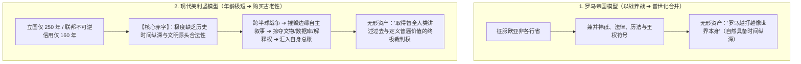
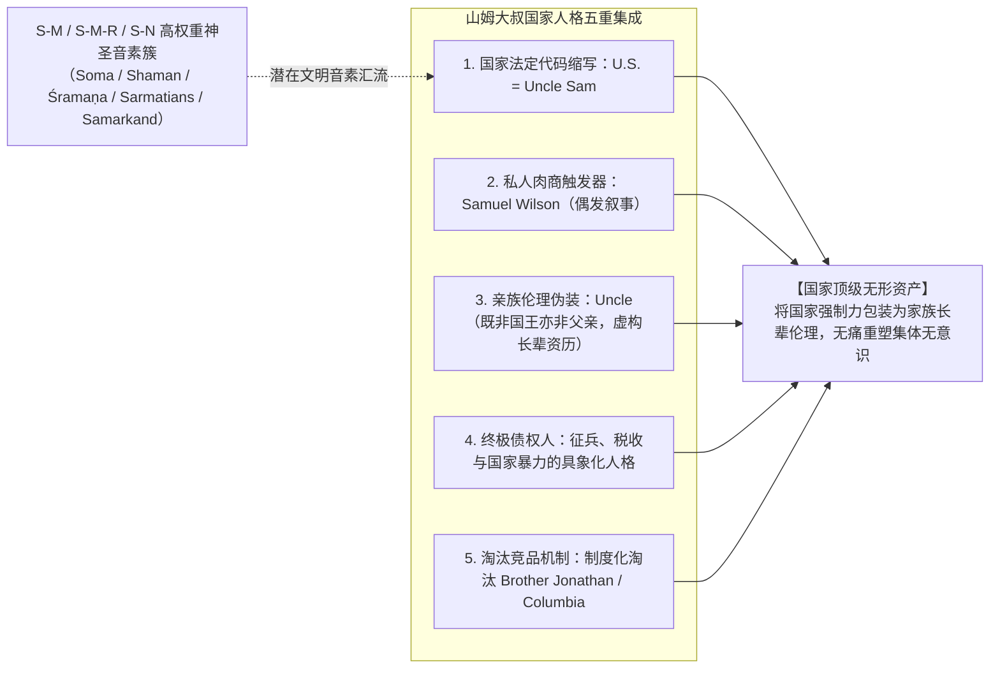
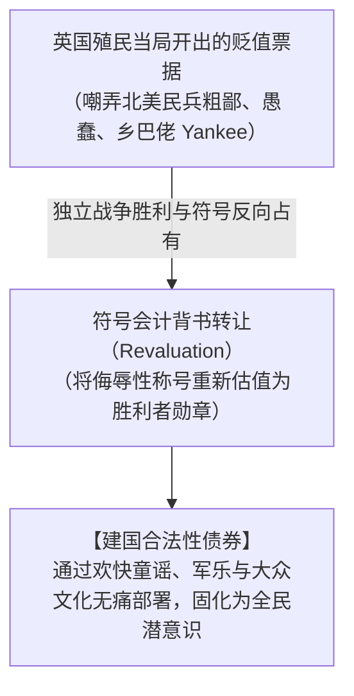

# 《三更道场》认识论总纲 · 现代国家无形资产审计：帝国“古老性购买”与符号再估值机制

> **版本**：v1.0（地缘战争无形资产与国家人格符号学专项审计）  
> **核心命题**：**战争不仅抢夺石油、土地与地缘控制权，更在为历史极短的新兴帝国“购买时间纵深（Time Depth）”与“普世文明继承权”。美国作为不可逆国家主体仅 160 年（南北战争与绿背信用统一），其最稀缺的战略资产是“古老性”；山姆大叔（Uncle Sam）与《扬基歌》（Yankee Doodle）正是国家机器实现符号再估值与无痛部署的顶级无形资产！**

---

## 一、罗马与美国的“年龄赤字”与文明继承权合并报表

### 1. 为什么“古老性”是最高维度的战略资产？
- 如果仅按财政预算与石油现金流计算，近半个世纪的多场远征在中短期财务上呈现天量赤字；
- **历史会计审计穿透**：战争的回报包含四类无法直接在财政表列示的**超级无形资产（Intangibles）**：
  1. **文明继承权**：将两河流域、地中海、近东与被征服区域的历史，追溯性打包进“西方文明从雅典到华盛顿”的单向神圣叙事；
  2. **绝对命名权**：定义谁是“自由世界”、谁是“蛮族”、谁代表“普遍价值与基于规则的秩序”；
  3. **档案与数据控制权**：控制全球顶级博物馆、学术基金会、近东考古数据库与历史编纂入口；
  4. **时间纵深购买**：让一个缺乏前现代深度的新兴帝国，迅速升格为全人类文明成果的“当然继承者与破产重组清算人”。

---

## 二、“山姆大叔（Uncle Sam）”的符号学与亲族伦理审计

### 1. 触发事件 vs 制度选择
- **民间庸俗故事**：1812 年战争期间 `U.S.` 军需牛肉桶与商人 Samuel Wilson 的谐音双关；
- **历史会计审计**：
  - Samuel Wilson 即使为真，也仅仅解释了**“这个词如何被触发”**；
  - 它完全无法解释：**为什么它能干掉更早的“乔纳森兄弟（Brother Jonathan）”？为什么国家机器在 20 世纪将其法定化为国家象征？**
- **亲族伦理与年龄重估**：
  - 为什么不是“山姆兄弟（Brother）”？
  - 一个年轻共和国，必须对内虚构一层“长辈（Uncle）”的资历与监护权——**既规避了君主制的“父权专制”，又在平民共和语境下获得了催缴税款与征兵送死的不可置疑的长辈权威**！

---

## 三、《扬基歌（Yankee Doodle）》：贬值票据的建国债券再估值

- **符号会计法则**：面对敌对阵营施加的贬值符号，最顶级的操作不是辩解或消灭该词，而是**在取得实体胜利后实施“符号反向占有（Re-appropriation）”**；
- 原本证明“你不配进入古典文明”的乡巴佬小调，被反向背书为“旧帝国不可战胜神话的埋葬者之歌”！

---

## 四、无形资产审计的纪律与底线

> [!IMPORTANT]
> **严禁将“符号聚类分析”直接等同于“深层共谋事实”！**  
> 必须严格区分以下三层事实：
> 1. **现象级事实**：`S-M` 音素在高权重神圣节点（萨满、微茫、月神、撒尔马提亚、撒马尔罕、山姆）中的高频聚集；
> 2. **制度级事实**：美国国家机器在 19~20 世纪通过法律、海报与教材对 Uncle Sam 的制度化筛选与垄断；
> 3. **因果级推论**：建国精英是否有意识调用远古密码，必须作为**“待查悬账”**，严禁在缺乏直接档案凭证的前提下强行结案！

---

## 五、全剧认识论总闭环

> **“美国不仅以战争取得地理空间，更以符号工程为自身购买历史时间；不仅控制物流与大宗现货，更通过接管古老名称、文明残余与普遍叙事，填补自身的年龄赤字。”**  
> 这构成了《三更道场》跨越古代欧亚水网、罗马帝国合并报表，直至现代世界体系无形资产大清算的完整方法论闭环！
