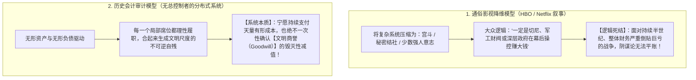
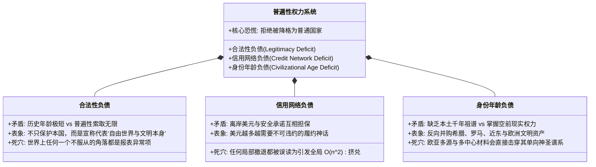
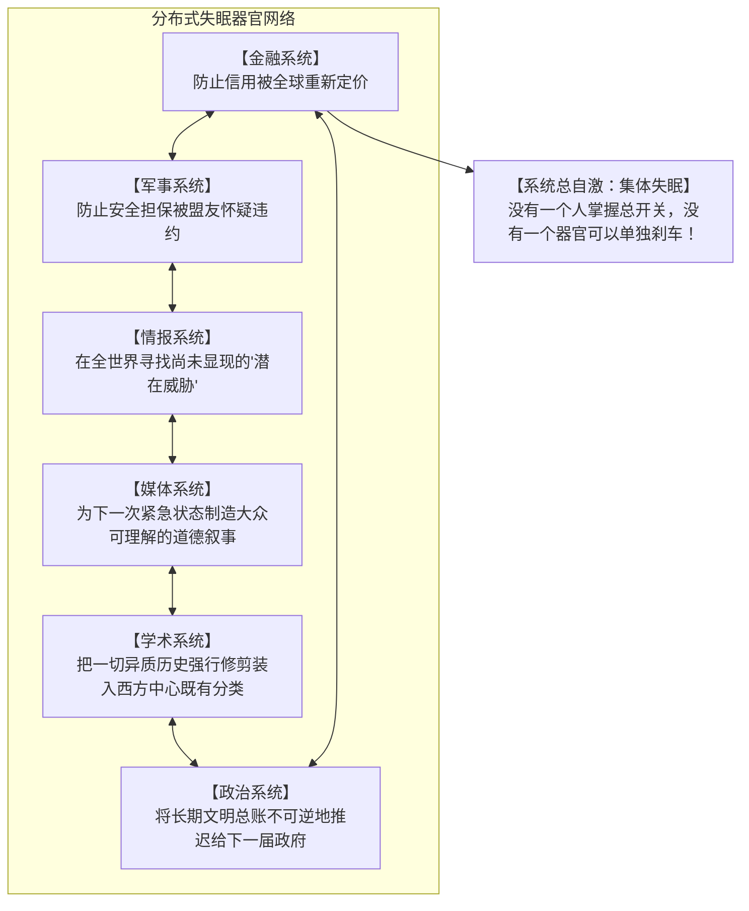

# 《三更道场》认识论总纲 · 现代国家无形资产审计：普遍性权力系统的三笔无形负债与“集体失眠”机制

> **版本**：v1.0（文明系统病理学与全球无形商誉减值总账）  
> **核心命题**：**发动并维持跨半球亏损战争的，从来不是某一个躲在幕后的具体阴谋集团（共济会/光明会/军工复合体/犹太财阀），而是“一个没有所有者、没有终止条件、以透支未来信用维持当前秩序的普遍性权力系统（Universalist Power System）”！推动它不断进行地缘自残与战略透支的，是三笔无人敢确认减值、却必须不断付息的【文明无形负债】；系统因失去“已安全”的判据，陷入不可逆的【分布式制度化集体失眠（Institutional Insomnia）】！**

---

## 一、破除大众通俗影视的“阴谋论降维陷阱”

### 为什么说大众把字形理解简单了？
- **汉字**：将字形、古义、典故与制度沿革强行压缩在同一个视觉与表意单位中，天然具备读取文明地层的纵深能力；
- **字母文字**：必须经过严格的古典语言与词源学教育，一旦古典教育被大众娱乐文化（影视快餐）稀释，社会便拥有**极高的横向信息吞吐量，却彻底丧失了纵向读取历史地层的能力**；
- 于是，面对无法由局部利益平账的战争，大众只能本能地寻找“背后的坏人”，而无法理解**“一个没有总舵手的自激系统如何稳定地输出灾难”**。

---

## 二、驱动系统不断付息的三笔“文明无形负债”

### 1. 第一笔：合法性负债（Legitimacy Deficit）
- 普通民族国家可以随时退回自己的物理国界之内，但宣称代表“普世秩序与文明终点”的国家不能；
- **核心风险**：一旦放弃干涉、不再扮演世界秩序，它就必须回答**“如果不是世界秩序，我究竟是谁”**这一致命的自我身份虚无。

### 2. 第二笔：信用网络负债（Credit Network Deficit）
- 美元、美债、基地、航道与盟约构成了一个庞大的**连带担保责任网络**；
- **自动主权机制**：没有任何人能主动叫停——每一个参与者都在维护自己手中的局部资产，但系统合起来发出的指令只有一条：**“必须继续动用武力以证明担保有效，哪怕动用武力会催生更多债务与敌人！”**

### 3. 第三笔：身份年龄负债（Civilizational Age Deficit）
- 年轻帝国通过**“文明层面的反向并购”**，将希腊民主、罗马法权、欧洲血统与全球博物馆文物强行并入自己的合并报表；
- **商誉减值恐慌**：任何证明“欧亚文明多源自生、交流并非西方中心单向流转、古希腊罗马并非自足孤岛”的学术与地层证据，都在实质上威胁这笔高达数万亿的文明无形商誉！

---

## 三、“分布式集体失眠（Institutional Insomnia）”的器官分工

系统没有“天下已定、已经安全”的终结判据，只有“暂时还没有暴雷”的焦虑状态。每个器官都在精密运转，合力将整体推向永远不能睡眠的自激回路：

---

## 四、比资本增值更深沉的冲动：拒绝确认文明商誉减值

> [!IMPORTANT]
> **终极审计结论**：  
> 战争保卫的从来不只是几口油井或几个航道，而是**“既有秩序为了避免承认自身没有最终根据，而产生的庞大自我保存冲动”**！  
> 它要用持续支付的天量有形成本，去竭力阻止三件事的公之于众：
> 1. **美国只是一个地缘上非常普通、历史上非常年轻的民族国家**；
> 2. **现行世界秩序只是二战与冷战特定历史条件下形成的临时外挂安排**；
> 3. **所谓自足、连续的‘西方古典文明’，是一份近代才编制出来的追溯性合并报表**！

---

## 五、全剧思想总闭环

> **“阴谋集团尚可被刺杀与推翻，但一笔由全人类共同参与维持、分散在所有机构中分别履职、却无人敢出面确认减值的巨额文明商誉负债，才会让整个世界真正陷入制度化的集体失眠。”**  
> 《三更道场》全剧的十四期结构与跨季大纲，正是要用这一套最冷酷、最严密的历史会计审计工具，穿透这场绵延百年的全球文明大梦！
