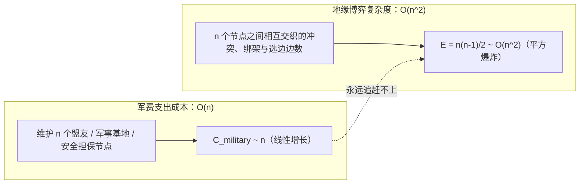
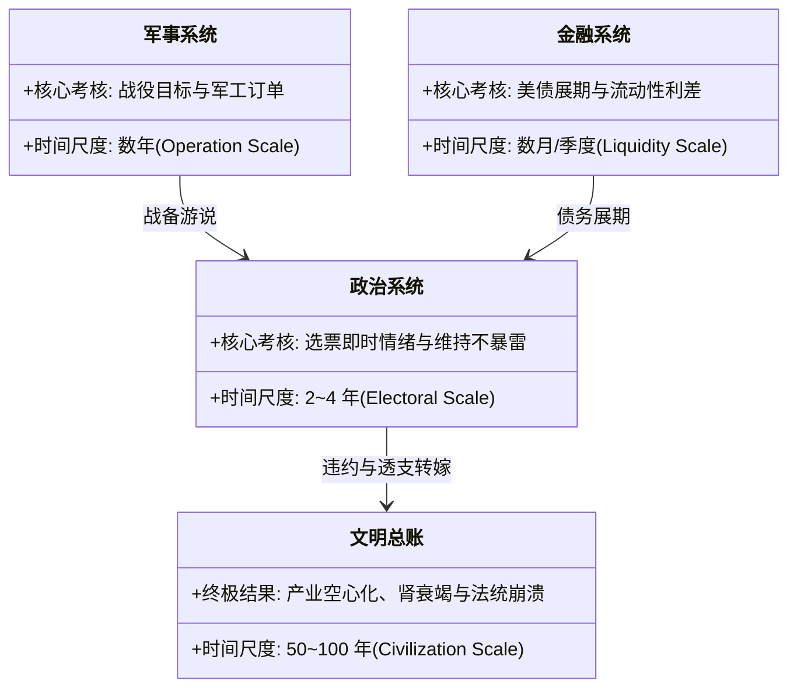

# 《三更道场》认识论总纲 · 现代国家无形资产审计：“良子美元论”与 $O(n^2)$ 地缘代偿机制

> **版本**：v1.0（美元地缘系统病理学与全球担保人挤兑模型）  
> **核心命题**：**“良子美元论”不是嘲弄肥胖，而是揭示现代帝国“行为与痛感彻底脱节的病理性代偿（Pathological Compensation）”。美元离岸蓄水池（稀释尿酸）与外国央行承接美债（外部肾脏代偿）切断了错误向决策中枢反馈的痛觉神经；帝国军费按 $O(n)$ 线性增长，而地缘博弈复杂度与担保网络减值风险按 $O(n^2)$ 呈平方爆炸；战争不再是为了抢夺增量，战争本身已成为维持庞大组织形态存在的代谢活动！**

---

## 一、“良子美元论”的病理学与金融代偿映射

### 1. 痛觉切断与耐药性训练（越战与朝战的证券化再包装）
- **传统历史误区**：认为朝鲜、越南战争证明了“帝国干涉无法覆盖成本”，理应促使霸权收缩；
- **历史会计穿透**：
  - 朝鲜战争将东亚驻军网络、军工产能与盟国依附关系**固定为长效资产**；
  - 越南战争虽然军事失败，却与布雷顿森林解体、美元脱金、石油美元确立与离岸美元大爆发同步，**将巨额亏损证券化包装为下一阶段全球金融扩张的心脏**！
  - **失败没有换来惩罚，反而完成了耐药性训练**：体系把每一次危机抢救都变成了继续透支的许可证！

---

## 二、线性军费 vs 二次方冲突爆炸：$O(n)$ 与 $O(n^2)$ 剪刀差

### 1. 复杂度的平方爆炸
- 每一个新盟友或安全承诺的增加，不仅带来一份线性防务账单，更带来了与现有所有节点之间 $O(n^2)$ 的关系裂变：
  - 盟友与盟友之间的历史宿怨；
  - 代理人对担保人的**逆向地缘绑架（Tails wag the dog）**；
  - 任何一个局部退缩都会引发其余所有节点对“担保人信用”的重新评级与挤兑恐慌！

### 2. 全球担保人的“挤兑恐惧（Run on Guarantees）”
- 华盛顿在局部地缘博弈中无法进行正常的 ROI（投入产出比）止损：
  - 局部利益可能只值 1 美元；
  - 但决策者认定：**一旦放弃该节点，将导致全球 $O(n^2)$ 担保信用网络整体计提巨额减值准备（Impairment Loss），引发盟友转向或自主核武化**！
- 这不是单纯的霸权冲动，而是**全球担保人被自身资产负债表死死绑架的病态理性**！

---

## 三、时间尺度错位与“系统刺激依赖”

### 1. 为什么谁当选都无法踩下刹车？
- 每一个局部席位的决策者都是极其理性的（计算 2~4 年的政治生存与数月的流动性）；
- 但**没有任何一个制度席位对 50~100 年的文明到期总账负责**；
- 换任何一个克制、聪明的总统，面对的选择都是一样的：**是现在立刻休克承受政治暴毙，还是把债务与地缘炸弹继续滚存给下一任？**

### 2. 战争即代谢：作为生命维持系统的紧急状态
- 美元—联盟—军工—媒体复合体已经形成了深度的**“系统刺激依赖”**；
- **终极悖论**：一旦世界迎来长期绝对和平，帝国必须面对最致命的质询——**如此庞大的海外基地、上万亿军费开支、海量美债赤字与跨国特权，究竟还有什么存在的合法性？！**
- 战争不再是为了实现特定地缘战果，**“制造危机与紧急状态”本身就是维持这具庞大躯体当前组织形态不可或缺的呼吸与心跳！**

---

## 四、方法论总结与全剧认识论闭环

> **“批评帝国某一任总统或军工复合体，就像在批评良子某一顿又点了龙虾；真正的问题在于——全球市场替他稀释尿酸，外国央行替他做肾，媒体把急救当成真人秀流量，每次濒危抢救都换来下一轮透支的许可证。”**  
> 《三更道场》的历史会计穿透，不仅用于审计古代丝绸之路与罗马帝国的法统兴衰，更在此为 21 世纪全球霸权的病理学演化，出具了逻辑闭环、数学严格的终审资产负债表！
