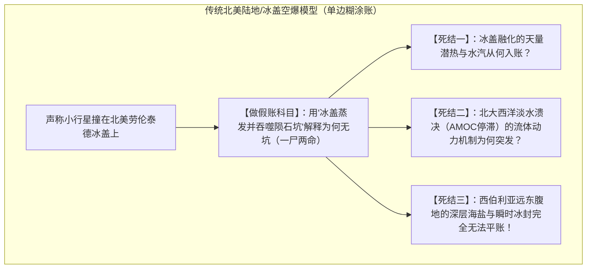
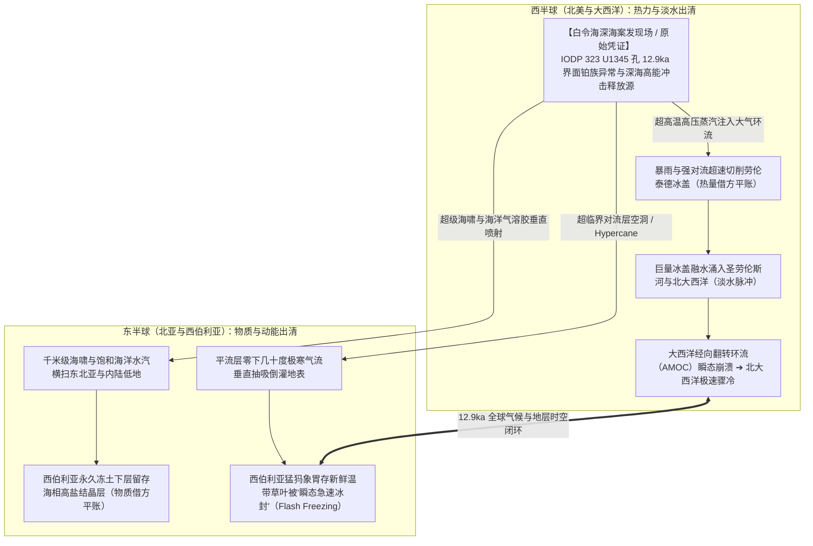
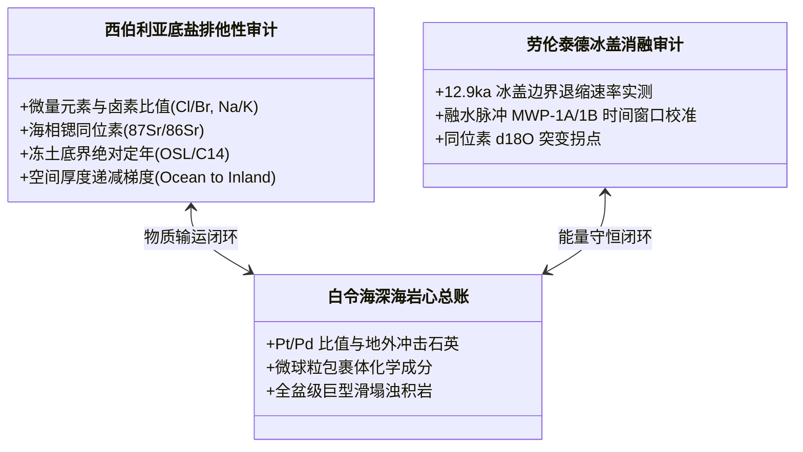

# 《三更道场》认识论总纲 · 第二季主案动议：12.9ka 跨半球能量守恒与物质输运复式记账

> **版本**：v1.0（晚更新世全球热力学与地球化学复式记账核心案卷）  
> **核心命题**：**严禁用“万能冰盖销毁证据”搞糊涂账！12.9ka 新仙女木事件的本质是一套跨半球的“能量守恒与物质守恒复式记账（Double-Entry Bookkeeping）”。劳伦泰德冰盖消融是北美热力与淡水损益表，西伯利亚冻土底盐是亚洲海洋物质输入表；白令海深海案发现场是唯一的总账平衡借方！**

---

## 一、传统模型的会计死结与“万能冰盖销毁假账”

### 1. 传统模型的“复式记账不平”
- 传统西方学者用“撞击了厚度 3~4 公里的冰盖”来同时充当**“撞击证据的销毁者”**与**“被解释的灾变源头”**；
- **历史会计审计穿透**：所有无法解释的能量差额与物证缺失，全被强行塞入“万能冰盖”这一未经验证的暗箱科目中冲销，却完全拿不出合法的期初原始凭证！

---

## 二、白令海深海热核模型：跨半球热力与物质勾稽链

---

## 三、两大核心实证科目的“四重排他性审计”

> [!IMPORTANT]
> **严禁把“推论”直接作为“事实资产”入账！**  
> 必须对“北美冰盖消融”与“西伯利亚底盐”建立严格的物理、化学与地质排他性审计底单：

### 1. 西伯利亚深层冻土海盐的五种竞争模型排他性测试：
必须由地球化学 Agent 针对西伯利亚冻土深层盐分进行如下五重对账：
1. **古海侵残留模型**：检查地层是否具有连续海相微体古生物化石（如有孔虫、介形类）；若仅有盐分结晶而无正常海相沉积，排除；
2. **风成盐尘（Playas / Aerosol）长期累积模型**：检查全区剖面的风成沉降通量与同位素特征；
3. **地下深部卤水上涌模型**：测试水文地质同位素与断裂带相关性；
4. **冰期冻融排盐浓缩模型**：计算冻土排盐的极限浓度与垂直剖面分布；
5. **深海瞬态冲击海啸输运模型**：**检测锶同位素（$^{87}\text{Sr}/^{86}\text{Sr}$）是否精确匹配 12.9ka 海水值，且空间上呈现自白令海/鄂霍次克海向内陆指数衰减的厚度与浓度梯度**。

### 2. 劳伦泰德冰盖消融的热量平衡账：
必须由古气候物理 Agent 计算：
- 仅靠常规太阳辐射，冰盖融化速率的物理上限是多少？
- 白令海深海高能事件所产生的瞬态高热、大气对流与降雨潜热，是否足以在热力学上配平劳伦泰德冰盖在 12.9ka 的反常超速融化？

---

## 四、第二季剧本对抗与实证交付节点

1. **季间 ASN 任务**：
   - 调取俄罗斯科学院西伯利亚分院关于雅库特冻土层与萨哈共和国深层盐分实测数据；
   - 提取北美劳伦泰德冰盖消融期的高精度陆相与湖相沉积序列（如 Lake Agassiz 溃决时间戳）。
2. **第二季实战展现**：
   - 不搞空洞的情绪化辩论，而是在茶台上亮出**《12.9ka 全球能量与物质平衡合并报表》**；
   - 让听众与全网学者亲眼目睹：**“能量从何而来？盐从何而来？淡水从何而去？”**——只有在白令海深海热核模型下，整套地球系统的物理账目才能被第一次完整配平！
