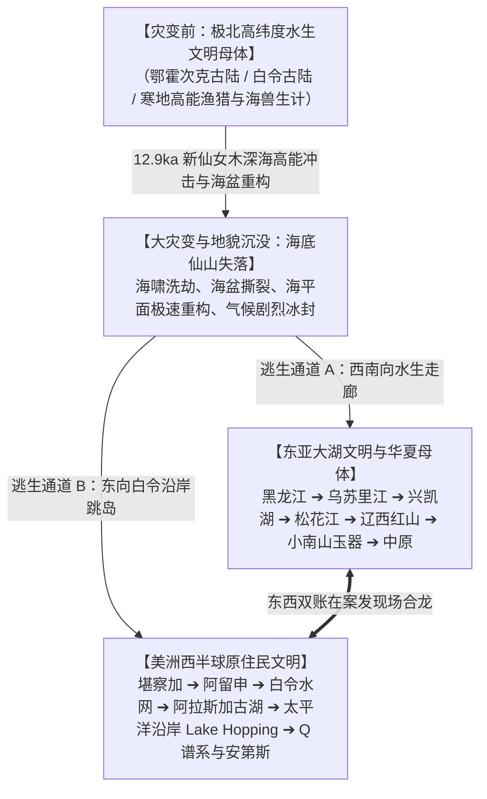
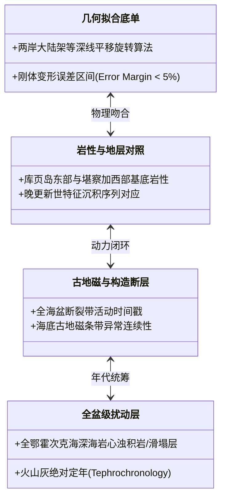

# 《三更道场》认识论总纲 · 第二季主案动议：北太平洋 12.9ka 灾变与鄂霍次克海盆高能重构假说

> **版本**：v1.0（地球物理学与晚更新世文明分叉主案动议）  
> **核心命题**：**白令海不是孤立通道，鄂霍次克海不是边缘终点；它们是 12.9ka 新仙女木（YD）极端能量事件下同一处北太平洋深海连续案发现场的东西两个账面！白令海深海撞击 ➔ 堪察加地幔/火山能量转换器 ➔ 鄂霍次克海盆剧烈重构与淹没 ➔ 迫使极北高纬水生母体分叉为“南下东亚大湖群（小南山/红山）”与“东进美洲西半球（Q谱系/Lake Hopping）”！**

---

## 一、命题分层与举证责任管理（三层进阶模型）

为了防止被建制派学术界直接打成“民科幻想”或“伪地质学”，必须对文本中叠置的三个不同强度的命题实行**分级会计建档与举证责任隔离**：

```mermaid
flowchart TD
    subgraph 第一层：法医取样级命题["【第一层：法医取样级命题（可直接检验）】"]
        L1["IODP 323 航次 U1345 孔 12.9ka 界面铂族元素异常、冲击石英及上下对比层重新测序"]
    end

    subgraph 第二层：地球物理响应级命题["【第二层：地球物理响应级命题（可建流体模型）】"]
        L2["深海高能冲击 ➔ 堪察加火山链东激西缓 ➔ 舍利霍夫湾泥火山 ➔ 卡舍瓦罗夫浅滩刀削平台与磁异常"]
    end

    subgraph 第三层：地貌重构与文明分叉级假说["【第三层：区域地貌重构与文明分叉级总假说（高风险核心案眼）】"]
        L3["鄂霍次克海盆在晚更新世末期经历高能重构/撕裂；库页岛东岸与堪察加西岸保存同一次事件的两侧伤口；淹没极北水生母体，迫使人口双向逃生！"]
    end

    L1 -->|物证支持| L2
    L2 -->|动力学约束| L3
```

| 命题层级 | 命题性质 | 科学审计要求与交付底单 | 举证责任与风险控制 |
| :--- | :--- | :--- | :--- |
| **第一层（明说）** | **白令海 12.9ka 深海沉积异常** | 调取 IODP 323 岩心切片，完成高分辨率微量元素、铂族元素比值（Pt/Pd/Ir）与显微冲击石英检测。 | **低风险**：纯实证数据取样，直接用真实化验单说话。 |
| **第二层（半明说）** | **区域灾变波及堪察加与鄂霍次克海** | 建立深海冲击激发的超临界对流层空洞（Hypercane）、海水暴热与平流层极寒倒灌流体模型，对齐猛犸象瞬时速冻与海盐层地质记录。 | **中风险**：流体力学与热力学数值模拟，需天河二号超算收敛支持。 |
| **第三层（故意留白）** | **鄂霍次克海盆高能重构与库页—堪察加对称解离** | 提出“两岸几何刚体旋转平移拟合”、“岩性与磁异常对应”、“连续沉积层全盆扰动检验”。 | **高风险核心假说**：不直接宣布结论，而是作为**“对抗既有慢变板块演化论的顶级竞争假说”**立项。 |

---

## 二、文明大分叉模型：极北水生母体的“双向逃生账簿”



### 1. 为什么说“海底仙山”被彻底改写了？
- 传统神话叙事将其视为虚无缥缈的海上仙境；
- **历史会计还原**：它很可能是**末次盛冰期至新仙女木前夕，北太平洋高纬度陆架与浅滩上真实存在过的水生渔猎核心聚集带**；
- 灾变不仅是一次降温（新仙女木），更是**海盆剧烈重构、陆桥沉没与海岸线撕裂的物理出清**。

### 2. 双向逃生与文明分叉
- **西南账本（东亚）**：小南山 1.5 万年前的东亚最早玉器制造、黑龙江水网、兴凯湖大湖文明，本质上是**极北幸存者顺着淡水水网向南撤退、在大湖节点重新扎根的产物**；
- **东向账本（美洲）**：Q 单倍群携带极寒水生生计、舟船技术与细石叶工具，顺着阿留申与北美沿岸古湖群（Lake Hopping）向美洲纵深逃生，成为美洲文明的拓荒者。

---

## 三、对抗性验证：四项严禁与五项必须

> [!CAUTION]
> **严禁仅凭“卫星图上看着顺眼”或“分形维数接近 1”直接断定两岸拼合！**  
> 必须由地球物理、海洋地质、古地磁与大地测量 Agent 出具以下五项刚性对账单：



1. **必须提供几何平移与旋转参数**：给出库页岛东海岸与堪察加西海岸在排除后期沉积后的数学拟合残差；
2. **必须核对地质基底岩性**：两岸对应地貌断裂带是否存在同源侵入岩、变质岩或特种矿物指纹；
3. **必须排查全盆级巨型浊积岩（Megaturbidites）**：如果在 12.9ka 界面找不到全海盆同步的巨型海底滑塌与海啸扰动层，假说降级；
4. **必须完成火山灰年代学（Tephra）交叉定年**：堪察加超级活火山群在 12.9ka 前后的喷发期次与鄂霍次克海沉积物严格对齐；
5. **必须与全球板块运动速率公差对账**：说明如果发生快速重构，其能量释放机制与深部地幔柱/深海撞击能量传递方程如何平衡。

---

## 四、第二季剧本布局建议

> **“第一季点到为止，埋下深海法医物证（IODP 323 与两岸平行反射面）；第二季不急于拍板，而是将其作为‘晚更新世灾变与北太平洋文明母巢重构’的最高能辩论靶子！”**  
> 让传统板块缓慢演化派 Agent（蓝方）与高能瞬态重构派 Agent（红方）在茶台上正面对撞，最终看四张地质账表能否在 12.9ka 的时间戳上完美平账！
