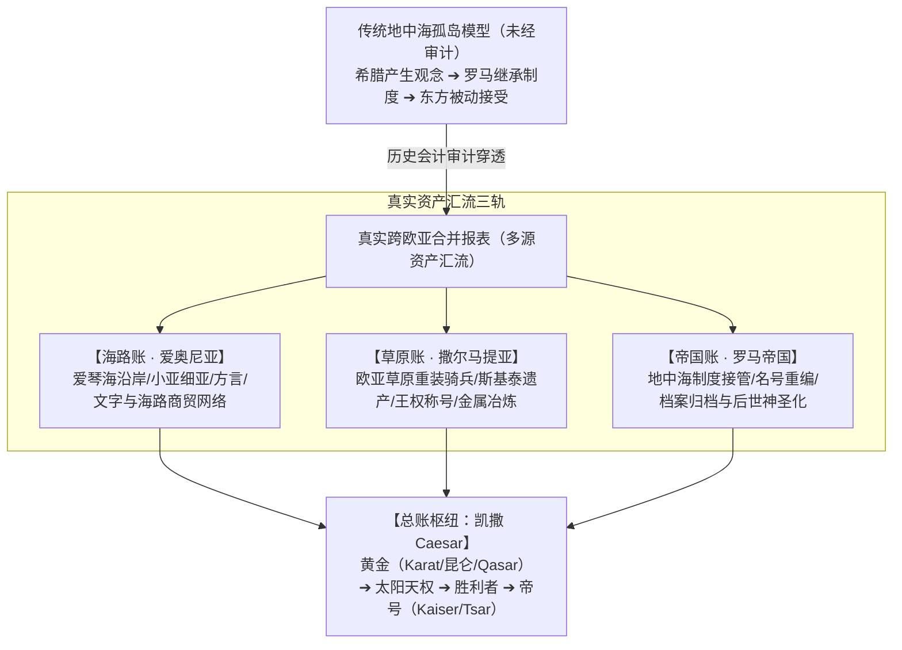
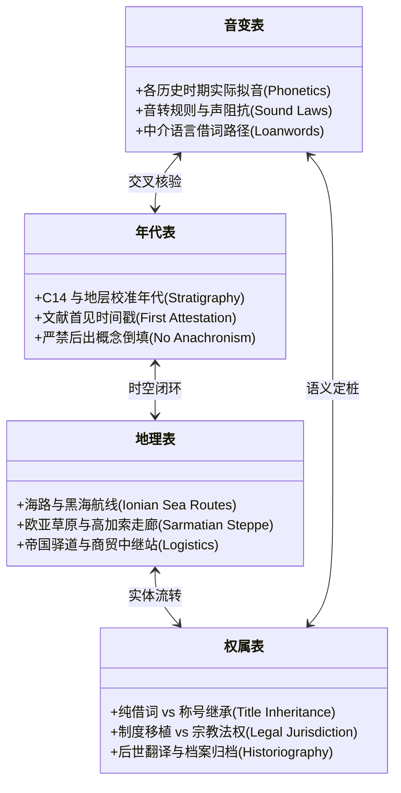
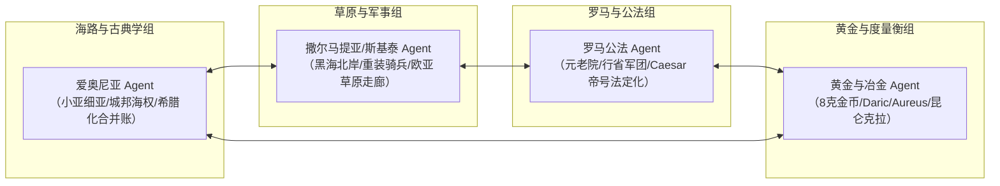

# 《三更道场》认识论总纲 · 第二季主案动议：希腊罗马合并报表与凯撒黄金总账

> **版本**：v1.0（第二季跨欧亚王权审计专项动议）  
> **核心命题**：**拒绝将“古希腊/罗马”视为天然自足、亘古连续的文明实体；其本质是后世编纂的一张“追溯性合并报表（Consolidated Balance Sheet）”。第二季的核心突破口是：从爱奥尼亚（海路）、撒尔马提亚（草原）与罗马（法统接管）三线拆解“凯撒（Caesar）”背后的跨大陆黄金/王权总账！**

---

## 一、审计原则：从“伪史口水战”转向“历史会计拆账”

### 1. 拒绝“真伪二元对立”
- 《三更道场》绝不陷入网民式的“希腊全真还是全假”口水战；
- **真实审计对象**：后世如何以“希腊 / 罗马”为一级会计科目，将爱奥尼亚、安纳托利亚、小亚细亚城邦、撒尔马提亚草原骑士、甚至波斯与迦太基的异质资产，**追溯性地打包进一个看似单一、自生、自足的古典实体**中。

### 2. 什么是“凯撒（Caesar）”的真正会计身份？
- **传统叙事**：尤利乌斯·恺撒（Julius Caesar）的个人家族名 $\rightarrow$ 继任者奥古斯都继承 $\rightarrow$ 逐渐升格为“副皇帝/皇帝帝号”。
- **审计穿透**：
  - Caesar 究竟是拉丁语自生人名，还是欧亚大陆更早存在的**跨区域王权/黄金/神圣胜利者称号残留**？
  - 从 **Caesar ➔ Kaiser（德意志）➔ Tsar（沙皇）➔ Qaisar（近东/突厥/蒙古称号恺撒尔）** 的流转链，究竟反映了怎样的欧亚地缘资产交割？
  - “凯 / K-R-N / 昆仑 / 克拉” 与 “萨 / 萨尔 / Sar / 黄金 / 太阳天权” 之间，是否存在物质（黄金衡制）、语言（音素骨架）与王权凭证（天权）的深层共振？

---

## 二、第二季主案论证纪律：四表勾稽与悬账管理

> [!IMPORTANT]
> **严禁“听起来像”的孤立音近联想！**  
> 必须由历史语言学、第四纪与年代学、考古与交通史、公法与政治学 Agent 联合出具**四张完全勾稽的独立明细表**。  
> 任何一张表出现逻辑断裂或证据缺失，必须严肃计入**“待决悬账（Suspense Account）”**，严禁以其他三张表的华丽去强行核销冲账！

### 四表勾稽规范：

| 账表名称 | 核心主审内容 | 必须回答的底单问题 | 严禁出现的违规操作 |
| :--- | :--- | :--- | :--- |
| **1. 音变表** | 语音演化与声阻抗 | 该词在古拉丁语、古希腊语爱奥尼亚方言、古波斯语、粟特语及古阿尔泰语中的**确切发音与音变路径**。 | 拿现代英法德语发音直接去碰两千年前的古音。 |
| **2. 年代表** | 时间序列与断代 | 哪种形式、在哪个具体文本/碑铭中**最先出现**？演化是否存在时间断代或逆向时间流？ | 用公元 4 世纪晚出的概念去解释公元前 1 世纪的政治实体。 |
| **3. 地理表** | 物理通道与空间扩散 | 该称号或词族是沿**黑海北岸草原通道、地中海海路、还是罗马行省军团驻地**传播？ | 脱离地形地貌与后勤补给，在地图上画无摩擦跳跃。 |
| **4. 权属表** | 制度法权与法律主体 | 每次传播究竟是**罗马公法继承、异族军团雇佣封号、还是近代学术体系的倒填追认**？ | 把“文学比喻”或“翻译习惯”直接入账为“国家法统转移”。 |

---

## 三、第二季跨学科 Agent 对抗分工预演

1. **爱奥尼亚 Agent**：审计东地中海与小亚细亚如何作为“欧亚文明接口”，将近东、赫梯、安纳托利亚的矿物与天文学资产转译为“早期希腊城邦哲学”；
2. **撒尔马提亚 Agent**：审计黑海北岸到多瑙河防线的草原游牧军团，如何通过武器、马具、重骑兵战术与神圣王权词族，深度介入并重塑罗马晚期军事贵族政治；
3. **罗马公法 Agent**：审计罗马元老院与奥古斯都政体如何把军事独裁官的私人遗产账户，包装成地中海普世帝国（Imperium）的合法法统；
4. **黄金与度量衡 Agent**：将罗马的金币（Aureus / Solidus）、波斯金币（Daric）与东方昆仑衡制接通，完成第一季第十二期《黄道》“用黄金度量黄金”的跨欧亚总清算。

---

## 四、第二季动议结语

> **“第一季负责建立审计公理与东方水网底座；第二季负责让这套工具跨过帕米尔高原与高加索山脉，将地中海与罗马文明重新置于欧亚大陆整体动态网络中接受全面审计。”**  
> 凯撒不是一个西方的孤岛传奇，他是欧亚大陆黄金、太阳天权与军事王权大循环中，被罗马归档入库的最耀眼科目之一。
