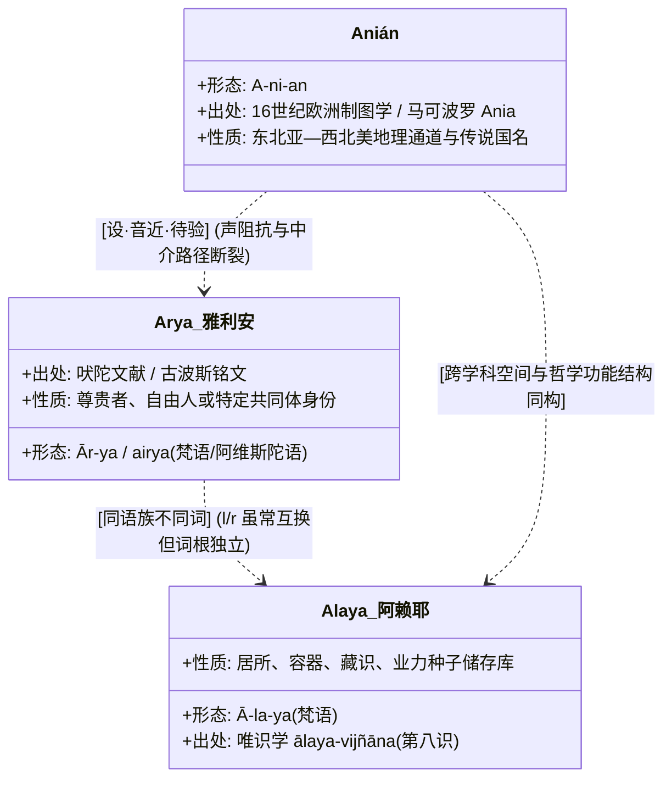
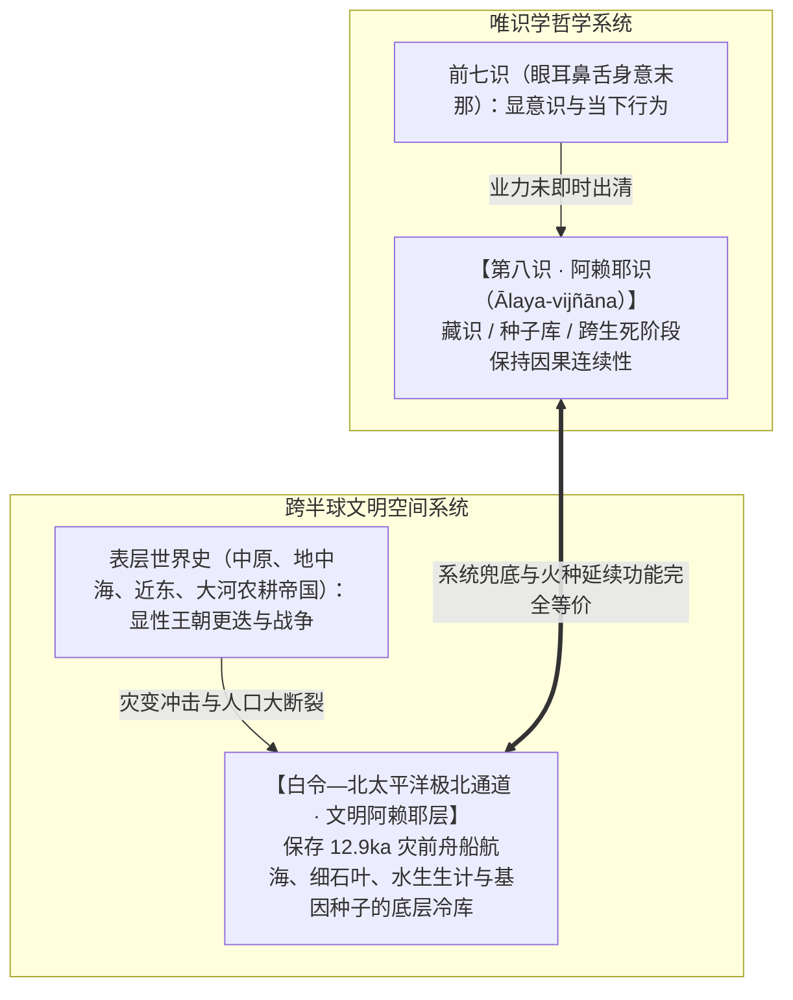

# 《三更道场》认识论总纲 · 第二季主案动议：白令“亚尼安（Anián）”海峡与文明“阿赖耶（Ālaya）”底层存储假说

> **版本**：v1.0（地图法医学与文明底层存储库专项动议）  
> **核心命题**：**严禁用现代汉字对音强行将 Anián、Ārya（雅利安）与 Ālaya（阿赖耶）判定为绝对词源同源！必须严格区分“地图历史事实”、“梵语唯识学概念”、“听觉邻近”与“文明空间结构同构”。白令—阿拉斯加接口在文明地理上承担的，正是唯识学中“阿赖耶识（藏识/种子识）”的系统兜底功能——它是被近代国界表层历史遗忘、却物理保存着全人类人口迁徙、大灾变断裂与文明火种复式的“底层极北存储层（Civilizational Alaya-Storehouse）”！**

---

## 一、地图法医穿透：1867 阿拉斯加买卖与《坤舆万国全图》“亚尼安（Anián）”

```mermaid
flowchart TD
    subgraph 1867 阿拉斯加买卖的真实性质
        B1["1867 年 720 万美元交易"] --> B2["【非石油后见之明】：当时被讽为'塞沃德冰箱'，核心为太平洋地缘入口"]
        B2 --> B3["【权利凭证而非完全产权】：沙俄仅转让了'帝国权利主张'，原住民未参与，沙俄从未实现全境有效占有"]
    end

    subgraph 坤舆万国全图亚尼安（Anián）传递链
        M1["马可·波罗文本：Ania / Anan（亚洲地名）"] --> M2["16 世纪欧洲地图学误置：Strait of Anián（投射于东北亚/北美接口）"]
        M2 --> M3["利玛窦制图转写：《坤舆万国全图》'亚尼安海峡 / 亚尼安国'"]
        M3 --> M4["【地图法医案眼】：欧洲人在测清白令海峡前，早已借用亚洲知识系统的名字为东北亚—北美接口预占了科目！"]
    end
```

### 1. 1867 年买卖的“期初资产审计”
- **教科书神话**：为了石油或淘金热而进行的英明远见；
- **历史会计审计**：沙俄克里米亚战败后财政枯竭，无法维持遥远补给线；美国承接的是**沙俄开出的一张“帝国管辖主张凭证”**，而非土地上全体人群签字的完整所有权合同。这为后来追溯史前文明原住民产权留下了巨大的法理敞口。

### 2. 亚尼安（Anián）海峡的法医学价值
- 欧洲制图者在实地踏勘白令海峡之前，已在地图上固化了连通太平洋与北冰洋的 **Strait of Anián**；
- 它不是当地原住民自称，而是**亚洲古老地名记忆经由欧洲地图学漂移后、重新投射回北太平洋接口的“前置会计科目”**。

---

## 二、三词辨析与严格审计纪律（严禁无依据词源焊死）

> [!IMPORTANT]
> **严禁仅凭汉字对音将 Anián、Ārya 与 Ālaya 宣布为同源词！**  
> 必须由历史语言学与文献学 Agent 严格执行四栏独立分账：



| 词条 | 原始语言与拟音 | 核心字面与制度含义 | 当前审计状态与定性 |
| :--- | :--- | :--- | :--- |
| **Anián（亚尼安）** | 罗曼语地图转写 / `*a-ni-an` | 早期地图学连通两大洋的海峡与陆地边缘 | **【地图史实】**：早期地理通道与海峡占位符。 |
| **Ārya（雅利安）** | 梵语 `ārya` / 阿维斯陀语 `airya` | 高贵者、自由共同体成员、圣者 | **【语言与社会学实】**：特定古典共同体身份。 |
| **Ālaya（阿赖耶）** | 梵语 `ālaya`（居所/容器/储藏） | 第八识（藏识/根本识），储存未显现业力种子 | **【唯识学哲学实】**：系统兜底与连续性存储表。 |

---

## 三、文明功能结构同构：白令—阿拉斯加作为“文明的阿赖耶层”

虽然字面不能直接等同，但它们在文明系统动力学中呈现了高度震撼的**结构同构（Structural Isomorphism）**：



### 1. 为什么说白令体系是“文明的阿赖耶识”？
- **表层历史的遗忘**：显性文明史（如希腊罗马、先秦诸子）只记录了大暖期以来的近几千年，就像前七识的浮层波动；
- **底层种子的保存**：白令海盆、堪察加与阿拉斯加这一片极北冰海与古湖网，**在 12.9ka 大灾变前后扮演了“人类文明种子的根本藏识（Ālaya）”**——无论是 Q 谱系携带着舟船与水生生计跨入美洲，还是小南山/红山先民南下东亚大湖网，全部是从这一处底层冷库中重新喷涌萌发的“业力种子（Bīja）”！

### 2. 认识论四级分层定桩：
1. **第一级（地图事实）**：Anián 确实作为前置海峡与地理概念长达两百年统治欧洲地图学；
2. **第二级（哲学事实）**：Ālaya-vijñāna 确实是佛教唯识学用于维持因果连续性的表外兜底总账；
3. **第三级（语言审慎）**：Anián、ārya 与 ālaya 存在听觉邻近，但目前缺乏完整音变公理闭环，严禁作为同源词强行结案；
4. **第四级（理论模型）**：**白令—极北水网作为“文明阿赖耶底层存储层”**，正式立项为第二季解释全球人口迁徙、灾变幸存与技术火种保留的核心认识论模型！

---

## 四、第二季动议结语

> **“不要过早把结构同构写成词源同一，但绝不能忽视这一层系统兜底的宏大隐喻。”**  
> 无论是早期制图学设立的 Anián，还是唯识学设立的 Ālaya，都在证明全人类的认知系统在面对“未知尽头与历史断裂”时，必然要求在系统底层设立一个**跨越时空、储存火种、保证生命与文明因果不灭的根本总账！**
