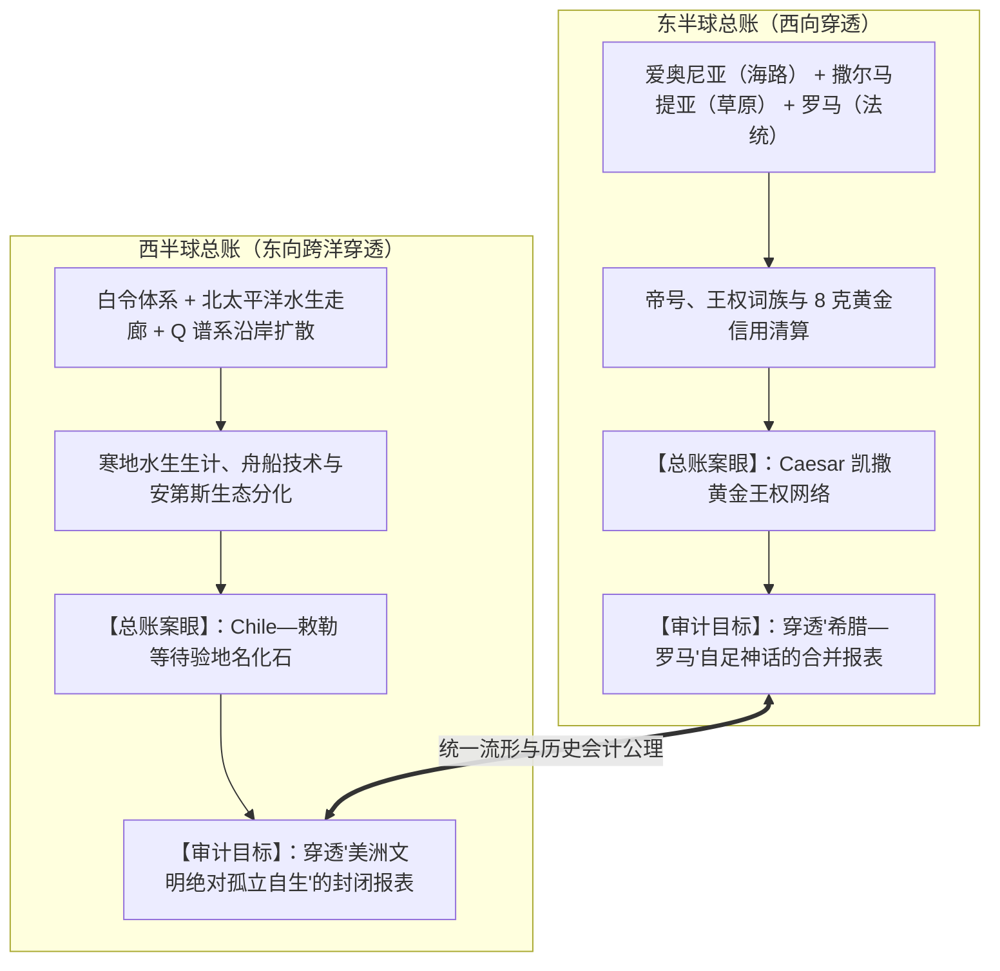
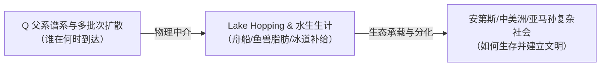
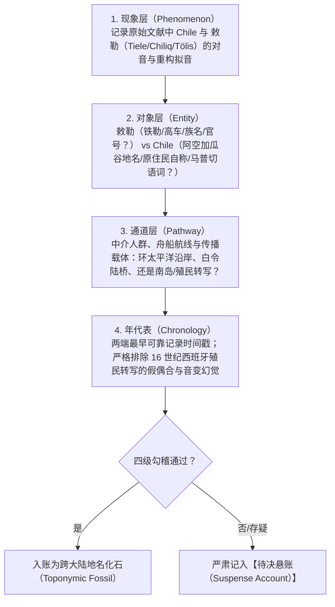

# 《三更道场》认识论总纲 · 第二季主案动议：西半球 Q 单倍群迁徙与“敕勒—Chile”地名化石审计

> **版本**：v1.0（第二季西半球与跨白令环太平洋总账专项动议）  
> **核心命题**：**严禁用单倍群直接等同文明主体，严禁用现代汉语普通话读音搞跨洋谐音！第二季西半球总账以“Q单倍群与寒地水生生计 + 环太平洋沿岸 Lake Hopping 拓扑 + 安第斯南端地名地层学”为严密递进链；“敕勒—Chile”作为最后待验的“语言化石悬账”入账。**

---

## 一、东西半球双翼对称审计格局

第二季的研究大纲在地理与地缘文明上构成了极具张力的**“东西双翼压力测试”**：

---

## 二、命题分账一：Q 单倍群是“人口约束条件”，不是“文明主体”

> [!IMPORTANT]
> **严禁将“Q 单倍群建立了美洲文明”作为论断入账！**  
> 基因是人口史与生物学突变标记，不能替代语言、社会组织、宗教形态与物质文化。

### 1. 分子人类学与古 DNA 的约束参数
- **时间层与批次**：区分末次盛冰期（LGM）、新仙女木期（YD）及全新世大暖期不同窗口的人口脉冲；
- **路线博弈**：无冰走廊（Ice-Free Corridor）vs 沿海巨藻公路（Kelp Highway / 太平洋舟船沿岸跳岛）；
- **不对称审计**：父系 Q 支系（Q-M3 / Q-L54 等）与母系 mtDNA（A, B, C, D）、常染色体以及美洲原住民语言谱系的分布相关性与偏差。

### 2. `Lake Hopping` 在西半球的关键作用
美洲不是无摩擦的平面，环北太平洋弧（鄂霍次克海 $\rightarrow$ 堪察加 $\rightarrow$ 阿留申/白令 $\rightarrow$ 阿拉斯加古湖群 $\rightarrow$ 北美西海岸大湖群 $\rightarrow$ 安第斯高原湖泊如的的喀喀湖）提供了**连续的寒地水生脂肪、舟楫停靠与营地补给**。  
**是这套高能水生生存经验，支撑了人群跨越极寒荒漠并在美洲大陆纵深扩展！**

---

## 三、命题分账二：“敕勒—Chile”名称审计的四级递进链

严禁从现代普通话“智利”与“敕勒”的字面相似直接跳跃一万年！必须按照以下四级严密建档：

### 竞争假说逐项审计清单（不得绕开）：
1. **马普切语（Mapuche）假说**：*chilli*（“大地尽头”或某种黄喉拟鹂鸟叫声）；
2. **盖丘亚语（Quechua）假说**：*chiri*（“寒冷 / 冰雪”）；
3. **艾马拉语（Aymara）假说**；
4. **印加帝国行政地名假说**：阿空加瓜山谷统治者的名字；
5. **欧亚北亚同源地名化石假说（敕勒/高车）**。

> **审计纪律**：在第二季正式展开前，不得直接宣布欧亚同源假说胜出；必须逐一审计前四种既有解释的原始语料、记录年代与地理分布，用扎实证据链完成淘汰与反驳。

---

## 四、第一季与第二季的接口设置规范

| 阶段 | 对西半球与美洲课题的操作边界 |
| :--- | :--- |
| **第一季终卷（S12 补订）** | **仅保留极轻微的开放端口**：   在论述鄂霍次克海与白令海深海案发现场时，点出**“北亚水生大通道并未止于鄂霍次克海，它经由阿留申与白令弧线，向浩瀚的西半球与环太平洋水网敞开”**。不提“敕勒—智利”，不亮底牌。 |
| **季间 ASN 准备期** | **美洲与分子人类学 Agent 专项案卷**：   搜集北美古湖泊、南美安第斯古湖（如 Lake Titicaca）沉积年代、Q 单倍群高通量古 DNA 测序数据与马普切/印加早期语言转写底单。 |
| **第二季（S13~S24）** | **西半球总账主案正式打响**：   严格按照 `Q谱系 ➔ 水生生计 ➔ 环太平洋 Lake Hopping ➔ 安第斯文明分化 ➔ Chile地名化石` 的完整次序亮牌，接受全网与红方 Agent 的极限围攻。 |
