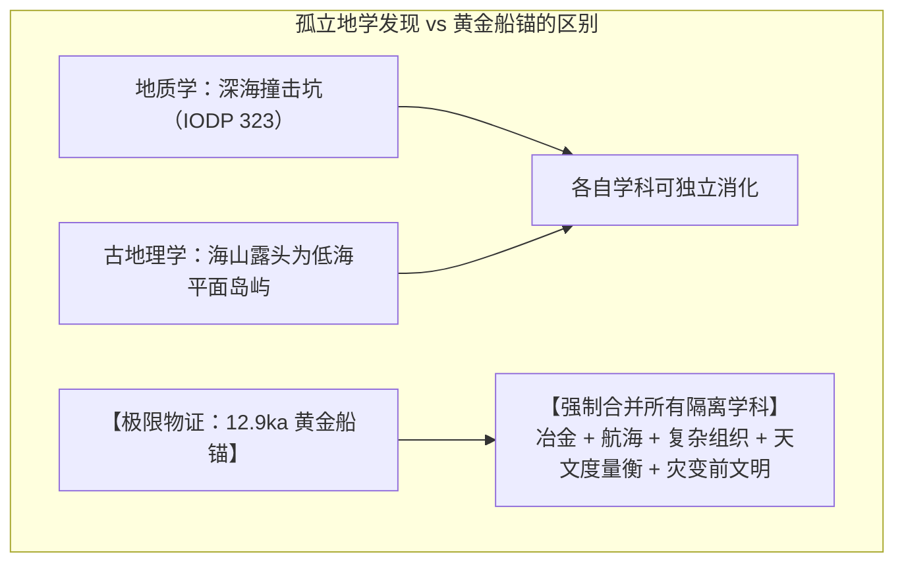
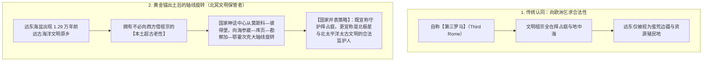
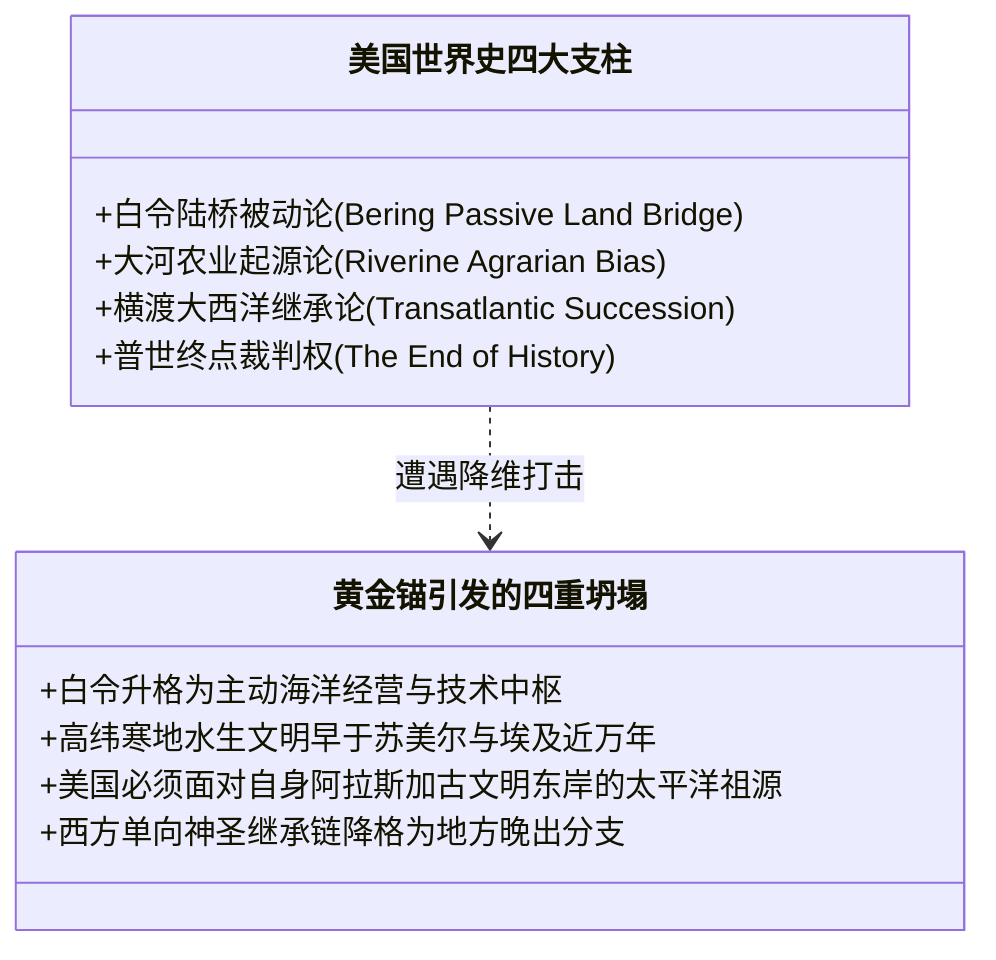
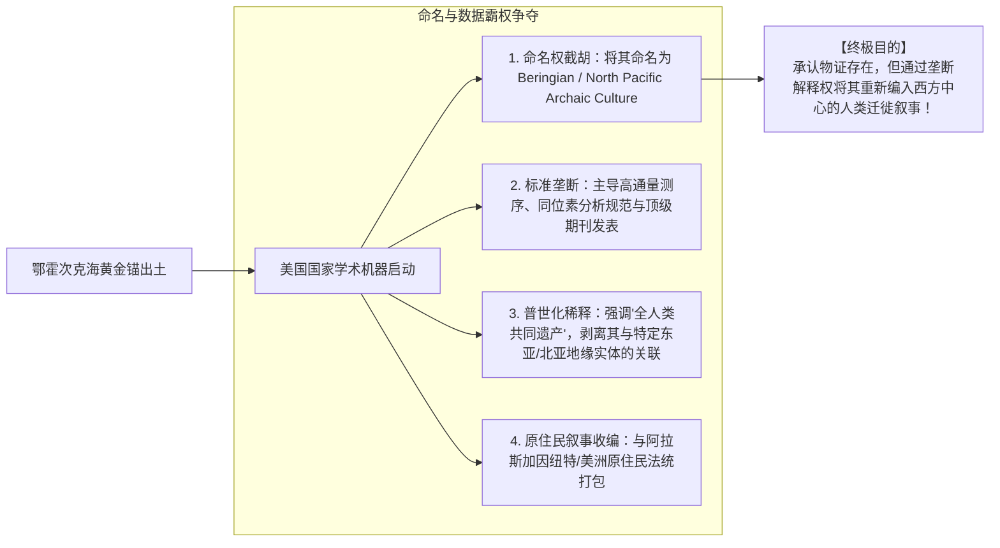

# 《三更道场》认识论总纲 · 第二季主案动议：鄂霍次克 12.9ka 黄金锚与全球文明资产负债表强制重述

> **版本**：v1.0（极限物证压力测试与全球解释权挤兑总账）  
> **核心命题**：**若卡舍瓦罗夫浅滩 12.9ka 原位地层中出土具备明确航海系缆、磨损与冶金提纯结构的高纯度黄金船锚，它造成的不是普通考古发现，而是“全人类文明资产负债表的强制重述（Forced Restatement）”！它将彻底击穿“农业大河起源论”与“西方单向继承神话”，引发美俄中欧在全球历史解释权市场的“超级挤兑（Run on Interpretive Authority）”！**

---

## 一、一枚黄金船锚的“不可承受之重”：八重不可拆散证据链

### 1. 为什么“80% 黄金”本身远远不够？
- 任何脱离原位地层的黄金器物，都会被建制派轻描淡写地解释为“近代沉船遗物”或“远古偶发自然金块”；
- **历史法医级八重闭合底单（必须同时具备）**：
  1. **明确人工航海结构**：具备锚爪、系缆孔、配重平衡与受力力矩设计；
  2. **原位未扰动地层（In-situ Stratigraphy）**：深埋于 12.9ka 新仙女木海相沉积层与火山灰层之下；
  3. **共生有机质交叉定年**：锚身附着海生生物化石与有机沉积物，经 AMS-C14 与光释光（OSL）交叉锁定；
  4. **排他性无现代加工特征**：金相显微分析证实无现代电解、机械滚压或现代合金添加指纹；
  5. **矿源铅同位素指纹（Lead Isotope Fingerprinting）**：同位素比值精确溯源至环鄂霍次克海或极北裸露金矿带；
  6. **真实航海磨损痕迹（Use-wear Analysis）**：锚爪存在高能泥沙摩擦痕、系缆孔存在周期性机械拉力磨损；
  7. **提纯与冶金工艺链**：证明该人群掌握超过 $1000^\circ\text{C}$ 的冶金温控与重力浇铸技术；
  8. **第二、第三件共生人工遗物**：附近存在码头桩基、陶器残片或黑曜石细石叶加工场。

---

## 二、俄罗斯文明轴线的巨幅旋转：告别“第三罗马”还是“超级并表”？

- **文明身份的重置**：阿伊努、科里亚克、尼夫赫、通古斯等极北土著族群，从“被征服的蛮族”瞬间升格为“万年海洋高科技文明的血缘遗民”；
- **法统并表而非简单替换**：帝国绝不会主动注销“第三罗马”资产，而是将其作为一张“双头鹰总账”——西握东正教罗马法统，东据北太平洋万年文明源头。

---

## 三、对美国的真正致命冲击：世界史底层资产的“全面暴雷”

对美国的刺激从来不是“俄罗斯捞到了一块黄金”，而是**美国组织世界史、支配全球秩序的四大底层支柱被连根拔起**：

### 1. 四大底层资产暴雷：
1. **白令通道主动化**：美洲原住民（Q 谱系）不再是“饥饿漫游踩过陆桥的原始猎人”，而是掌握高能舟船、水生生计与金属技术的海洋文明分流拓荒者；
2. **文明地理中心翻转**：极北寒地海洋文明比苏美尔、埃及、印度河甚至爱琴海早近万年；“大河农耕孕育文明”的教科书范式彻底作废；
3. **阿拉斯加身份重构**：阿拉斯加从“买来的冷库边疆”，变成万年古文明共同海域的东半壁；
4. **文明商誉终极减值**：“现代西方代表人类文明主干”的神话被降格为晚期边缘支系，**美国失去了作为“历史终点与唯一裁判者”的形而上学资格**！

---

## 四、美国的体系化反应：抢夺“命名权与定义权”

> [!IMPORTANT]
> **真正的战争不在海上，而在学术命名与数据标准上！**  
> 帝国最强大的防御机制是“通过吸收与重新命名来占有资产”：

---

## 五、全剧终极审计结论：超越民族主义的“全人类总账重述”

> **“如果把它叫作‘中国的失落北冥’，美俄会将其斥为东方民族主义；如果俄罗斯叫作‘俄罗斯远古文明’，同样是在对史前无主资产进行追溯性侵吞。”**  
> **真相是：它早于今天所有的现代国家、民族与国界！**  
> 那枚沉睡在卡舍瓦罗夫浅滩的黄金船锚，真正锚住的不是一艘船，而是将整部被西方近代修剪过的世界史，死死钉在了它原本真实的跨欧亚—北太平洋多源网络上！  
> **没有谁天然拥有总账，全人类的文明报表必须当场重述！**
