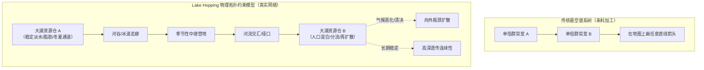
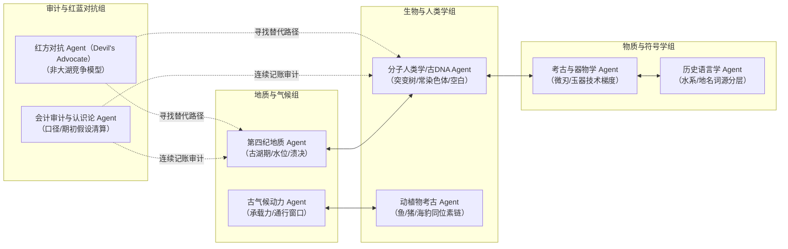

# 《三更道场》认识论总纲 · 第二季研究纲领与季间 ASN 垂直审计规范

> **版本**：v1.0（第二季顶层设计与季间对抗训练标准）  
> **核心命题**：**Lake Hopping（大湖跳岛）是分子人类学的物理拓扑约束与迁徙成本函数；ASN agents 季间训练以“可对抗案卷”为唯一交付标准。**  
> **季间节奏律**：第一季提出底座与研究纲领 ➔ 季间三个月由 ASN agents 分别完成垂直对抗训练 ➔ 第二季将垂直账本接回统一流形，正式检验并围攻 Lake Hopping。

---

## 一、为什么必须先有大湖文明，才能谈分子人类学分叉

如果没有大湖文明与古水网作为底座，分子人类学极易退化为**“悬空的分叉树”**：在某地测得单倍群突变，便在平面地图上画一条任意的线性迁徙箭头。

### 1. `Lake Hopping` 提供的物理约束方程
古人并非在地图上无摩擦滑动，大湖及其附属河网构成了连续的生存与补给节点：
$$\text{大湖资源仓} \longrightarrow \text{河谷/冰道通道} \longrightarrow \text{季节性营地} \longrightarrow \text{下一座大湖}$$

每一座大湖同时提供六重刚性支撑：
1. **稳定水源与水生脂肪**（鱼类、海豹、水禽、岸线植物，突破纯陆生热量瓶颈）；
2. **可重复辨认的地理地标**与天球星象反光镜像；
3. **低阻力航运通道**（夏季舟楫、冬季冰封坦途）；
4. **人口停留、混血、技术交换与二次扩散的超级中继站**；
5. **灾变缓冲池**（干旱期周围植被退化时的最后庇护所）；
6. **迁徙成本函数（Cost Function）**：绕行大湖或顺流而下的能耗远低于横穿干旱荒漠与崇山峻岭。

### 2. 从“单向分叉树”到“汇流网络图”
- **传统树状假定**：祖先节点 $\rightarrow$ 基因突变 $\rightarrow$ 两支分开 $\rightarrow$ 永不相见。
- **大湖网络真相**：
  - 一个湖区可多次接纳不同来源人口；
  - 不同支系在同一湖盆长期共存并发生**重组与混血（Admixture）**；
  - 气候恶化或湖泊溃决后，同一混合人群沿不同水系向多方向辐射；
  - 后来者继承前人的技术、渔猎生计与地名语根，但不一定全盘继承其常染色体；
  - **公式**：$$\text{遗传突变（底层底层）} \times \text{湖网迁徙（反复汇流）} \times \text{文化/语言传播（异速扩散）}$$

---

## 二、第一季与第二季的节奏分工

| 阶段 | 核心任务 | 术语与内容边界 |
| :--- | :--- | :--- |
| **第一季（S00~S12）** | **拆毁旧账，立起底座** 1. 拆解现代民族/国境/字义预设的虚假账户； 2. 确立大湖文明与东北亚水生文明为生态地理底座； 3. 在 S11/S12 升维为欧亚统一流形与华夏发生学。 | 正文保留 S10 的“河西走廊古湖群跳岛航线”等**暗钩**，不硬塞完整英文术语 `Lake Hopping`，避免增加解释成本。 |
| **季间 3 个月** | **ASN Agents 垂直对抗训练** 各学科 Agent 独立建立垂直领域可对抗案卷。 | 交付四大账本（支持账、反证账、空白账、勾稽接口），形成跨学科对抗张力。 |
| **第二季（S13~S24）** | **正式命名与全网围攻** 1. 正式命名 `Lake Hopping` 理论； 2. 展开分子人类学高精度数据、古水文变迁与语言地层学的大合流。 | 检验各垂直账本能否在同一张流形上“平账”。 |

---

## 三、季间 ASN Agents“可对抗案卷”规范

> **严禁徒子徒孙式的“材料附会与命题作文”**！  
> 每个 Agent 必须独立出具审计意见，包含以下四张标准资产负债表：
> 1. **支持账（Assets）**：本学科内确凿支持 Lake Hopping 模型的物理数据与地层证据；
> 2. **反证账（Liabilities）**：什么具体发现会直接推翻、证伪或显著削弱该模型；
> 3. **空白账（Deficits）**：哪些关键地理断裂带、湖盆年代层或人群样本尚未采样（禁止以空白断定断裂）；
> 4. **接口账（Reconciliation）**：本学科输出的数据字段如何与相邻 Agent 的模型勾稽对账。

### 八大 Agent 垂直任务分工表

| Agent 角色 | 核心主审领域 | 季间垂直对抗任务与交付底单 |
| :--- | :--- | :--- |
| **第四纪地质 Agent** | 古湖泊学与地貌演变 | 重建贝加尔湖、巴尔喀什湖、罗布泊、居延泽、达里诺尔等欧亚核心古湖群的**存在时间戳、最高水位线与溃决/干涸窗口期**。 |
| **古 DNA / 分子人类学 Agent** | 人类遗传学与单倍群 | 绘制古人类 DNA 样本的经纬度、C14 矫正年代、测序深度与常染色体成分；**严格标出欧亚草原与森林过渡带的“采样黑洞”**。 |
| **田野考古 Agent** | 物质文化与工具链 | 核对各湖盆之间**细石叶（Microblade）、压制剥片技术、早期陶器与玉器形制**的时间梯度，检验是否存在逆向传播。 |
| **动物考古与生计 Agent** | 稳定同位素与食谱 | 提取古代人骨与动物骨骼的 $\delta^{13}\text{C}$ 与 $\delta^{15}\text{N}$ 同位素，**计算淡水鱼类、海生哺乳类、草食动物与陆生作物的热量贡献比例**。 |
| **历史语言学 Agent** | 历史比较语言学与地名学 | 梳理欧亚大陆北方水系（湖泊、河流、山口）古地名的**语音分层与同源转写规则**；严禁在缺乏音变规律的前提下直接宣布同源。 |
| **气候模型 Agent** | 古气候流体数值模拟 | 计算全新世大暖期（Holocene Optimum）至新仙女木期间，各纬度古湖泊生态系统的**生物承载量（Biomass）与冰期冰道可通行月份**。 |
| **会计审计 Agent** | 认识论与审计准则 | 检查各学科报告中的**统计口径、样本偏差（Sampling Bias）与期初假设**；剔除将“推论”当作“事实资产”入账的违规操作。 |
| **红方对抗 Agent（Devil's Advocate）** | 竞争假说与证伪测试 | **专职寻找“不依赖大湖系统亦能完全自洽解释”的竞争模型**（如纯草原走廊漫游、沿海独木舟跳跃、干旱山地垂直游牧等），对 Lake Hopping 实施极限承压测试。 |

---

## 四、AGI 对抗试验的评估标准

第二季开播前的季间答辩，将是对多智能体网络（ASN）的一次真实能力检验：
1. **证据纪律**：智能体能否坚守本学科事实，不因主理人（峨眉）的假说而迎合剪裁证据；
2. **跨界接口**：智能体能否理解相邻领域的参数限制（例如：地质学的干涸年代直接制约分子人类学的扩散时间窗口）；
3. **模型收敛**：当发生严重证据冲突时，系统是强行修饰账目，还是主动修正统一流形参数；
4. **平账闭环**：最终形成的解释模型，必须在年代学、物理地理学、遗传学与物质文化四张总账上同时配平。
