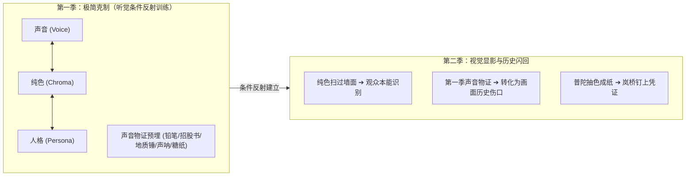

# 《三更道场》视听工业化制片规范 v1.0 (Production Pipeline Specification)

> **核心哲学**：  
> **第一季不负责给观众看世界，只负责训练观众怎样听见一个人；第二季才把这些已经被听见的人，从颜色背后显影出来。**  
> **第一季听见创伤，第二季看见伤口。**  
> **声音是主时钟，画面必须服从声音。**

---

## 一、 顶层美学路线与季播分层



1. **第一季纯色语法（Strict Constraints）**：
   - **谁发言，画面进入谁的专属主色**；
   - **发言权转移，触发麦克风转场动效**；
   - **无人说话，进入公共底色或黑场**；
   - **绝不急于堆砌**：人物立绘、股票K线、历史照片和廉价AI空镜。规避粗糙画面对宏大历史文本的降智侵蚀，保持《十二怒汉》式密室交锋张力。
2. **防色弱与相近色冲突（身份三位一体识别码）**：
   $$
   \text{角色视觉身份} = \text{专属主色 (Hex)} + \text{席位编号与花名} + \text{极简纹理/印记 (Sigil)}
   $$
   - **主色**负责第一反应；
   - **花名**负责文字确认；
   - **纹理/印记**负责在色弱环境与相近色系下的绝对区分，严禁让观众参加“这是青绿还是蓝绿”的色彩考试。

---

## 二、 全剧十七席学者视觉三要素与声音物证总表

| 席位 | 花名 | 法定真名 | 专属主色 (HEX) | 视觉印记 (Sigil) / 纹理 | 第一季预埋声音物证 (创伤回收锚点) | 角色功能与身份 |
|:---:|:---:|:---:|:---:|:---:|:---:|:---:|
| **01** | **青衣** | **秦雍琼** | `#1C2D42` (深青黛) | 广电声波同心圆 / 极细横纹 | 总台红铅笔批注稿件声、稳健高跟鞋落地声 | 广电总台副台长 · 流程司仪 |
| **02** | **盛乐** | **敖日其楞** | `#6E2D1B` (胡桃赭石) | 草原勒勒车轮印 / 粗粝毛毡纹 | 骨质扳指扣击茶台、大笑后翻动粗糙宣纸声 | 北亚游牧史教授 · 死文字破壁 |
| **03** | **峨眉** | **梅心易** | `#3A4B35` (冷杉墨绿) | 梅花易数挂爻 / 竹帘暗影 | 金属打火机开盖脆响、吐烟草气声、茶杯重顿 | 川大哲学系副教授 · 儒道双修叛徒 |
| **04** | **乐山** | **游牧仁** | `#825838` (生土夯褐色) | 鸭子河地层剖面线 / 陶土砂粒 | 考古手铲刮过陶片、泥水靴子踏地声 | 省考古院资深领队 · 坐地户大账房 |
| **05** | **渔阳** | **于鲜洋** | `#8C2D19` (故宫宫墙红) | 复式记账丁字账格 / 铜质算盘珠 | 实木算盘清脆归零声、钢笔刷刷划过账簿 | 央财金融史教授 · 国家大账总审计 |
| **06** | **珞珈** | **落花生** | `#4A3B32` (深壤土褐) | 条约骑缝章印痕 / 羊皮纸压纹 | 粗布袖口摩擦桌面、厚重条约法典翻页声 | 武大法学院副教授 · 国际条约法医 |
| **07** | **紫金** | **王佑德** | `#2B2848` (深空曜紫) | 引力波双星回旋线 / 黑板粉笔尘 | 粉笔在黑板上极其坚决的断裂与敲击声 | 中科大/南大双聘 · 天体物理大宗师 |
| **08** | **琅琊** | **迟阆钟** | `#0A192F` (黑潮深蓝) | 洋流等深线 / 船体龙骨钢构 | 船体发动机低频震颤、深海声呐脉冲、风浪声 | 海大物理海洋首席/船长 · 深海医官 |
| **09** | **云中** | **云久元** | `#756658` (云冈石青褐) | 榫卯斗栱截面 / 木石风化纹 | 剥开木糖醇铁盒声、折尺拉开卡扣咬合声 | 大同大学古建工程教授 · 营造史宗师 |
| **10** | **番禺** | **潘谦钺** | `#264653` (南越青铜碧) | 青铜钺刃影 / 超临界气旋涡 | **白瓷杯盖轻碰瓷碗边缘清脆一声，方才开口** | 中大大气科学学院教授 · 席下藏钺 |
| **11** | **良渚** | **梁随祝** | `#3D5A58` (玉琮深青灰) | DNA双螺旋交叠线 / 玉琮兽面纹 | 离心机超低频嗡鸣、乳胶手套摘下弹响 | 浙大生命科学首席 · 古DNA双螺旋 |
| **12** | **敦煌** | **黄拓石** | `#A67C52` (戈壁风蚀褐) | 第四纪沉积纹层 / 拓片石纹 | **地质锤敲击岩石清脆金石声**、粗布擦拭标本 | 兰大地质学院教授 · 托石老队长 |
| **13** | **知春** | **丛中笑** | `#D48828` (煎饼暖橙黄) | 拜占庭多节点拓扑 / 终端光标 | 机械键盘青轴连击声、撕开煎饼果子油纸声 | 原字节高P/计算所 · 赛博执剑人 |
| **14** | **竹湖** | **江映帆** | `#3C4A5A` (冷战阴霾蓝灰) | 离岸雷达测距圆环 / 水波旧影 | 纯银烟盒弹开声、古董钢笔旋开笔帽阻尼声 | 台湾新竹清华退休 · 岛链地缘清醒者 |
| **15** | **酒泉** | **唐数敕** | `#8B4513` (戈壁沙金褐) | 多维偏微分算子 / 弹道流形 | **撕开大白兔奶糖糖纸窸窣声**、粉笔高速狂写 | 西工大数统院教授 · 算法即国家敕令 |
| **16** | **普陀** | **华忠仁** | **【抽色无色】** (白宣纸底) | **无色 / 绝对留白 / 铅笔墨痕** | **铅笔划过便签、医院听力纯音测试尖锐盲音、骤然失声** | 原量化对冲合伙人 · 打破第四面墙 |
| **17** | **岚桥** | **尹卞迁** | `#1A2530` (穿透冷钢青) | **审计科目红线 / 资金流向箭头** | **翻动厚重招股书、打印机吐纸、计算器盲打、文件重摔** | 财团合规首席 · 四证平趟提篮桥预备役 |

---

## 三、 普陀与岚桥：视听系统的“元规则例外”

### 1. 普陀（华忠仁）的“抽色特权”
华忠仁拥有全剧唯一的**“打破第四面墙”的视觉抹杀权限**：
```yaml
visual_mode: chroma_absence
voice_mode: negative_voice
transition: desaturate_to_paper
trigger: "普陀递出便签或笔谈"
fx_rules:
  color: "全场颜色逐渐褪为灰白（RGB Saturation 归零），仅保留铅笔灰与素纸白"
  bgm: "BGM 瞬间物理切断（Zero Decibel Mute）"
  ambience: "环境声进入低通滤波（Low-pass Filter < 300Hz），模拟耳蜗失聪后的沉闷水下感"
  center_frame: "一张素白便签从画面中央渐显，毛笔/铅笔手写字逐笔出现"
```
**艺术真理**：他是唯一能让所有学者的颜色全部失效的人。因为在画中人眼里，所有争论都是被涂抹的颜料。

### 2. 岚桥（尹卞迁）的“白纸钉凭证”
岚桥与普陀形成绝对的反向对抗：
```yaml
visual_mode: forensic_audit_grid
transition: hard_cut_staccato
trigger: "岚桥开口接管话语权"
fx_rules:
  color: "画面不进入虚浮色块，而是直接切入冷酷的高对比度财务解剖网格"
  hud: "右上角固定出现招股书页码（P142）、资产负债表科目、红线框选"
  audio: "背景音乐不增加抒情旋律，而是节拍像老式计算器一样突然量化跳动"
```
**艺术真理**：普陀把世界还原成一张白纸，岚桥则拿着法律解释和交割单，把凭证一张张血淋淋钉在白纸上。

---

## 四、 声音资产压力测试规范（四组实战深蹲）

23篇古文试音仅是初筛（测试气息、长句、古汉语文脉重量）。任何角色母带定板前，必须跑通以下四组实战压力测试：

```text
1. 数字账目压力测试 (Numerical Accounts)
   - 语料要求：混合包含“年份、百分率（小数点后两位）、千亿级金额、报表页码、连续小数”。
   - 考核指标：数字咬字是否沉稳、有无机械念数字的轻浮感。

2. 中英混读与代码术语 (Code-Switching Stress)
   - 语料要求：极其自然嵌入 EBITDA、SPV、Default、Rollover、Debt Covenants、Killing vector、Token API。
   - 考核指标：严禁生硬翻译腔，必须像母语呼吸般流畅自然。

3. 激烈交锋状态机 (Heated Debate)
   - 语料要求：抢话打断、反问质问、“怒而不吼”（知识分子的高级冷怒）、突然急刹车。
   - 考核指标：声码器绝不能爆音、杂音或出现机械塑料感。

4. 低情绪与长停顿段落 (Subdued Recall)
   - 语料要求：私人创伤回忆、轻声认错、长达两秒的沉思停顿、散场定场诗。
   - 考核指标：微弱气声、真实声带边缘震颤与微小叹息的拟真度。
```

---

## 五、 “六合档案”标准数据结构 (Six-Dimension Persona Schema)

每个角色的配置必须严格归一化为如下单事实源 Schema：

```yaml
character_id: "17_lanqiao"
identity:
  codename: "岚桥"
  legal_name: "尹卞迁"
  spinoff_column: "廊桥疑梦"
  title: "财团顶层设计合规首席 / 上财中欧EMBA"
  jurisdiction: "企业微观财务模型、资本结构穿透、反做空合规与债务重组"
baseline:
  model_pipeline: "OmniVoice (海派金融精英冷讽普)"
  f0_target: "135Hz-150Hz"
  accent: "海派普通话，极轻微吴语柔和底色，思维与语速极快"
prosody:
  pacing: "中快速 (280-320字/分)，数字处骤降加重"
  pause_rule: "讲到刑法司法解释与涉案金额时留白0.4秒"
emotion_fsm:
  states: ["BASE", "PROBE", "ATTACK", "DEFEND", "BREAK", "AFTERGLOW"]
lexicon:
  terms:
    "EBITDA": "iːˈbɪtdɑː"
    "非经常性损益": "fēi jīng cháng xìng sǔn yì"
prohibitions:
  - "禁止出现播音腔大平舌念台词"
  - "禁止把金融术语念得犹豫或带有解释感"
visual:
  primary_color: "#1A2530"
  text_color: "#E0E6ED"
  sigil: "审计红线 / 资金流动箭头 / 招股书页码"
  texture: "冷轧钢板微光与牛皮纸档案卷宗纹理"
  transition: "hard_cut_staccato"
  physical_sound_cue: "招股书翻页、机械计算器连击、交易终端警报"
```

---

## 六、 剪映自动化解耦与中间时间线规范

### 1. 架构解耦原则
**严禁把角色与台词逻辑直接写死在剪映的 `draft_content.json` 中**。建立厂商中立的抽象时间线（Intermediate Representation, IR）：

```text
分角色台词脚本
      ↓
TTS 语音生成 (真实物理 .wav)
      ↓
获取音频真实时长与 Whisper 强制对齐 (Word-level Timestamps)
      ↓
生成厂商中立时间线 (episode.timeline.json)
      ├── [Jianying Draft Adapter] ➔ 剪映草稿目录 (一键打开即成片)
      └── [FFmpeg Fallback Renderer] ➔ 纯服务器无头渲染 (离线即时产出)
      ↓
人工终审 (仅做最终审片)
```

### 2. 中间时间线数据格式 (`episode.timeline.json`)

```json
{
  "episode_id": "EP01",
  "master_clock": "audio_primary",
  "timeline": [
    {
      "segment_id": "seg_001",
      "start": 0.00,
      "end": 8.45,
      "speaker": "01_qingyi",
      "audio_file": "audio/ep01/qingyi_001.wav",
      "text": "青衣江注大渡河，大渡河横锁三峨。诸位先生，三更已到，开卷。",
      "visual_state": {
        "color_hex": "#1C2D42",
        "sigil": "soundwave_circle",
        "transition_in": "fade_in_slow",
        "transition_duration_ms": 500
      },
      "audio_cues": {
        "sfx_cue": "sfx/pen_cap_click.wav",
        "bgm_state": "play",
        "ducking_db": -12
      }
    },
    {
      "segment_id": "seg_002",
      "start": 8.45,
      "end": 14.20,
      "speaker": "16_putuo",
      "audio_file": null,
      "text": "（递过一张素白便签：四千五百点做空的人，骨头都化了。）",
      "visual_state": {
        "color_hex": "#F4F4F0",
        "sigil": "paper_note_reveal",
        "transition_in": "desaturate_to_paper",
        "transition_duration_ms": 300
      },
      "audio_cues": {
        "sfx_cue": "sfx/pencil_on_paper.wav",
        "bgm_state": "mute_immediate",
        "ducking_db": -99
      }
    }
  ]
}
```

### 3. 麦克风转场动效三档律
- **正常轮转（Normal Handoff）**：150ms ~ 250ms 平滑色彩擦除交接；
- **抢话打断（Interrupt / Cut-in）**：硬切（0ms），绝不做优雅过渡，体现学术与事实火药味；
- **主持人正式交棒（Formal Transfer）**：完整声波纹理迁移转场（400ms）；
- **普陀便签（Silent Exception）**：严禁调用任何转场动效，直接全画幅抽色为白，声画骤停。

---

## 七、 音乐管线（Ace）基因库与变奏规范

1. **音乐核心基因（Motif DNA）**：
   - 锁定一份不可动摇的华夏祭坛历史主动机（Master Motif）；
   - 固定拆分为 4 条通用音频分轨（Stems）：
     - **Stem 1: Drums**（大鼓、编钟重击、节奏骨骼）
     - **Stem 2: Bass**（低音提琴、深海低频震动）
     - **Stem 3: Melody**（古琴、箫笛、大提琴主旋律）
     - **Stem 4: Ambience**（合成器空灵声场、风雨呼啸）
2. **角色级变奏签名**：
   - **普陀出场**：物理抽掉 Melody 与 Drums 声部，仅留弱电平 Ambience；
   - **岚桥出场**：节奏突然量化，加入机械跳动的打击音符；
   - **迟阆钟/唐数敕出场**：Bass 增强，引入工业律动。
3. **元数据溯源归档**：
   每一首生成的配乐片段必须在 `music/` 下留存伴生 `.meta.json`：记录提示词（Prompt）、随机种子（Seed）、模型版本、调式与授权哈希，保证半年后复现无差。
