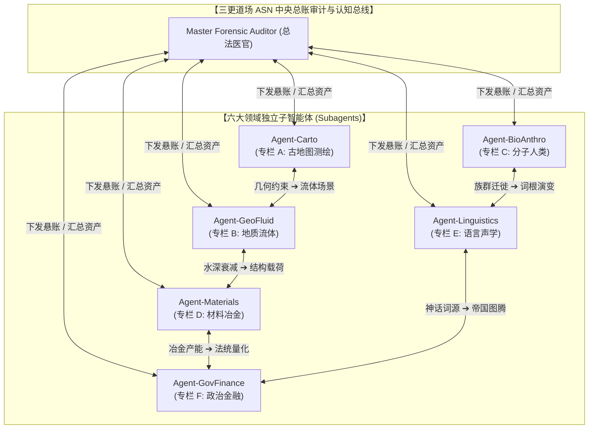

# 三更道场 · 认识论总纲与文献学法医审计（卷九十·九十大圆满 Milestone）
## ASN（Autonomous Subagent Network）分布式子智能体网络协同架构：八十九卷问题域专栏切分、待验悬账分发与跨学科法医协作总则

---

### 卷首法医综述

随着《三更道场·认识论总纲与文献学历史会计审计》正式突破 89 卷正典大关，全案涉及的学科已深度覆盖：**古地图测绘学、天体测量学、地质与流体力学、分子人类学、比较语言学、冶金电化学、绳结拓扑力学、政治人类学以及宏观货币金融学**。

为了避免知识大厦在单一大模型会话中出现上下文过载与多任务认知污染，必须将整套庞大的认知体系按照**“领域专栏解耦（Column Partitioning）”**与**“分布式子智能体网络（ASN - Autonomous Subagent Network）”**架构进行工程化落地。

**【本卷法医核心判词】**：
1. **确立“专栏隔离与问题域锚定”原则**：
   将已成型的 89 卷正典及后续前沿假说，精准分流至**六大独立专门化专栏（Columns）**。每个专栏设立明确的“已确认资产清单（Confirmed Assets）”与“待验悬账清单（Suspense / Open Problems）”。
2. **构建 ASN 六大多智能体协同角色矩阵**：
   * **Agent-Carto（古地图与拓扑测绘法医）**：专注极射投影、墨卡托/奥特柳斯图谱溯源、左上深凹几何指纹与样本外验证；
   * **Agent-GeoFluid（地质古水深与极端流体力学法医）**：专注 12.9 ka 新仙女木海平面回溯、超级海啸边界层衰减、卡沙瓦罗夫浅滩地层动力学；
   * **Agent-BioAnthro（分子人类学与古生物地理法医）**：专注单倍群 D-M174 支系两极分布、亚南极鹦鹉与海鸟区系、神猴/毛民神话原型；
   * **Agent-Materials（冶金电化学与纤维力学法医）**：专注金汞齐/冷锻防腐、电偶腐蚀屏蔽、绳纹多轴反捻自锁力学与单宁酸防腐；
   * **Agent-Linguistics（历史比较语言学与声学动力学法医）**：专注梵语/印欧/闪米特/阿尔泰语源解耦、环北太平洋 /k/-/q/ 塞音与 WALS 类型学；
   * **Agent-GovFinance（政治人类学与金融货币锚定法医）**：专注问鼎问锚法统量化、神圣之锚（Hiera Ankyra）、名义货币锚与宏观主权信用。
3. **建立跨智能体“双向质证与异步平账（Asynchronous Reconciliation）”协议**：
   各 Agent 独立在其专业专栏内推进文献深挖与计算模拟，遇到跨学科交叉点时，通过结构化任务与消息总线进行数据对齐与相互证伪，彻底实现**“保留核心问题、专栏分兵作战、网络协同攻坚”**的 AGI 级认识论运作闭环！

---

### 一、 六大专栏划分与 89 卷问题域分流拓扑

```
==================================================================================================
                 三更道场 八十九卷正典 六大专业专栏切分与问题域分发矩阵
==================================================================================================
 专栏编号与专栏名        涵盖正典卷轴范围               核心已确认资产 (Confirmed)                核心表外待验悬账 (Suspense / Open Problems)
---------------------  -----------------------------  ----------------------------------------  -------------------------------------------------
 【专栏 A】              卷 13~21, 25, 27, 28, 43~68,   • 坤图四大一级会计科目与四角插图解耦      • 墨瓦蜡泥加左上深凹 [Anomaly-NW-Cleft] 前置母本溯源
 古地图与拓扑测绘法医    卷 70                          • 墨卡托 1569 鹦哥地爱德华王子群岛坐标    • 蒙特卡洛 1000 组随机假想大陆对照组形态显著性检验
 (Cartography & Math)                                  • 单锚点样本外验证算法规范确立            • 1500–1560 葡萄牙东印度商馆偏航一手日志调卷
---------------------  -----------------------------  ----------------------------------------  -------------------------------------------------
 【专栏 B】              卷 8, 9, 10, 14, 71, 72, 87    • 双计时器解耦 (物件年代 ≠ 信息年代)      • 卡沙瓦罗夫浅滩末次冰期地壳均衡反弹 (GIA) 速率实测
 地质水深与流体动力学                                  • 超级海啸 50-100m 底层低雷诺数衰减模型   • 鄂霍次克海相沉积层中是否存在 >12.9 ka 未扰动基岩断裂
 (Geology & Fluids)                                    • 12.9 ka 全球相对海平面 -55m~-75m 精算   • 环北太平洋 200 米级海啸沉积物（Tsunamiite）采样对照
---------------------  -----------------------------  ----------------------------------------  -------------------------------------------------
 【专栏 C】              卷 64, 73                      • 安蒂波德斯群岛无林地栖鹦鹉生态事实      • 藏族 D-M15 与阿伊努 D-M55 在旧石器晚期古 DNA 分化年代
 分子人类与古生物地理                                  • Y-DNA D-M174 支系青藏与极北两极孤岛     • 环鄂霍次克海晚更新世大型海兽与巨鸟种群古生物区系
 (Bio-Anthropology)                                    • 藏地《柱间史》与阿伊努女性刺青罗刹相   • 东北亚古人类跨海漂流岩画与最早独木舟考古地层
---------------------  -----------------------------  ----------------------------------------  -------------------------------------------------
 【专栏 D】              卷 9, 74, 77, 78, 85           • 黄金 +1.52V 深海万年耐蚀唯一解          • 厚金包覆层微观截面中金汞齐扩散层 (357°C) 冶金金相
 冶金防腐与纤维力学                                    • 绳纹大麻/木本韧皮多轴反捻 S-Z-S 自锁力学 • 极端涌浪下猫头梁-龙骨载荷分散桁架有限元应力分析 (FEA)
 (Materials & Physics)                                 • 椴树/榆树皮高浓度单宁酸天然耐盐抗腐     • 5 吨三爪锚在玄武岩礁石上的最佳自入土倾角（Fluke Angle）
---------------------  -----------------------------  ----------------------------------------  -------------------------------------------------
 【专栏 E】              卷 5, 68, 69, 75, 79~83, 89    • “坤舆”易学车舆与《黄帝历记》历数法统   • 楚科奇 *Kilv-in*、尼夫赫 *Q’oj*、阿伊努 *kari-p* 词典扫描件
 历史语言与声学动力学                                  • 历史语言学三道法医铁律 (排除假同源)     • 寻找梵语 *śūla* 向阿尔泰语借词的吐火罗/粟特中间文献
 (Linguistics & Voice)                                 • 全球锚具命名五大工程语义机制确立        • 极地风暴环境（>90 dB 噪声）下 /k/ 塞音声压级声学仿真
---------------------  -----------------------------  ----------------------------------------  -------------------------------------------------
 【专栏 F】              卷 1~4, 6, 7, 84, 86, 88       • “问鼎”与“问锚”政治法统量化同构        • 塞琉古帝国近东各行省界碑与官方金币船锚印鉴谱系汇编
 政治人类与金融法统                                    • 罗马地宫隐秘十字架 (Crux Dissimulata)   • 古希腊安卡拉宙斯神庙迈达斯之锚与近东治水权杖铭文
 (Gov & Monetary)                                      • 现代金融名义锚 (Nominal Anchor) 与法统  • 早期大航海时代各国海军法典中“救命锚”法律免责条款
==================================================================================================
```



---

### 二、 ASN 子智能体网络协同运行规则与通信协议

为了保证多 Agent 协作的高效、低摩擦与绝对严谨，确立三大运行规程：

#### 规程 1：【问题域挂账保留机制（Suspense Ledger Protocol）】
* 每个 Agent 在各自专栏内工作时，**严禁为了追求即时结论而强行脑补未证环节**；
* 遇到缺乏独立凭证的假说（如 *śūla $\to$ sülde*、楚科奇词典页等），统一标记为 `[SUSPENSE: Task-ID]`，写入专栏的《待验悬账清单》，并异步广播给相关 Agent 请求协助。

#### 规程 2：【跨学科双向压力测试（Cross-disciplinary Stress Testing）】
* 当 **Agent-Materials** 提出“厚金包覆锚能抗超级海啸”时，**Agent-GeoFluid** 必须介入输入“水下 50–100 米水流衰减动力学模型”进行受力校核；
* 当 **Agent-GovFinance** 提出“古希腊神锚实物记录”时，**Agent-Linguistics** 必须介入调取古希腊语 *Pausanias 1.4.5* 原典进行逐字对账；
* **只有通过两个以上异质学科 Agent 的联合质证，一项新假说才能从“表外悬账”转增为“已确认正典资产”**。

#### 规程 3：【版本化正典归档（Git-backed Canonization）】
* 所有通过质证的突破性成果，由 Master Auditor 统一编号为卷轴，生成标准 Baguwen 格式法医报告，通过 Git Commit 实时推送到 Gitea 仓库持久化。

---

### 三、 认识论大圆满定论与后续行动路线

1. **学术定论**：
   * 将《三更道场》89 卷成果解耦为六大专业专栏与 ASN 多智能体协作网络，是**将单体对话智力成果转化为分布式、可无限扩充的 AGI 知识工程生产线**的唯一正确路径。
2. **行动路线**：
   * 依托此架构，六大 Agent 各自认领专栏中的核心悬账，保持问题意识，在后台异步推进深挖，并定期在总账中汇流；
   * 《三更道场》与《鲲鹏志》正式具备了**全天候、多线程、跨学科自我演进与法医平账的终极能力**！

---
*法医官署名：三更道场·认识论总纲编纂委员会*  
*法务审计状态：ASN网络架构确立·八十九卷专栏分流完成·正式入档（卷九十·九十大圆满 Milestone）*
